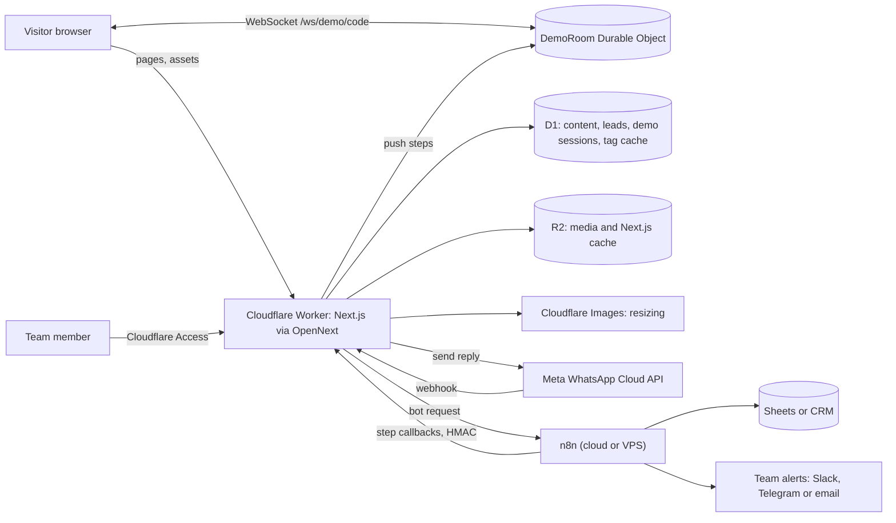
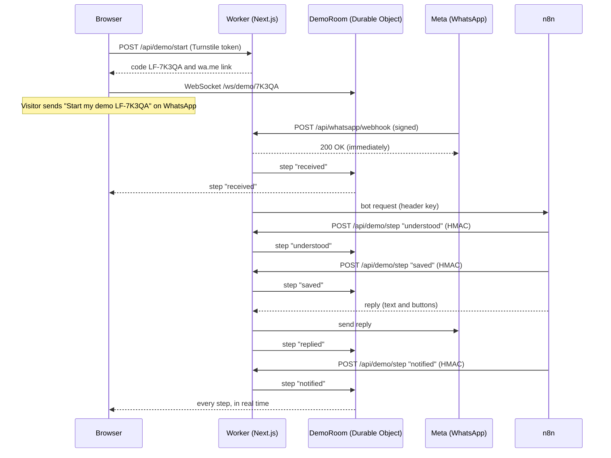

# Legit Forge — Website Master Plan

Version 2.0, 25 September 2026. Sources checked on this date (see §20).

**This is the only document for this project.** It replaces the earlier `IDEAS.md` and `docs/PLAN.md`, which have been deleted. Everything agreed so far lives here.

Legit Forge is a **two-person freelance studio**. We build websites and web apps, a quotation and warranty system, WhatsApp automation and n8n workflows. This document is the complete plan for the company website: concept, design system, every animation, every section, backend, WhatsApp and n8n integration, SEO, performance, accessibility, roadmap and launch.

**What changed in version 2**

| # | Change | Where |
|---|---|---|
| 1 | The team is **2 freelancers**, not 2–3 full-time people. Scope and roadmap re-cut into three releases. | §22 |
| 2 | **Five services**, including the quotation and warranty system (new). | §6.3, §6.3b |
| 3 | New hero signature: **The Phone Becomes the Machine** — a photographic hand and phone whose interface explodes into our whole stack, wires up, becomes our services, and collapses back. | §6.2a |
| 4 | **Clean-UI rules** so nothing reads as generated. | §1.6 |
| 5 | A **three-viewport contract** (375 / 768 / 1440) with a pass/fail gate. | §4.8 |
| 6 | **Trust copy** you can paste, and where each line goes. | §18.6 |
| 7 | A **verified image library** — real URLs, all free to use commercially. | §21 |
| 8 | A **scroll playbook**: the Cleave transition and eight card behaviours. | §23 |

**How to use this document**

| Who | Read first |
|---|---|
| Founders / project lead | §0, §1, §2, §16, §19 |
| Designer | §1, §4, §5, §6, §18 |
| Frontend developers | §4, §5, §6, §7, §11, §12 |
| Backend developers | §8, §9, §13, §14 |
| AI coding agent (Claude Code, Cursor) | §15 — copy the `CLAUDE.md` starter into the repo |
| Anyone building UI | **§1.6 and §4.8 are mandatory.** Read them before writing a component. |

- Anything in `[square brackets]` is a placeholder (domain, prices, numbers, names). Replace all of them before launch.
- Lines marked **(verify)** depend on third-party services that change often. Re-check them before launch.

---

## 0. One-page summary

**What we are building:** a marketing and lead-generation website that proves Legit Forge's skills by working, not by claiming.

**The big idea:** the scroll forges something. A raw idea at the top gets heated and hammered as you scroll, and a finished, hallmarked product comes out at the bottom.

- **Dark mode = "Forge Night":** blued-iron surfaces, heat colors (cherry, orange, yellow, white-hot), rising embers.
- **Light mode = "Workshop Day":** zinc-steel surfaces, blueprint grid, temper colors (straw, bronze, purple, blue).

**Two signature moments (this is where we spend our boldness):**

1. **Live WhatsApp test:** the visitor messages our real bot, and the workflow lights up on the page in real time.
2. **Lanyard ID cards:** physics-based ID cards for each team member. Drag, stretch, flip, scan the QR code, open the portfolio.

Everything else stays quiet: one signature motion per section, no fade-up on every block.

**Goals:** WhatsApp conversations and qualified leads, trust, and rankings for "[service] + [city]" searches.

**Stack:** Next.js 16 (App Router) on Cloudflare Workers through the OpenNext adapter, D1, R2, Durable Objects, Turnstile, WhatsApp Cloud API, n8n.

**Hosting reality check:** Cloudflare Pages is no longer the right target for a full-stack Next.js app. Deploy to **Workers** with OpenNext. Budget for **Workers Paid (from $5/month)**, because Next.js server rendering does not fit the Free plan's 10 ms CPU limit per request.

**Timeline:** about 6 weeks for 2–3 people (§16).

**Deadline alert:** WhatsApp Business Platform pricing changes on **1 October 2026** (§9.2).

### Key decisions

| Decision | Choice | Why |
|---|---|---|
| Hosting | Workers + OpenNext | Runs real Next.js; the old Pages adapter is archived; bindings to D1/R2/Durable Objects |
| vinext (Cloudflare's Vite-based Next.js rebuild) | Watch, don't use yet | Cloudflare is moving to make it the default for new projects, but it launched as experimental and re-implements Next.js instead of running it |
| Team cards on phones | 2D ID cards (tap to flip) | Touch-drag fights page scrolling; 3D physics is heavy on mid-range phones |
| Bot logic | In n8n | You sell n8n, so the demo shows n8n; the Worker keeps the WhatsApp token |
| Content (projects, team, testimonials) | D1 + R2 with a small admin | Non-developers can add projects and images; pages stay cached for SEO |
| Motion | Scroll-driven, one signature per section | Visitor controls pace; accessible; distinctive instead of templated |
| Team size | 2 freelancers with client work | Real capacity is 10–15 h/week each. Full spec is a 4-month build, so we ship in three releases (§22) |
| Launch point | **R1: every section, zero scroll animation** | The motion-off state each section already needs *is* a complete website. Launch it, then upgrade a live asset |
| Hero signature | **The Phone Becomes the Machine** (§6.2a) | A real hand and phone open into the systems we build, wire themselves together, become our service list, then close. Proves all three claims at once. CSS 3D, no WebGL, ~110 KB |
| Quotation and warranty system | Its own section, not a fifth pinned demo | It is a product and a trust story, and five pinned stages is too much scroll (§6.3b) |
| Third lanyard card | The **visitor's card** (`LF-003`), not a hiring card | Two cards look sparse; a hiring ad from a 2-person shop reads as premature; this one converts (§6.8) |
| Live test transport | Polling in v1, Durable Objects later | Saves the hardest days of work; a 2 s lag on an 8 s sequence is invisible (§22) |

---

## 1. Concept: "The Forge"

### 1.1 The scroll story

Each homepage section is one stage of forging. Every section carries a `data-heat` value (0 to 1) that drives the background and accent colors (§5.6).

| Forge stage | Section | What the visitor learns | Heat |
|---|---|---|---|
| Spark | Intro (first visit only) | Something is being made here | 0.15 → 0.6 flare |
| Ignite | Hero | What we do, how to reach us; the phone opens into the machine and closes again (§6.2a) | 0.35, flaring to 0.6 at closure |
| Four fires | Services | The four things we build, each demos itself | 0.55 |
| Proof test | Live test | "It actually works. I just tried it." | 0.8 |
| Hammer | Process | How we work, with no surprises | 0.9 |
| Forged work | Projects | Real, live results | 1.0 |
| The smiths | Team | Real people behind it | 0.7 |
| Hallmarks | Proof wall, pricing, FAQ | Others trust them; prices are clear | 0.45 |
| Quench | Contact | An easy next step | 0.05 |

### 1.2 Two worlds, not two color schemes

- **Forge Night (dark):** heat colors. Embers rise from the bottom of the screen; their amount and brightness follow the scroll story.
- **Workshop Day (light):** temper colors, which are the real colors steel shows when it is tempered at lower heat. A faint blueprint grid sits behind the page, and a few construction lines draw themselves near headings.
- Same layout and content, different material.
- Default theme follows the device setting; the visitor's choice is remembered.
- The theme toggle is a physical lever that reveals the other world in a circle from where you tapped (§5.6.1).

### 1.3 Rhythm: wow, then proof

Alternate curiosity hooks and trust builders so the site never feels like just a show:

Hero (hook) → Services (hook) → Live test (proof) → Process (proof) → Projects (proof) → Team (hook) → Hallmarks (proof) → Quench (close).

### 1.4 Design principles

1. **Proof over promises.** Every claim has a link, a number, a face or a live demo behind it.
2. **One signature per section.** Everything else in that section stays still.
3. **Motion answers the visitor.** Scroll, drag and tap drive animation. Nothing important animates on its own for more than 5 seconds.
4. **Speed is a feature.** The home page must score 90+ on mobile PageSpeed with all effects on. We will invite visitors to test it.
5. **Real HTML for everything important.** 3D and canvas are decoration on top of indexable, accessible content.
6. **Plain words.** Say "your customers get answers on WhatsApp at 2 a.m.", not "webhook orchestration".
7. **Honest numbers only.** Placeholder stats are removed before launch, not rounded up.

### 1.5 Defaults we are deliberately not using

These looks appear on thousands of generated sites. Using them would make "Legit" look generic.

| Common default | Why we skip it | What we do instead |
|---|---|---|
| Cream background, serif display, terracotta accent | The most common AI-generated look | Zinc steel with temper colors |
| Near-black background with one neon or vermilion accent | Same | Blued iron with a full heat ramp that changes with scroll |
| Fade-and-slide-up on every section | Reads as a template; delays content | One signature motion per section |
| All-caps eyebrow label above every heading | Template chrome | Headings stand alone, in sentence case |
| Monospace "data labels" | Template chrome | Archivo condensed with tabular numbers |
| Identical rounded cards with soft grey shadows | SaaS-kit look | Objects with a material: ID cards, stamps, plates, blueprints |
| An arrow glyph added to every link and button | Template chrome | Verb-first labels, such as "Read the case study" |
| Auto-scrolling logo marquee | Needs a pause control; generic | A static logo row, or skip until there are 6+ logos |
| One headline word in a different color | Common tell | The whole headline heats and cools together |

### 1.6 Clean-UI rules (mandatory)

The brief was: *it must never feel vibe-coded.* Generated-looking UI is not caused by bad taste, it is caused by **inconsistency** — values that vary for no reason. These rules remove the variance. They are checkable in review, so use them as a checklist, not a mood.

**The ten rules**

1. **One accent per screen.** If two things are orange, one of them is wrong. Accent marks the single most important action in view.
2. **Every spacing value comes from the 4 px scale** (§4.4). No 13 px, no 27 px, no "looks about right". A stray value is the clearest tell of generated UI.
3. **Cards in a group are identical** — same padding, radius, border weight, image ratio. If one differs, that difference must be deliberate and repeated elsewhere.
4. **One left edge per section.** Headings, body and controls align to the same line. Optical alignment beats mathematical for icons, quotes and round shapes.
5. **Three levels of visual weight per section, maximum**: heading, body, meta. A fourth turns the block to mush.
6. **No decoration without a job.** Every line, dot, glow and border must mark structure or state. If you cannot say what it marks, delete it.
7. **Text measures 45–75 characters.** Never a full-width paragraph.
8. **Whitespace is a component.** If a section feels cramped, remove an element before reducing the gaps.
9. **Never centre more than three lines of text.** Only the Quench section is centred (§6.11).
10. **Pick one separator per surface level** — a border, or a shadow, or a fill. Never all three on the same card.

**Tells we actively avoid**

| Tell | Why it reads as generated | What we do |
|---|---|---|
| Identical cards with soft grey shadows and 12 px radius | The default of every UI kit | Materials: ID cards, stamps, plates, blueprints (§4.4) |
| Gradient text on a heading | Pure decoration, hurts contrast | One solid heading colour (§4.3) |
| Emoji used as icons | Inconsistent across platforms, unprofessional | Lucide, 1.5 px stroke |
| Everything centred | No hierarchy; nothing leads the eye | Left-aligned, one edge per section |
| Three equal columns for three unequal things | Grid used as a substitute for editing | Asymmetric layouts sized to the content |
| Icon + heading + paragraph, repeated six times | Template rhythm | Each service demos itself differently (§6.3) |
| Gaps of 24, then 32, then 20 | Variance with no system | The 4 px scale, enforced in review |
| A hero that is only headline, subhead and two buttons | Says nothing specific | A working object and a real bot conversation (§6.2) |
| Purple-to-blue gradient on anything | The single most common AI-site signature | Heat ramp in dark, temper colours in light (§4.2) |

**Review gate:** a component is not done until someone else can open it and find no value outside the scale, no second accent, and no decoration without a job.

---

## 2. Goals and success metrics

| Goal | Metric | Target (first 90 days) |
|---|---|---|
| Conversations | WhatsApp chats started from the site | [X] per month |
| Leads | Qualified form submissions | [X] per month |
| Proof engagement | Live tests completed / started | 25% or more |
| Trust | Portfolio opens from team cards | [X] per month |
| SEO | Search Console clicks and impressions | Month-over-month growth; top 10 for 5 target terms within 6 months |
| Speed | Mobile PageSpeed (home) | 90+; LCP ≤ 2.5 s, CLS ≤ 0.05, INP ≤ 200 ms (field data, 75th percentile) |
| Accessibility | Lighthouse accessibility, axe | 100; zero critical issues |

---

## 3. Sitemap

```
/                               Home (the forge story)
/services                       Overview of all services
/services/website-development   Static and dynamic websites
/services/whatsapp-automation   WhatsApp bots and automation
/services/n8n-automation        n8n workflows and integrations
/work                           All projects (filter by service)
/work/[slug]                    Case study
/team                           Team (lanyards and list)
/team/[slug]                    Member portfolio
/blog                           Guides (SEO)
/blog/[slug]                    Article
/contact                        WhatsApp, form, business details
/privacy, /terms                Legal
/admin/*                        Content admin (Cloudflare Access)
/api/*                          Backend routes (§8.11)
```

---

## 4. Design system

### 4.1 Color tokens

Components never use raw hex values. They use these tokens, which switch with the theme.

| Token | Forge Night (dark) | Workshop Day (light) | Used for |
|---|---|---|---|
| `--bg` | `#151A20` blued iron | `#E8ECEF` zinc | Page background |
| `--surface` | `#1D242C` anvil | `#F7F9FA` polished steel | Panels, cards, form fields |
| `--surface-2` | `#26303A` tool steel | `#DDE3E8` brushed steel | Raised or pressed surfaces |
| `--line` | `#33404C` mill scale | `#C3CCD4` grid line | Borders, dividers, grid |
| `--text` | `#EDE6DA` ash | `#1B2129` graphite | Body text and headings |
| `--text-muted` | `#9AA3AB` cool steel | `#56606B` | Secondary text |
| `--accent` | `#F0701E` orange heat | `#2A58A0` temper blue | Primary buttons, links |
| `--accent-ink` | `#151A20` | `#FFFFFF` | Text on accent backgrounds |
| `--heat-lo` | `#C8321E` cherry | `#D9B45A` pale straw | Low end of the heat ramp (decoration only) |
| `--heat-mid` | `#F0701E` orange | `#9A5B22` bronze | Middle of the ramp |
| `--heat-hi` | `#FFC24A` yellow | `#6B4796` temper purple | High end of the ramp |
| `--quench` | `#5FA8C9` steam | `#2D6CB5` blueprint | Contact section, calm states, blueprint lines |
| `--focus` | `#FFC24A` | `#6B4796` | Focus ring |
| `--success` | `#5CC08A` | `#1B6E45` | Success messages |
| `--danger` | `#FF7A6B` | `#B3261E` | Error messages |

The logo mark uses `--accent`: orange in Forge Night, temper blue in Workshop Day. It is the same steel at two temperatures.

Contrast ratios for every text pair are in §12.1. Cherry and pale straw fail text contrast on purpose; use them only for decoration and large shapes.

### 4.2 The heat system

- One global CSS variable, `--heat` (0 to 1), is set by the Heat Director (§5.6.3) based on the section in view.
- A derived color, `--heat-color`, mixes `--heat-lo` and `--heat-hi` by the current heat. In the dark world that runs cherry → yellow; in the light world it runs straw → purple.
- Used by: the scroll progress rod, the active-service marker, ember particles, the live-test graph, card cooling in Projects.
- Never used for body text (its contrast changes).

### 4.3 Typography

- **One family: Archivo** (Google Fonts, variable: weight 100–900 and width 62–125). Its width axis is our hammer: display type is set wide and heavy, labels are set condensed. Load it with `next/font` so it is self-hosted and does not shift the layout.
- **One stamp face:** a stencil display face (for example Big Shoulders Stencil) used only inside hallmark stamps and ID codes on cards. Never for interface text.
- Widths are fixed per text style. We never animate the width axis after the first paint, because changing letter widths moves text and causes layout shift (§5.1).

| Style | Size (mobile → desktop) | Weight | Width | Line height | Letter spacing |
|---|---|---|---|---|---|
| Display (H1) | 44 → 96 px | 800 | 112% | 0.95 | −0.02em |
| H2 | 32 → 60 px | 700 | 106% | 1.0 | −0.015em |
| H3 | 21 → 26 px | 600 | 100% | 1.2 | −0.005em |
| Lead paragraph | 18 → 21 px | 400 | 100% | 1.55 | 0 |
| Body | 16 → 18 px | 400 | 100% | 1.65 | 0 |
| Small | 14 → 15 px | 400 | 96% | 1.5 | 0.005em |
| Label / UI | 14 px | 500 | 88% | 1.3 | 0.01em |
| Numbers (prices, stats) | inherit | 600 | 92% | inherit | `tabular-nums` |

Fluid sizes (375 px → 1440 px viewport):

```css
--step-display: clamp(2.75rem, 1.6rem + 4.9vw, 6rem);
--step-h2:      clamp(2rem, 1.38rem + 2.63vw, 3.75rem);
--step-h3:      clamp(1.3125rem, 1.2rem + 0.47vw, 1.625rem);
--step-lead:    clamp(1.125rem, 1.06rem + 0.28vw, 1.3125rem);
--step-body:    clamp(1rem, 0.96rem + 0.19vw, 1.125rem);
```

Rules:

- Sentence case everywhere. No all-caps interface labels.
- Body line length at most 65 characters (`max-width: 65ch`).
- Headlines are one color. No single-word color accents.
- Left-aligned text everywhere except the final Quench section, which is centered.

### 4.4 Layout, spacing, shape

- **Design widths:** 375 (phone), 768 (tablet), 1024 (small laptop), 1440 (desktop). Tailwind breakpoints: `sm` 640, `md` 768, `lg` 1024, `xl` 1280.
- **Container:** max 1240 px content, 24 px side padding (16 px on phones).
- **Grid:** 12 columns on desktop (24 px gutter), 6 on tablet (20 px), 4 on phones (16 px).
- **Section spacing:** `--section-y: clamp(4.5rem, 3rem + 5vw, 8rem)` top and bottom.
- **Spacing scale (4 px base):** 4, 8, 12, 16, 24, 32, 48, 64, 96, 128.
- **Radius by hierarchy:** 4 px for inputs and chips, 10 px for buttons and panels, 16 px for ID cards and media frames, full pill only for status badges.
- **Elevation:** no generic grey shadows.
  - Forge Night: raised surfaces use `--surface-2` with a 1 px `--line` border. Active elements get a heat glow: `box-shadow: 0 0 0 1px var(--heat-color), 0 8px 32px -12px var(--heat-color)`.
  - Workshop Day: a 1 px machined edge plus an inner highlight: `box-shadow: inset 0 1px 0 #fff, 0 0 0 1px var(--line)`.

### 4.5 Imagery

- **Team photos:** same neutral backdrop, same soft key light from the left, shoulders up, at least 1600 × 2000 px, real expressions. No stock photos.
- **Project media:** real screenshots at 2400 × 1500 (desktop) and 1170 × 2532 (phone) in minimal device frames. Optionally one short screen recording per featured project (8 seconds max, muted, poster image, plays only on hover or tap).
- **Illustration:** only technical line drawings in Workshop Day. None in Forge Night; embers and heat carry the mood.
- **Icons:** Lucide (ships with shadcn/ui), 1.5 px stroke, 20 or 24 px.
- **Formats:** AVIF or WebP through `next/image` and Cloudflare Images (§8.6).

### 4.6 Logo

- Mark: an anvil silhouette with a single spark above it. Wordmark: "Legit Forge" in Archivo 800 at 112% width.
- Files needed: SVG mark, SVG wordmark, SVG lockup, PNG 512 × 512 (for structured data), favicon SVG plus 32 px ICO, 180 px Apple touch icon, default Open Graph image 1200 × 630.

### 4.7 Token file (Tailwind CSS v4)

```css
/* app/globals.css */
@import "tailwindcss";
@custom-variant dark (&:where(.dark, .dark *));

:root {
  /* Workshop Day (light) */
  --bg: #E8ECEF; --surface: #F7F9FA; --surface-2: #DDE3E8; --line: #C3CCD4;
  --text: #1B2129; --text-muted: #56606B;
  --accent: #2A58A0; --accent-ink: #FFFFFF;
  --heat-lo: #D9B45A; --heat-mid: #9A5B22; --heat-hi: #6B4796;
  --quench: #2D6CB5; --focus: #6B4796; --success: #1B6E45; --danger: #B3261E;

  --heat: 0.2; /* set live by the Heat Director */
  --heat-color: color-mix(in oklab, var(--heat-hi) calc(var(--heat) * 100%), var(--heat-lo));

  --section-y: clamp(4.5rem, 3rem + 5vw, 8rem);
  --ease-forge: cubic-bezier(0.16, 1, 0.3, 1);
}

.dark {
  /* Forge Night (dark) */
  --bg: #151A20; --surface: #1D242C; --surface-2: #26303A; --line: #33404C;
  --text: #EDE6DA; --text-muted: #9AA3AB;
  --accent: #F0701E; --accent-ink: #151A20;
  --heat-lo: #C8321E; --heat-mid: #F0701E; --heat-hi: #FFC24A;
  --quench: #5FA8C9; --focus: #FFC24A; --success: #5CC08A; --danger: #FF7A6B;
}

@theme inline {
  --color-bg: var(--bg);
  --color-surface: var(--surface);
  --color-surface-2: var(--surface-2);
  --color-line: var(--line);
  --color-text: var(--text);
  --color-muted: var(--text-muted);
  --color-accent: var(--accent);
  --color-accent-ink: var(--accent-ink);
  --color-heat: var(--heat-color);
  --color-quench: var(--quench);
  --font-sans: var(--font-archivo), ui-sans-serif, system-ui, sans-serif;
}

html { background: var(--bg); color: var(--text); }
:focus-visible { outline: 2px solid var(--focus); outline-offset: 3px; }
section[id] { scroll-margin-top: 88px; } /* sticky header never covers targets */

.type-display { font-size: var(--step-display); font-weight: 800; font-stretch: 112%; line-height: .95; letter-spacing: -0.02em; }
.type-h2      { font-size: var(--step-h2); font-weight: 700; font-stretch: 106%; line-height: 1; letter-spacing: -0.015em; }
.type-label   { font-size: .875rem; font-weight: 500; font-stretch: 88%; letter-spacing: .01em; }
```

```tsx
// app/layout.tsx (font excerpt)
import { Archivo } from 'next/font/google';

const archivo = Archivo({
  subsets: ['latin'],
  axes: ['wdth'],           // enables the width axis (62–125)
  variable: '--font-archivo',
  display: 'swap',
});
// <html lang="en" className={archivo.variable} suppressHydrationWarning>
```

If `font-stretch` has no visible effect in a browser, use `font-variation-settings: "wdth" 112` on that style instead.

### 4.8 The three-viewport contract

Everything is designed, built and reviewed at **exactly three widths**. "Responsive" is not a goal; these three being perfect is the goal.

| | Phone | Tablet | Laptop |
|---|---|---|---|
| Design width | **375 px** | **768 px** | **1440 px** |
| Also must not break | 320, 430 | 834, 1024 | 1280, 1920 |
| Gutter | 16 px | 24 px | 24 px (content max 1240 px) |
| Columns | 4 | 6 | 12 |
| Body / H1 | 16 / 44 px | 17 / 64 px | 18 / 96 px |
| Pinned scroll | **Never** | **Never** | Allowed, max 1 viewport per section |
| 3D and physics | Never | Tier B only (§6.8) | Tier A |
| Hover states | None — everything must work on tap | Tap first | Hover enhances, never informs |
| Horizontal rows | Native swipe, 85 vw cards, next peeks | Native swipe, 70 vw | Scroll-driven track |
| Touch targets | 44 × 44 px minimum | 44 px | 32 px minimum |

**Rules that prevent the usual breakages**

- **Inputs are 16 px on phones.** Anything smaller makes iOS Safari zoom on focus and the layout never recovers.
- **No hover-only information anywhere.** If a hover reveals a fact, that fact must also be visible or tappable.
- **Nothing touches the viewport edge** except full-bleed media, which must be deliberate.
- **Fixed aspect ratios on every image slot** so a slow image never shifts the page (CLS budget is 0.05, §11.1).
- **`100svh`, never `100vh`** — `vh` is wrong while mobile browser chrome is showing.
- **Test with the phone keyboard open.** Forms are where this bites (§6.11).
- **Both themes × motion on and off × all three widths** = the real matrix. It is 12 combinations per section; check them at section sign-off, not at launch.

**Pass/fail gate for every release.** A section ships only when, at 320–1920 px:

- [ ] No horizontal page scroll at any width.
- [ ] No text below 14 px, no touch target below 44 px on phones.
- [ ] The H1 fits in 4 lines at 375 px.
- [ ] Nothing overlaps at 200 % browser zoom.
- [ ] Every interactive element is reachable and visible with a keyboard.
- [ ] Both themes, motion on and off, all three widths.

---

## 5. Motion system

### 5.1 Motion rules

1. **One orchestrated moment per page load:** the Spark intro, first visit only (§6.1).
2. **One signature motion per section.** Other elements in that section appear without animation.
3. **Scroll-driven, not time-driven.** Section animations are scrubbed by scroll, so the visitor controls the pace. This also satisfies WCAG 2.2.2 (nothing moves by itself for more than 5 seconds).
4. **Only animate** `transform`, `opacity`, `filter`, `clip-path` and CSS variables that affect paint (color, glow). Never animate width, height, top, left, margins or the font width axis after first paint. Those move layout and hurt CLS.
5. **Everything has a motion-off state** that respects `prefers-reduced-motion` and our own "Animations: on/off" switch.
6. **Physical timing:** fast out, soft landing. Stamps overshoot slightly. Real physics only in the lanyard.
7. **Performance gate:** every animation must hold 60 fps on a mid-range Android phone (test with Chrome DevTools, 4× CPU throttle).

### 5.2 Timing and easing tokens

| Token | Value | Use |
|---|---|---|
| `instant` | 120 ms | Press feedback |
| `quick` | 200 ms | Hover, toggles |
| `base` | 400 ms | Panels, stamps, node ignition |
| `slow` | 700 ms | Theme reveal, card flip |
| `cinematic` | 1200 ms | Intro, heat changes |

| Easing | CSS | GSAP | Use |
|---|---|---|---|
| forge-out | `cubic-bezier(0.16, 1, 0.3, 1)` | `expo.out` | Most entrances |
| settle | — | `power2.out` | Heat and value changes |
| stamp | — | `back.out(2)` | Hallmark stamps |
| strike | — | `power4.in` | Wind-up before an impact |
| scrub | `linear` | `none` | Scroll-scrubbed timelines |

### 5.3 Libraries and what each one does

| Library | Job | How it loads |
|---|---|---|
| GSAP 3 + ScrollTrigger + `@gsap/react` | Scroll timelines, pinning, scrubbing | Main bundle |
| GSAP SplitText, DrawSVGPlugin | Intro heat pass, process line, graph edges | With their sections (dynamic import) |
| Lenis | Smooth scrolling synced to the GSAP ticker | Main bundle; off when motion is off |
| React Three Fiber, drei, `@react-three/rapier`, meshline | Lanyard ID cards only | Dynamic import near the team section, capable devices only |
| View Transitions API (native) | Theme lever reveal | No library |
| next-themes | Theme state without a flash | Main bundle |
| Canvas 2D (no library) | Ember background | Main bundle, small |
| CSS transitions | Hovers, toggles, accordion | — |

All GSAP plugins, including the former paid bonus plugins such as SplitText and DrawSVG, are free. Do not add a second animation library (such as Motion) for jobs GSAP or CSS already cover; two libraries doing the same work only add bytes.

### 5.4 Master animation map

This table is the source of truth for "which animation goes where".

| # | Where | Element | Trigger | Animation | Timing | Tech | Phone | Motion off |
|---|---|---|---|---|---|---|---|---|
| 1 | Global | Ember background (dark) | Always; intensity follows heat | Embers rise; count, speed and brightness follow `--heat`; they drift away from the cursor | Continuous; heat eases over 1.2 s | Canvas 2D | 60 embers, DPR ≤ 1.5, no cursor | One still frame |
| 2 | Global | Blueprint lines (light) | Section becomes active | 2–3 construction lines draw near the heading | 900 ms, forge-out | Inline SVG + DrawSVG | Same, fewer lines | Lines already drawn |
| 3 | Global | Heat rod (scroll progress) | Scroll | 2 px bar under the header fills; color follows `--heat-color` | Scrubbed | ScrollTrigger → CSS variable | Same | Hidden |
| 4 | Global | Theme lever | Click, Enter, Space | Lever handle flips; new theme reveals in a circle from the lever | 700 ms, forge-out | View Transitions API | Same | Instant switch |
| 5 | Global | Header | Scroll direction | Hides scrolling down, returns scrolling up | 300 ms, forge-out | CSS transform | Same | Always visible |
| 6 | Intro | Spark and heat pass | First visit, after hydration | Spark strikes the first letter; heat sweeps across the headline; embers flare | 1.2 s total | GSAP + SplitText | 0.9 s | Skipped |
| 6a | Hero | **The Phone Becomes the Machine** (§6.2a) | Scroll 0 → 1 over the hero | Four acts: the interface explodes out of the phone in Z; orange paths wire the parts and a pulse runs the chain; technical labels become service names; everything collapses back with one heat flash | Scrubbed, pinned ≤ 1 viewport | GSAP ScrollTrigger + CSS 3D + inline SVG. **No WebGL** | 4 plates, acts 1/3/4, no pin, done by 85 vh | Static act 3: plates spread, wired, labelled with services |
| 6b | Hero → Services | **The Cleave** (§23.1) | Scroll | The hero image splits along a shear line and the halves part, revealing the next section; a white-hot seam glows at the cut | Scrubbed, pinned ≤ 1 viewport | `clip-path` + transforms | No pin; simple section change | Sections simply adjacent |
| 7 | Hero | Primary button | Hover, focus, press | Heat fills upward; press squashes to 98% | 200 ms / 120 ms | CSS | Press only | Color change only |
| 8 | Services | Pinned stage | Scroll | Four service panels: old one cools (grey, 96%, fades), new one ignites | Scrub 0.6, snaps to each service | ScrollTrigger pin | No pin; each demo plays once in view (≤ 4 s) with a Replay button | Four static final frames |
| 9 | Services | Static-site demo | Scroll inside its panel | Wireframe blocks snap into a styled page; speed score ring fills | Scrubbed | GSAP timeline | Plays once | Final frame |
| 10 | Services | Dynamic-app demo | Scroll | Chart line draws; numbers count; a booking row slides in | Scrubbed | GSAP + DrawSVG | Plays once | Final frame |
| 11 | Services | WhatsApp demo | Scroll | Phone mock: messages appear with typing dots; a button gets tapped | Scrubbed | GSAP | Plays once | Full conversation, static |
| 12 | Services | n8n demo | Scroll | A glowing pulse travels node to node; each node gets a check | Scrubbed | GSAP + DrawSVG | Plays once | Static graph with checks |
| 13 | Compare | Divider | Drag, arrow keys | Reveals the static or dynamic version | Follows input | Range input + `clip-path` | Same | Same (user-driven) |
| 14 | Live test | Workflow graph | Real server events | Node ignites; pulse runs along the edge from the previous node | 400 ms per node | CSS variables + SVG | Same | Nodes change color and show a check |
| 15 | Process | Molten line | Scroll | Line draws down the timeline; each step node glows then cools | Scrubbed; node glow 800 ms | DrawSVG + ScrollTrigger | Same, shorter | Line fully drawn |
| 16 | Projects | Card track | Scroll | Track moves sideways while the section is pinned | Scrub 1 | ScrollTrigger `containerAnimation` | Native swipe with scroll-snap | Vertical grid |
| 17 | Projects | Card cooling | Card moves toward center | Heat-tinted image cools to full color | Tied to position | CSS variable `--card-heat` | Not used | Full color |
| 18 | Projects | Hallmark stamp | Card reaches 55% of the screen | Stamp lands: scale 1.4 → 1, small rotation, 2 px shake | 450 ms, stamp | GSAP | Same (IntersectionObserver) | Stamp shown, still |
| 19 | Team | Card drop-in | Section enters (first time) | Cards fall from the rail and swing | Physics, about 1.5 s | R3F + Rapier | 2D cards | 2D cards, still |
| 20 | Team | Drag and stretch | Pointer drag | Card follows the pointer; band thins under tension | Physics | Rapier | Not used | Not used |
| 21 | Team | Flip | Click or tap without drag; Enter on name tag | Springs around to the back | About 600 ms spring | Physics controller (§6.8) | CSS 3D flip | Instant front/back swap |
| 22 | Team | Open portfolio | Button | Card image flies to the portfolio header | 500 ms, forge-out | GSAP overlay | Same | Normal navigation |
| 23 | Proof wall | — | — | No signature motion (quiet on purpose) | — | — | — | — |
| 24 | FAQ | Accordion | Click, Enter | Height opens | 250 ms | `<details>` + CSS | Same | Instant |
| 25 | Quench | Heat drop | Section enters | Embers fade; steam wisps rise; palette calms | 1.5 s | Heat store + canvas | Same | Still |
| 26 | Form | Submit | Submit | Button fills like a heat bar, then a "Sent" stamp lands | 300 ms + 450 ms | CSS + GSAP | Same | Text change only |

### 5.5 Reduced motion and the motion switch

- Motion is **off** when the device asks for reduced motion **or** the visitor turns "Animations" off in the footer.
- A tiny inline script in `<head>` sets `html[data-motion="on|off"]` before first paint, so there is no flash.
- React components read `useMotionEnabled()` and pass it as a `useGSAP` dependency with `revertOnUpdate: true`, so switching instantly reverts all animations to their final state.
- Per-section behavior with motion off is in the last column of §5.4 and in §12.4.

```tsx
// app/layout.tsx (inside <head>)
<script
  dangerouslySetInnerHTML={{
    __html: `try{var m=localStorage.getItem('lf-motion');var r=matchMedia('(prefers-reduced-motion: reduce)').matches;document.documentElement.dataset.motion=(m==='off'||r)?'off':'on'}catch(e){}`,
  }}
/>
```

```tsx
// components/motion/motion-provider.tsx
'use client';
import { createContext, useContext, useEffect, useState } from 'react';

type MotionCtx = { enabled: boolean; setEnabled: (on: boolean) => void };
const Ctx = createContext<MotionCtx>({ enabled: true, setEnabled: () => {} });

const reducedQuery = '(prefers-reduced-motion: reduce)';

export function MotionProvider({ children }: { children: React.ReactNode }) {
  const [enabled, setState] = useState(
    () => typeof document === 'undefined' || document.documentElement.dataset.motion !== 'off',
  );

  useEffect(() => {
    const mq = matchMedia(reducedQuery);
    const onChange = () => setState(!mq.matches && localStorage.getItem('lf-motion') !== 'off');
    mq.addEventListener('change', onChange);
    return () => mq.removeEventListener('change', onChange);
  }, []);

  useEffect(() => {
    document.documentElement.dataset.motion = enabled ? 'on' : 'off';
  }, [enabled]);

  const setEnabled = (on: boolean) => {
    localStorage.setItem('lf-motion', on ? 'on' : 'off');
    setState(on && !matchMedia(reducedQuery).matches);
  };

  return <Ctx.Provider value={{ enabled, setEnabled }}>{children}</Ctx.Provider>;
}

export const useMotionEnabled = () => useContext(Ctx).enabled;
export const useMotionSwitch = () => useContext(Ctx);
```

### 5.6 Global motion building blocks

#### 5.6.1 Theme lever (View Transitions circular reveal)

```tsx
// components/layout/forge-lever.tsx
'use client';
import { useEffect, useState } from 'react';
import { flushSync } from 'react-dom';
import { useTheme } from 'next-themes';
import { useMotionEnabled } from '@/components/motion/motion-provider';

export function ForgeLever() {
  const { resolvedTheme, setTheme } = useTheme();
  const motionOn = useMotionEnabled();
  const [mounted, setMounted] = useState(false);
  useEffect(() => setMounted(true), []);
  const isDark = resolvedTheme === 'dark';

  function toggle(e: React.MouseEvent<HTMLButtonElement>) {
    const next = isDark ? 'light' : 'dark';
    if (!('startViewTransition' in document) || !motionOn) {
      setTheme(next);
      return;
    }
    // Reveal starts from the lever itself (works for mouse, touch and keyboard).
    const r = e.currentTarget.getBoundingClientRect();
    const x = r.left + r.width / 2;
    const y = r.top + r.height / 2;
    const radius = Math.hypot(Math.max(x, innerWidth - x), Math.max(y, innerHeight - y));

    const transition = document.startViewTransition(() => {
      document.documentElement.classList.toggle('dark', next === 'dark');
      flushSync(() => setTheme(next));
    });
    transition.ready.then(() => {
      document.documentElement.animate(
        { clipPath: [`circle(0px at ${x}px ${y}px)`, `circle(${radius}px at ${x}px ${y}px)`] },
        { duration: 700, easing: 'cubic-bezier(0.16, 1, 0.3, 1)', pseudoElement: '::view-transition-new(root)' },
      );
    });
  }

  return (
    <button
      type="button"
      role="switch"
      aria-checked={mounted ? isDark : undefined}
      aria-label="Dark mode"
      onClick={toggle}
      className="forge-lever"
      data-state={mounted && isDark ? 'night' : 'day'}
    >
      {/* SVG lever: handle rotates from -35deg (day) to 35deg (night) with a 200ms CSS transition */}
    </button>
  );
}
```

```css
/* globals.css */
::view-transition-old(root),
::view-transition-new(root) { animation: none; mix-blend-mode: normal; }
```

Theme provider: `<ThemeProvider attribute="class" defaultTheme="system" enableSystem disableTransitionOnChange>` from `next-themes`, with `suppressHydrationWarning` on `<html>`.

#### 5.6.2 Smooth scrolling (Lenis synced with GSAP)

```tsx
// components/motion/smooth-scroll.tsx
'use client';
import { useEffect, useRef } from 'react';
import { ReactLenis, type LenisRef } from 'lenis/react';
import 'lenis/dist/lenis.css';
import { gsap } from 'gsap';
import { ScrollTrigger } from 'gsap/ScrollTrigger';
import { useMotionEnabled } from './motion-provider';

gsap.registerPlugin(ScrollTrigger);

export function SmoothScroll({ children }: { children: React.ReactNode }) {
  const lenisRef = useRef<LenisRef>(null);
  const motionOn = useMotionEnabled();

  useEffect(() => {
    if (!motionOn) return;
    const lenis = lenisRef.current?.lenis;
    const unsubscribe = lenis?.on('scroll', ScrollTrigger.update);
    const tick = (time: number) => lenisRef.current?.lenis?.raf(time * 1000);
    gsap.ticker.add(tick);
    gsap.ticker.lagSmoothing(0);
    return () => {
      gsap.ticker.remove(tick);
      unsubscribe?.();
    };
  }, [motionOn]);

  if (!motionOn) return <>{children}</>;
  return (
    <ReactLenis root ref={lenisRef} options={{ autoRaf: false, lerp: 0.1 }}>
      {children}
    </ReactLenis>
  );
}
```

Open menus and modals call `lenis.stop()` and `lenis.start()` to lock scrolling.

#### 5.6.3 Heat Director (drives `--heat`)

```tsx
// components/motion/heat-director.tsx
'use client';
import { gsap } from 'gsap';
import { ScrollTrigger } from 'gsap/ScrollTrigger';
import { useGSAP } from '@gsap/react';
import { useMotionEnabled } from './motion-provider';

gsap.registerPlugin(ScrollTrigger, useGSAP);

/** Read every frame by the ember canvas. */
export const heat = { value: 0.2 };

const writeHeatVar = () =>
  document.documentElement.style.setProperty('--heat', heat.value.toFixed(3));

export function HeatDirector() {
  const motionOn = useMotionEnabled();

  useGSAP(
    () => {
      gsap.utils.toArray<HTMLElement>('[data-heat]').forEach((section) => {
        ScrollTrigger.create({
          trigger: section,
          start: 'top 55%',
          end: 'bottom 55%',
          onToggle: (self) => {
            if (!self.isActive) return;
            const target = Number(section.dataset.heat);
            if (!motionOn) {
              heat.value = target;
              writeHeatVar();
              return;
            }
            gsap.to(heat, { value: target, duration: 1.2, ease: 'power2.out', overwrite: true, onUpdate: writeHeatVar });
          },
        });
      });
    },
    { dependencies: [motionOn], revertOnUpdate: true },
  );

  return null;
}
```

Usage: `<section id="services" data-heat="0.55">`. Mount `<HeatDirector />` once per page that uses heat.

#### 5.6.4 Ember background (Forge Night)

Spec:

- One fixed `<canvas>` behind everything: `position: fixed; inset: 0; z-index: -1; pointer-events: none`, `aria-hidden="true"`.
- Only runs in Forge Night. Workshop Day uses a CSS grid background plus inline SVG construction lines per section (§5.4 row 2).
- Embers spawn at the bottom, rise and cool: young embers use `--heat-hi`, older ones `--heat-lo`. Count and speed scale with `heat.value`.
- Caps: 160 embers (desktop), 100 (tablet), 60 (phone). DPR capped at 2 (1.5 on phones).
- Embers within 120 px of the cursor drift away (fine pointers only).
- Stops when the tab is hidden, in Workshop Day, and when motion is off (draws one still frame instead).
- In Quench (heat below 0.1) spawning nearly stops and a few large, faint `--quench` steam wisps rise.

```tsx
// components/background/forge-canvas.tsx
'use client';
import { useEffect, useRef } from 'react';
import { heat } from '@/components/motion/heat-director';
import { useMotionEnabled } from '@/components/motion/motion-provider';

type Ember = { x: number; y: number; vx: number; vy: number; age: number; ttl: number; r: number };

export function ForgeCanvas() {
  const ref = useRef<HTMLCanvasElement>(null);
  const motionOn = useMotionEnabled();

  useEffect(() => {
    const canvas = ref.current;
    const ctx = canvas?.getContext('2d');
    if (!canvas || !ctx) return;

    const root = document.documentElement;
    const small = matchMedia('(max-width: 767px)').matches;
    const finePointer = matchMedia('(pointer: fine)').matches;
    const dpr = Math.min(window.devicePixelRatio || 1, small ? 1.5 : 2);
    const cap = small ? 60 : window.innerWidth < 1024 ? 100 : 160;
    const embers: Ember[] = [];
    const pointer = { x: -9999, y: -9999 };
    let colors = { lo: '#C8321E', hi: '#FFC24A' };
    let w = 0, h = 0, raf = 0, last = performance.now();

    const readColors = () => {
      const s = getComputedStyle(root);
      colors = { lo: s.getPropertyValue('--heat-lo').trim(), hi: s.getPropertyValue('--heat-hi').trim() };
    };
    const resize = () => {
      w = window.innerWidth; h = window.innerHeight;
      canvas.width = Math.round(w * dpr); canvas.height = Math.round(h * dpr);
      ctx.setTransform(dpr, 0, 0, dpr, 0, 0);
    };
    const spawn = (y = h + 8) => embers.push({
      x: Math.random() * w, y, vx: (Math.random() - 0.5) * 14, vy: -(24 + Math.random() * 46),
      age: 0, ttl: 2.5 + Math.random() * 3.5, r: 0.6 + Math.random() * 1.8,
    });
    const paint = (e: Ember, t: number) => {
      const k = e.age / e.ttl;
      ctx.globalAlpha = (1 - k) * (0.35 + 0.65 * t);
      ctx.fillStyle = k < 0.35 ? colors.hi : colors.lo; // hot when young, cooler as it rises
      ctx.beginPath(); ctx.arc(e.x, e.y, e.r, 0, Math.PI * 2); ctx.fill();
    };

    const frame = (now: number) => {
      const dt = Math.min((now - last) / 1000, 0.05);
      last = now;
      const t = heat.value;
      ctx.clearRect(0, 0, w, h);
      ctx.globalCompositeOperation = 'lighter';
      const target = Math.round(cap * (0.25 + 0.75 * t) * (t < 0.1 ? 0.1 : 1));
      if (embers.length < target && Math.random() < 0.6) spawn();
      for (let i = embers.length - 1; i >= 0; i--) {
        const e = embers[i];
        e.age += dt;
        const dx = e.x - pointer.x, dy = e.y - pointer.y;
        if (dx * dx + dy * dy < 14400) { e.vx += dx * 0.25 * dt; e.vy += dy * 0.25 * dt; }
        e.x += e.vx * dt * (0.6 + t);
        e.y += e.vy * dt * (0.6 + t);
        if (e.age >= e.ttl || e.y < -10) { embers.splice(i, 1); continue; }
        paint(e, t);
      }
      ctx.globalAlpha = 1;
      ctx.globalCompositeOperation = 'source-over';
      raf = requestAnimationFrame(frame);
    };

    const stop = () => { cancelAnimationFrame(raf); raf = 0; };
    const drawStill = () => {
      ctx.clearRect(0, 0, w, h);
      embers.length = 0;
      for (let i = 0; i < 40; i++) spawn(Math.random() * h);
      embers.forEach((e) => { e.age = Math.random() * e.ttl * 0.8; paint(e, 0.4); });
      ctx.globalAlpha = 1;
    };
    const sync = () => {
      readColors();
      stop();
      if (!root.classList.contains('dark') || document.hidden) { ctx.clearRect(0, 0, w, h); return; }
      if (!motionOn) { drawStill(); return; }
      last = performance.now();
      raf = requestAnimationFrame(frame);
    };
    const onPointer = (e: PointerEvent) => { pointer.x = e.clientX; pointer.y = e.clientY; };

    resize();
    sync();
    const themeObserver = new MutationObserver(sync);
    themeObserver.observe(root, { attributes: true, attributeFilter: ['class'] });
    window.addEventListener('resize', resize);
    document.addEventListener('visibilitychange', sync);
    if (finePointer) window.addEventListener('pointermove', onPointer, { passive: true });

    return () => {
      stop();
      themeObserver.disconnect();
      window.removeEventListener('resize', resize);
      document.removeEventListener('visibilitychange', sync);
      window.removeEventListener('pointermove', onPointer);
    };
  }, [motionOn]);

  return <canvas ref={ref} aria-hidden="true" className="pointer-events-none fixed inset-0 -z-10 h-full w-full" />;
}
```

Workshop Day background (no JavaScript):

```css
:root:not(.dark) body::before {
  content: ""; position: fixed; inset: 0; z-index: -1; pointer-events: none; opacity: .35;
  background-image:
    linear-gradient(var(--line) 1px, transparent 1px),
    linear-gradient(90deg, var(--line) 1px, transparent 1px);
  background-size: 32px 32px;
}
```

---

## 6. Home page: section-by-section spec

Each section follows the same pattern: goal, content, layout, animation, states, accessibility, build notes, and "done when". Animation numbers (#) point to the master map in §5.4.

**Build rule for every animated section:** the HTML's default state is the *finished* frame. Timelines animate *from* earlier states (`gsap.from`, `fromTo`). This way, motion-off visitors, search engines and anyone without JavaScript always see complete content.

| Order | Section | `id` | `data-heat` |
|---|---|---|---|
| 0 | Header | — | — |
| 1 | Intro Spark | runs on top of the hero | — |
| 2 | Hero | `top` | 0.35 |
| 3 | Services | `services` | 0.55 |
| 4 | Compare slider | `compare` | 0.55 |
| 5 | Live test | `live-test` | 0.8 |
| 6 | Process | `process` | 0.9 |
| 7 | Projects | `work` | 1.0 |
| 8 | Team | `team` | 0.7 |
| 9 | Proof wall | `proof` | 0.45 |
| 10 | Pricing and FAQ | `pricing` | 0.45 |
| 11 | Quench (contact) | `contact` | 0.05 |
| 12 | Footer | — | — |

### 6.0 Header

**Goal:** WhatsApp is always one tap away, and visitors always know where they are.

**Content:** logo (links home); nav: Services, Work, Team, Process, Blog; theme lever; "Chat on WhatsApp". On phones: logo, "Chat" button (WhatsApp icon plus the word), menu button.

```
Desktop, 72 px tall
┌──────────────────────────────────────────────────────────────────────┐
│ [logo] Legit Forge   Services  Work  Team  Process  Blog   [lever] [Chat on WhatsApp] │
└──────────────────────────────────────────────────────────────────────┘
 ━━━━━━━━━━━━━━━━━━━━━━━━━━━━━  heat rod: 2 px scroll progress

Phone, 60 px tall
┌──────────────────────────────────┐
│ [logo]              [Chat]  [≡]  │
└──────────────────────────────────┘
```

| State | Behavior |
|---|---|
| Top of page | Transparent, no border |
| Scrolled past 80 px | `--surface` at 85% opacity, `backdrop-filter: blur(12px)`, 1 px `--line` bottom border |
| Scrolling down | Slides up out of view (#5) |
| Scrolling up | Slides back in |
| Focus inside the header | Never hides |
| Phone menu open | Full-screen panel, 28 px links, focus trapped, Esc closes, page scroll locked |

**Heat rod (#3):** `transform: scaleX(var(--progress))` with `transform-origin: left`, colored `--heat-color`. Use transform, never width.

```tsx
// components/layout/header.tsx (excerpt)
useGSAP(() => {
  const header = headerRef.current!;
  ScrollTrigger.create({
    start: 80,
    end: 'max',
    onToggle: (self) => { header.dataset.solid = String(self.isActive); },
    onUpdate: (self) => {
      if (header.contains(document.activeElement) || menuOpen.current) return;
      header.dataset.hidden = String(self.direction === 1 && self.scroll() > 200);
    },
  });
  ScrollTrigger.create({
    start: 0,
    end: 'max',
    onUpdate: (self) => rodRef.current?.style.setProperty('--progress', self.progress.toFixed(3)),
  });
});
```

```css
header[data-hidden="true"] { transform: translateY(-100%); }
header { transition: transform 300ms var(--ease-forge), background-color 200ms; }
[data-motion="off"] header { transition: none; }
[data-motion="off"] header[data-hidden="true"] { transform: none; } /* always visible when motion is off */
```

**Accessibility:** "Skip to content" is the first focusable element (visible on focus); `<header>` and `<nav aria-label="Main">` landmarks; menu button has `aria-expanded` and `aria-controls`; the phone "Chat" button has `aria-label="Chat on WhatsApp"`.

**Done when:** the header never covers a focused element; the WhatsApp button is visible at all times on phones when scrolling up; the menu is fully keyboard-operable.

### 6.1 Intro "Spark" (first visit only)

**Goal:** one short, memorable moment that sets the forge mood without delaying content.

**Rules:**

- The hero headline is visible from the very first paint (it is the LCP element). The intro only adds heat on top of it; it never hides text.
- Runs once per browser (`localStorage['lf-intro-seen']`), only when motion is on and the page loaded at the top.
- 1.2 s total (about 0.9 s on phones). Transforms and paint properties only.
- Any scroll, touch or key press jumps it to the end.

| Time | Element | What happens |
|---|---|---|
| 0–150 ms | Background | Heat rises 0.15 → 0.6; embers flare from the bottom (#6) |
| 150–470 ms | Spark | A small white-hot spark with a short trail flies from lower left to the first letter of the headline (`power4.in`) |
| 470 ms | First letter | The strike: `scaleY` 0.9 → 1 in 120 ms |
| 470–1100 ms | Headline | Heat sweeps left to right: each letter glows and cools (stagger 18 ms) |
| 700–1200 ms | Background | Heat settles to 0.35 (hero level) |

Workshop Day version: the spark is a temper-blue chalk mark, and the sweep turns letters temper purple and back, with no glow.

```css
.hero-title .char {
  --glow: 0;
  color: color-mix(in oklab, var(--heat-hi) calc(var(--glow) * 100%), var(--text));
  text-shadow: 0 0 calc(var(--glow) * 0.4em)
    color-mix(in oklab, var(--heat-mid) calc(var(--glow) * 100%), transparent);
}
:root:not(.dark) .hero-title .char { text-shadow: none; }
.intro-spark { visibility: hidden; position: absolute; } /* GSAP autoAlpha shows it */
```

```tsx
// components/sections/hero/intro-spark.tsx
'use client';
import { gsap } from 'gsap';
import { SplitText } from 'gsap/SplitText';
import { useGSAP } from '@gsap/react';
import { heat } from '@/components/motion/heat-director';
import { useMotionEnabled } from '@/components/motion/motion-provider';

gsap.registerPlugin(SplitText, useGSAP);

const writeHeat = () => document.documentElement.style.setProperty('--heat', heat.value.toFixed(3));

type Props = {
  titleRef: React.RefObject<HTMLHeadingElement | null>;
  sparkRef: React.RefObject<SVGSVGElement | null>;
};

export function IntroSpark({ titleRef, sparkRef }: Props) {
  const motionOn = useMotionEnabled();

  useGSAP(() => {
    if (!motionOn || window.scrollY > 50 || localStorage.getItem('lf-intro-seen')) return;
    localStorage.setItem('lf-intro-seen', '1');

    // aria defaults to 'auto': the heading keeps one readable label for screen readers.
    const split = SplitText.create(titleRef.current, { type: 'chars', charsClass: 'char' });
    const tl = gsap.timeline({ onComplete: () => split.revert() });

    tl.to(heat, { value: 0.6, duration: 0.15, overwrite: 'auto', onUpdate: writeHeat })
      .fromTo(sparkRef.current, { x: -240, y: 160, autoAlpha: 1 }, { x: 0, y: 0, duration: 0.32, ease: 'power4.in' })
      .set(sparkRef.current, { autoAlpha: 0 })
      .fromTo(split.chars[0], { scaleY: 0.9 }, { scaleY: 1, duration: 0.12, ease: 'power2.out' }, '<')
      .to(split.chars, { '--glow': 1, duration: 0.2, stagger: 0.018, ease: 'power2.out' }, '<')
      .to(split.chars, { '--glow': 0, duration: 0.4, stagger: 0.018, ease: 'power2.in' }, '<0.2')
      .to(heat, { value: 0.35, duration: 0.6, ease: 'power2.out', overwrite: 'auto', onUpdate: writeHeat }, '-=0.5');

    if (window.innerWidth < 768) tl.timeScale(1.3);

    const skip = () => tl.progress(1);
    const events = ['wheel', 'touchmove', 'keydown'] as const;
    events.forEach((type) => window.addEventListener(type, skip, { once: true, passive: true }));
    return () => events.forEach((type) => window.removeEventListener(type, skip));
  }, { dependencies: [motionOn] });

  return null;
}
```

**Done when:** LCP is unchanged with the intro on vs. off; CLS is 0; it never runs twice; it never runs with motion off.

### 6.1b The Hallmark Strike: loading and landing moment (replaces 6.1)

*Added 26 September 2026 at the founders' request, from their "hot-stamping tool" and "Titan coin" reference sheets.* A cinematic first-visit moment. A forging press strikes a blank coin, "LEGIT FORGE" is stamped into it, the coin is tossed, flips in 3D, and lands face-up as our hallmark. Then it flies into the header logo and the page is there.

**Why a coin.** "Legit" is a promise. A hallmark stamped into metal is the oldest way of proving something is genuine. The coin carries our name the way the Maker's promise (§6.9) carries our commitments.

**Sequence (1.8 s; phones 1.4 s):**

| Time | What happens |
|---|---|
| 0.00 | The page is already painted underneath. A dark veil holds it, low smoke drifts across the floor, and embers rise |
| 0.10 | The press drops from the top: a knurled knob, a spring, a steel ram and a brass "LEGIT FORGE" plate. It is layered SVG with metal gradients, not a photo |
| 0.45 | **Strike.** A white flash, a shockwave ring, 16 sparks, a 3 px screen shake, and smoke puffing outward |
| 0.60 | The ram lifts. The coin is revealed glowing orange-hot, with the embossed LEGIT FORGE ring text and a bold centre wordmark |
| 0.75 | **The toss.** The coin rises, flips 3½ turns in real 3D (CSS 3D, with both faces and a stacked rim so the edge shows mid-flip), and motion blur stretches it at speed |
| 1.35 | It lands face-up with two small wobbles, and cools from orange to gold and steel |
| 1.55 | It shrinks and flies to the header logo (a FLIP transition to `.logo-mark`) while the veil lifts and the hero's phone brand screen continues |

**Build:** real 3D without WebGL, because a loading screen cannot itself wait to load.
- **Coin:** CSS 3D. Two faces, 12 rim layers (`translateZ` steps) for thickness, and radial and conic gradients for machined gold with a steel ring. Embossed text is SVG `textPath` with a highlight and shadow pair.
- **Press:** layered SVG. **Smoke:** a 2D canvas of soft sprite puffs (about 40 particles), started after the first frame.
- **Weight and runtime:** about 8 KB of inline CSS and SVG plus about 3 KB of JS. It runs on pure CSS keyframes, so if JavaScript fails the veil still lifts on its own at 1.8 s.
- **Optional realism upgrade:** photoreal coin-face and press textures rendered once (≤ 40 KB AVIF each), used as the CSS face images.

**Rules:**
- First visit per browser only (`localStorage['lf-intro-seen']`, try/catch), only with motion on, only when the page loads at the top. Decided by the inline boot script before first paint, so returning visitors never see a flash of it.
- Any key, click, touch or wheel skips straight to the end (the coin jumps to the logo).
- The hero is painted underneath from the first frame, so LCP is unaffected: the veil sits over content, it never replaces it.
- Motion off, no JS, or a repeat visit: no veil at all.
- Reuse the coin as our hallmark elsewhere: the team card seal, the project "Live" stamps and the favicon.

### 6.2 Hero "Ignite"

**Goal:** within 5 seconds, a visitor knows what we do, who it's for, and how to reach us.

**Content:**

- **H1** (pick one; options and notes in §18.2):
  - A: "Websites and WhatsApp automations that bring you customers."
  - B: "We build your website and make WhatsApp answer your customers."
  - C: "Fast websites. WhatsApp that replies at 2 a.m. Workflows that run themselves."
- **Lead:** "Legit Forge is a small team of developers in [City]. We build static and dynamic websites, WhatsApp automation and n8n workflows. You can test our WhatsApp bot on this page right now."
- **Primary button:** "Chat on WhatsApp" → `https://wa.me/[number]?text=Hi%20Legit%20Forge%2C%20I%27d%20like%20to%20talk%20about%20a%20project.`
- **Secondary button:** "Try the live demo" → scrolls to `#live-test`.
- **Reply note** (a sentence, not a dot-separated string): "We usually reply within [10 minutes], [Monday to Saturday, 10 a.m. to 7 p.m.]." followed by a status: "Open now" or "Closed now. We'll reply from [10 a.m.]"
- **Bot card (desktop, right side):** a phone-shaped card showing a real conversation with our bot (customer name hidden). Caption: "A real conversation with our bot. Test it yourself below."
- **Below:** a static row of client logos (only with 6+ real logos), or one short testimonial with photo.

```
Desktop (text in columns 1–7, bot card in columns 9–12)
┌──────────────────────────────────────────────────────────────┐
│                                                              │
│  Websites and WhatsApp                     ┌─────────────┐   │
│  automations that bring                    │ bot card    │   │
│  you customers.                            │ Hi! Looking │   │
│                                            │ for a site? │   │
│  Legit Forge is a small team of…           │ [Website]   │   │
│                                            │ [WhatsApp]  │   │
│  [Chat on WhatsApp]  [Try the live demo]   └─────────────┘   │
│  We usually reply within 10 minutes. Open now.               │
│                                                              │
│  logo    logo    logo    logo    logo    logo                │
└──────────────────────────────────────────────────────────────┘

Phone
┌──────────────────────────┐
│ Websites and WhatsApp    │
│ automations that bring   │
│ you customers.           │
│ Lead paragraph…          │
│ [Chat on WhatsApp]       │  full width
│ [Try the live demo]      │  full width
│ Reply note and status    │
│ (bot card below the fold)│
└──────────────────────────┘
```

- Desktop height: `min-height: min(100svh, 920px)`. Phones: natural height, no forced full screen.

**Animation:** the Spark intro (#6), The Phone Becomes the Machine (#6a, §6.2a) and button states (#7). The bot card is still: no auto-typing loop.

### 6.2a The Phone Becomes the Machine: the hero signature

**The idea.** A real hand holds a real phone. As you scroll, the interface **explodes out of the screen in Z** and spreads into the system behind it — website, API, database, automation, WhatsApp, AI. Orange paths wire the parts together and a pulse runs the chain. The technical labels then turn into the services we sell. Finally everything collapses back into the phone, which is now showing a finished product.

It is one continuous shot, and it makes three claims without a line of copy:

1. We build the thing you can see — websites and apps.
2. We build the systems behind it — APIs, databases, automations, bots.
3. We can build experiences at this level, because you are looking at one.

The third claim is the reason this is worth the effort. **The hero is the portfolio piece.** Under it, put a quiet link: *"How we built this — read the breakdown"* pointing at a blog post about the animation (§10.6). That converts decoration into proof, and it is a linkable asset that will earn backlinks from developers.

**Keep it cinematic, not generic.** The difference is entirely in these six details: leader lines with part numbers, depth-of-field blur on far plates, eased pulse travel (never linear), **one** heat flash at closure rather than one per step, machined plate edges (1 px `--line` plus an inset highlight, never a soft grey shadow), and overlapping stagger instead of uniform timing.

#### The seven plates

Eight concepts were requested; seven plates ship. `Database` and `CRM` merge into one data plate — they are the same layer to a client, and seven is the most that stays readable. Each plate carries a technical label in acts 1–2 and a service name in act 3.

| # | Technical label (acts 1–2) | Becomes (act 3) | Z at rest |
|---|---|---|---|
| 01 | Website / UI | **Websites** | +120 |
| 02 | App shell | **Mobile Apps** | +60 |
| 03 | API | **Custom Business Systems** | 0 |
| 04 | Database / CRM | **Dashboards** | −60 |
| 05 | n8n | **Automations** | −120 |
| 06 | WhatsApp | **WhatsApp Bots** | −60 |
| 07 | AI / Integrations | **AI Systems** | +60 |

Plates fan **up and back** in an arc. The phone stays front and low-centre so the hand is never occluded: device in front, machine behind it.

#### The four acts

One scrubbed timeline, `scrub: 0.8`, pinned for at most one viewport height on desktop.

| Act | Scroll | What happens |
|---|---|---|
| **1 — Explode** | 0 → 0.35 | Plates emerge from the screen in pipeline order, staggered 60 ms, rising along the arc with a slight Y-rotation. Leader lines draw from the phone to each plate. Part numbers and technical labels fade in. |
| **2 — Wire** | 0.35 → 0.60 | Orange paths draw between plates in order (01 → 07) via `stroke-dashoffset`. A pulse travels the full chain on an eased curve. Each plate's border heats to `--heat-color` as its connection lands. |
| **3 — Become** | 0.60 → 0.85 | Each technical label cross-fades to its service name; the plate grows a stamped edge. The paths stay lit and keep pulsing slowly. **This is the frame that sells the business** — hold it longest. |
| **4 — Collapse** | 0.85 → 1.0 | Paths retract, plates converge back into the screen in reverse order, and the phone lands showing a finished dashboard. One heat flash at closure. |

#### Architecture: no WebGL here

This is the answer to "reserve heavy 3D for where it adds value" — **here it adds nothing.** CSS 3D transforms with `perspective` give real depth, correct occlusion ordering through `translateZ`, and run on the compositor thread. `three.js` and React Three Fiber would add 450–600 KB to do the same job worse, and would blow the 180 KB first-load budget (§11.1) in the one place on the site where speed is most visible.

| Element | Built with | Weight |
|---|---|---|
| Hand and phone | One AVIF with alpha, cut out | ≤ 80 KB |
| Screen content | A real project screenshot from D1, swapped per visit | ≤ 30 KB |
| 7 plates | DOM elements, CSS 3D transforms, **real text labels** | ~0 |
| Leader lines and orange paths | One inline SVG, `stroke-dashoffset` | ~0 |
| Pulse | One circle on `offset-path` along the same paths | ~0 |
| Driver | One GSAP timeline writing CSS custom properties | shared |

**Where WebGL would earn its place, later:** a desktop-only heat-shimmer pass over the plates at the moment of closure. Optional, R3, Tier A only, and only if it is measured not to cost a frame. The lanyard (§6.8) remains the only required 3D on the site.

```tsx
// components/hero/machine.tsx — plate layout and the scrubbed timeline
const PLATES = [
  { id: 'web', tech: 'Website / UI',      service: 'Websites',                x: -34, y: -22, z:  120 },
  { id: 'app', tech: 'App shell',         service: 'Mobile Apps',             x: -22, y: -40, z:   60 },
  { id: 'api', tech: 'API',               service: 'Custom Business Systems', x:   0, y: -48, z:    0 },
  { id: 'db',  tech: 'Database / CRM',    service: 'Dashboards',              x:  22, y: -40, z:  -60 },
  { id: 'n8n', tech: 'n8n',               service: 'Automations',             x:  34, y: -22, z: -120 },
  { id: 'wa',  tech: 'WhatsApp',          service: 'WhatsApp Bots',           x:  28, y:   2, z:  -60 },
  { id: 'ai',  tech: 'AI / Integrations', service: 'AI Systems',              x: -28, y:   2, z:   60 },
];

useGSAP(() => {
  if (!motionOn) return;
  const mm = gsap.matchMedia();

  mm.add('(min-width: 768px)', () => {
    const tl = gsap.timeline({
      defaults: { ease: 'none' },
      scrollTrigger: {
        trigger: heroRef.current, start: 'top top', end: '+=100%',
        pin: true, scrub: 0.8, invalidateOnRefresh: true,
      },
    });

    // Act 1 — explode (plates start collapsed inside the screen)
    tl.addLabel('explode');
    PLATES.forEach((p, i) => {
      tl.fromTo(`[data-plate="${p.id}"]`,
        { xPercent: 0, yPercent: 0, z: 0, autoAlpha: 0, rotateY: 0 },
        { xPercent: p.x, yPercent: p.y, z: p.z, autoAlpha: 1, rotateY: p.x * 0.18, duration: 0.5 },
        i * 0.06);
      tl.fromTo(`[data-leader="${p.id}"]`, { drawSVG: '0%' }, { drawSVG: '100%', duration: 0.4 }, i * 0.06);
    });

    // Act 2 — wire
    tl.addLabel('wire')
      .fromTo('[data-path]', { drawSVG: '0%' }, { drawSVG: '100%', duration: 1, stagger: 0.08 })
      .to('[data-plate]', { '--plate-heat': 1, duration: 0.6, stagger: 0.08 }, '<')
      .fromTo('[data-pulse]', { motionPath: { path: '#chain', start: 0, end: 0 } },
                              { motionPath: { path: '#chain', start: 0, end: 1 }, duration: 1.2,
                                ease: 'power1.inOut' }, '<0.2');

    // Act 3 — become  (hold: this is the frame that sells)
    tl.addLabel('become')
      .to('[data-label="tech"]',    { autoAlpha: 0, y: -6, duration: 0.3, stagger: 0.04 })
      .to('[data-label="service"]', { autoAlpha: 1, y:  0, duration: 0.3, stagger: 0.04 }, '<')
      .to({}, { duration: 0.6 });                      // the hold

    // Act 4 — collapse
    tl.addLabel('collapse')
      .to('[data-path], [data-leader]', { drawSVG: '100% 100%', duration: 0.5 })
      .to('[data-plate]', { xPercent: 0, yPercent: 0, z: 0, autoAlpha: 0, duration: 0.6,
                            stagger: { each: 0.05, from: 'end' } }, '<0.1')
      .to('[data-screen]', { '--heat': 0.6, duration: 0.15 })   // the one flash
      .to('[data-screen]', { '--heat': 0.35, duration: 0.5 });
  });
}, { dependencies: [motionOn], revertOnUpdate: true, scope: heroRef });
```

```css
[data-machine]  { perspective: 1400px; transform-style: preserve-3d; }
[data-plate]    {
  --plate-heat: 0;
  transform-style: preserve-3d;
  border: 1px solid color-mix(in oklab, var(--heat-color) calc(var(--plate-heat) * 70%), var(--line));
  box-shadow: inset 0 1px 0 rgb(255 255 255 / .06);     /* machined edge, never a soft shadow */
  filter: blur(calc((1 - var(--depth)) * 1.5px));        /* depth of field on far plates */
}
```

#### Per viewport (§4.8)

| | Phone (375) | Tablet (768) | Laptop (1440) |
|---|---|---|---|
| Plates | **4** — Website, Automations, WhatsApp, AI | 5 | 7 |
| Pin | **No.** Runs as the hero scrolls out, done by 85 vh | No | Yes, ≤ 1 viewport |
| Acts | 1, 3, 4 (wire is implied by a single static path) | All four, shorter | All four |
| Phone image | 62 vw, centred | 44 vw | 34 vw, columns 7–12 |
| Depth blur | Off | Off | On |

Seven plates at 375 px is unreadable — four is the honest maximum. The story survives: things come out, they become services, they go back in.

#### Motion off: a deliberate exception

Everywhere else the HTML default is the *finished* frame (§5.1). Here the finished frame is a collapsed phone, which communicates nothing.

**So the HTML default is act 3** — plates spread, wired, labelled with service names. If JavaScript never runs, the visitor sees the full labelled machine, which is the most informative state on the page. Reduced motion gets the same static act 3. With JavaScript and motion on, the boot script's `html[data-motion="on"]` switches the CSS to the collapsed start (plates hidden) before first paint, so nothing collapses in front of the visitor while GSAP loads; stage and phone sizes are server-rendered CSS variables and the fit-to-box scale is set by an inline script during parsing, so the first paint already has final geometry (no layout shift).

#### SEO and accessibility

**The plate labels are real text in the DOM.** That means the hero literally contains "Websites, Mobile Apps, Custom Business Systems, Dashboards, Automations, WhatsApp Bots, AI Systems" as crawlable copy — our entire service list, in the highest-value block on the site. This is a real ranking asset, not a picture of one.

- The plates are a `<ul>` of real list items, positioned by transform. Screen readers get a clean service list.
- The hand, phone, leader lines and paths are `aria-hidden="true"`.
- Keyboard: the hero is not a control. Nothing here takes focus; the CTAs below it do.
- One visually hidden sentence: *"Diagram: a phone opening into the systems we build — website, app, API, database, automation, WhatsApp and AI — then closing again."*

#### The asset

Working placeholder, already downloaded to `assets/hero/phone-in-hand-source.jpg` (2400 × 2400, straight-on, blank screen, white background, Unsplash License, by personalgraphic.com — see §21).

**Before launch, shoot our own.** That photo reads slightly synthetic, and a site arguing "two real people, no middlemen" should not open on a stock hand. Our own hand, our own phone, white wall, window light, screen off, shot square-on from about 40 cm. Ten minutes, free, and unfakeable.

Preparation either way:

1. Cut the background out; keep a clean alpha edge around the fingers.
2. **Separate the screen area into its own layer** so a project screenshot can be composited behind the glass, with the phone's reflection and bezel on top.
3. Export the device-and-hand layer as AVIF with alpha, ≤ 80 KB. Record intrinsic dimensions.
4. Store at `public/hero/phone.avif`; the screen content comes from D1 at render time (`projects.is_featured`, newest first), so the hero shows real client work and refreshes itself as we add projects.

#### Performance

- Total above-the-fold image weight ≤ **110 KB** (phone 80 + screenshot 30), inside the 150 KB budget (§11.1).
- The phone image is `priority` and preloaded. **It will probably be the LCP element**, so it must be ≤ 80 KB and served from R2 — measure it; if LCP exceeds 2.0 s, shrink the image before touching anything else.
- Fixed `aspect-ratio` on the stage. CLS contribution must be **0**.
- Animate only `transform`, `opacity`, `filter` and custom properties. Nothing here touches layout.
- The whole machine is `content-visibility: auto` once scrolled past.

**Done when:** 60 fps at 4× CPU throttle on a mid-range Android; CLS 0; LCP ≤ 2.0 s; all seven service names present in view-source; and with motion off you get one clear, readable, wired diagram.

### 6.2b Hero upgrades: ten ideas for the exploded view

*Added 26 September 2026, after the first build of §6.2a.* The built hero works: plates explode, wires draw, labels become services, everything collapses. What it does not yet do is make a visitor **lean in**. Right now it shows boxes with words on them. The ideas below turn it into a small story that a visitor watches to the end, understands without reading, and remembers.

**What is missing today (the gap these ideas close):**

- The plates are labels, not proof. Nothing on them *works*.
- There is no story. The pulse is abstract, so there is nothing to follow and nothing to wait for.
- The depth is flat. The stage never moves, so the CSS 3D reads as a 2D diagram.
- The ending pays nothing off. The phone shows the same wireframe from start to finish, not a finished product (§6.2a promised a finished screen).
- It is 2.6 screens of pinned scroll with no sign of progress, so people do not know there is more to see.

**Rules every idea keeps:** no WebGL in the hero (§6.2a). Every plate stays real text for search and screen readers. With motion off, show a single meaningful still frame. On phones: 4 plates, no pin (§4.8). And each idea must say something about the business, not just decorate.

| # | Idea | What the visitor sees | What it says about us | Effort |
|---|---|---|---|---|
| 1 | **Follow one message** | A single customer message ("Is my cake ready?") leaves the phone as a glowing chip and travels the wires. Its label changes at each plate: *form → request → row #214 → workflow → reply*. At the end a WhatsApp reply pops onto the phone screen. | We build the whole chain, and it really works end to end | M |
| 2 | **Finished-product payoff** | In act 4 the phone lands showing a **real client project** with a *Live* hallmark stamp and "Built by Legit Forge — [client]". It rotates per visit and links to the case study. | This is not a mock-up; it ships | S |
| 3 | **Camera move and depth of field** | The whole machine turns about 8° on Y as it explodes, the camera dollies in, and far plates blur. On desktop at rest, it follows the pointer by 2–3°. | Real 3D craft, the portfolio claim of §6.2a | S |
| 4 | **Live plates** | Each plate is a working miniature, not a label: the site renders, JSON lines scroll on the API, rows tick in the database, n8n nodes light up, WhatsApp bubbles appear, the AI plate types. Tiny HTML/SVG, reused from the service demos. | Every part is something we can show working | M |
| 5 | **Hallmark stamp** | In act 3 each service name is *struck* onto its plate: scale 1.12 → 1, six embers burst, the edge flashes hot and keeps a stamped border. | The forge brand, at the frame that sells | S |
| 6 | **Screen X-ray** | Before the plates fly, the phone's screen peels into its own design layers in Z (background, cards, buttons, text), each with a hairline label. Those layers keep travelling back and *become* the system plates. | The link between what you see and what runs behind it | M |
| 7 | **Build-log HUD and act rail** | A small monospace log synced to scroll: `› page rendered 0.9 s`, `› POST /api/orders 201`, `› n8n: new-order ran (4 steps)`, `› WhatsApp: delivered ✓✓`. Beside it, a thin rail with *Explode · Wire · Become · Ship*. | Real engineering, plus "there's more — keep scrolling" | S |
| 8 | **The machine breathes** | Scroll fast and the wires glow hotter and the chip speeds up (§23.3 `--scroll-energy`). Stop and the plates idle-float ±2 px while a slow pulse keeps circulating. | Alive, not a scrubbed video | S |
| 9 | **Open a plate** | At the act-3 hold, plates become real buttons. Hover or tap lifts one toward the camera (+80 Z) and shows one line — *"Answers customers at 2 a.m."* — with *See an example* linking to the right service page. | Watch becomes explore; the hero is also navigation | S–M |
| 10 | **Pick your business** | Four chips under the hero: *Shop · Clinic · Restaurant · Dealer*. The choice re-labels the plates with that industry's outcomes, changes the travelling message ("Can I book for 5 p.m.?") and pre-fills the WhatsApp CTA. | We understand *your* business, not businesses in general | M |

#### How they combine: the new four acts

The upgrade keeps the §6.2a structure and gives each act a job the visitor can feel.

| Act | Scroll | Now | With the upgrades |
|---|---|---|---|
| 0 — Arrive | load | Static phone | The HUD rail appears; the phone's screen shows the visitor's industry (#10, default *Shop*) |
| 1 — Explode | 0 → 0.30 | Plates fly out | The screen peels into layers (#6); the camera turns and dollies in, with blur on far plates (#3); plates arrive as live miniatures (#4) |
| 2 — Wire | 0.30 → 0.55 | Wires draw, abstract pulse | The **message chip** rides the wires, changing label per plate (#1); the HUD logs each step (#7); speed follows the scroll (#8) |
| 3 — Become | 0.55 → 0.80 | Labels cross-fade | Service names are **stamped** (#5); plates become clickable (#9); the camera holds still — this is the frame that sells |
| 4 — Ship | 0.80 → 1.0 | Collapse, same wireframe | Plates collapse; the WhatsApp reply lands on the screen (#1), then a real project with its *Live* stamp (#2); one heat flash |

Shorten the desktop pin from 260 % to **about 180 %**. With a story to follow, a shorter scroll feels richer, and the §6.2a limit was one screen height.

#### Build order (stop wherever time runs out; each step is shippable)

1. **#2 Finished-product payoff, #3 Camera and depth of field, #5 Hallmark stamp.** Small changes with the largest change to what people remember. About 2 days.
2. **#1 Follow one message, #7 Build-log HUD.** Together they turn the hero into a story with a payoff. This is the step that makes people scroll to the end. About 3 days.
3. **#4 Live plates, #8 The machine breathes.** The richness layer. About 3 days.
4. **#9 Open a plate, #10 Pick your business.** Interaction and relevance; measure these (below) before making them permanent. About 3 days.
5. **#6 Screen X-ray.** The most cinematic idea and the most delicate to time. Prototype it last, and ship it only if it beats step 1 in review.

#### Phones, motion-off and weight

- **Phones (no pin):** #1 plays once when the machine enters view, on a four-plate route *Website → n8n → WhatsApp → AI* and back to the phone, with a Replay button. #2, #5 and #7 carry over. #3 becomes a small tilt from the device's scroll. #6 is skipped. #9 and #10 work by tap.
- **Motion off:** the still act-3 frame gains the chip parked on the WhatsApp plate, a static route drawn with numbered steps, and the finished project on the screen. It tells the whole story in one image.
- **Weight:** everything here is DOM, SVG and the GSAP already on the page, so no new library. Budget about 6 KB of JavaScript; the only new image is the project screenshot (≤ 30 KB AVIF, loaded after hydration).

#### How we will know it works

Track with first-party events (§14):

- the share of visitors who reach act 4 (goal: over 60 % on desktop)
- clicks on plates (#9)
- industry chip use (#10)
- WhatsApp clicks from the hero, before and after the upgrade

Keep what moves those numbers, and cut what doesn't.

### 6.2c The Teardown: the phone in the hand, exploded (replaces the ring of boxes)

*Added 26 September 2026 at the founders' request.* The ring of labelled boxes around the phone read as a diagram. They asked instead for the **phone and hand themselves** to come apart, like a real exploded product drawing. The hand and phone stay photographic. What explodes out of the screen are **five glass layers, each a live, working screen**.

| Layer | What it shows while it plays | Flow |
|---|---|---|
| 01 Static website | The page builds, a visitor taps "Book", the speed ring counts to 99 | A tap sends an enquiry down to layer 02 |
| 02 WhatsApp | The enquiry arrives as a chat; the bot types and answers; ticks turn blue | The conversation hands off to 03 |
| 03 n8n automation | The workflow runs node by node: sheet row, AI intent, alert | It creates the quote in 04 |
| 04 Quotation | Line items add up, the total counts, and an ACCEPTED stamp strikes | Acceptance issues the warranty in 05 |
| 05 Warranty | A QR scan sweeps, a VALID stamp lands, a reminder is scheduled | Done: back into the phone |

**Look: a technical data sheet** (from the founders' reference sheets).
- The layers stand in an isometric exploded stack (rotateX 55°, rotateZ −40°) above and behind the phone. Each is a real 3D slab: tinted glass with a thin lit edge (a stacked-rim technique, as for the coin), a specular sweep, and a soft contact shadow on the layer below.
- Thin leader lines run from each layer to a callout in blueprint type: "01 — STATIC WEBSITE · 0.9 s load". There are dimension ticks, and a faint grid floor under the stack.
- A small orange data pulse drops from layer to layer, down the stack, as each hand-off happens. It is the customer's journey, not a decoration.

**Scroll story** (desktop pinned about 2 screens; phones not pinned, see below):
1. **Teardown (0–0.25):** the screen glass lifts out of the phone, and the layers separate one by one up the diagonal, rising and rotating into the isometric stack. Parallax: nearer layers move faster.
2. **Run (0.25–0.85):** each layer in turn swings forward (it flattens toward the camera and scales about 1.35×) and plays its flow. The others dim and blur slightly. The pulse carries the result down to the next layer.
3. **Reassemble (0.85–1):** the layers fall back into the phone in order with a satisfying snap, and the phone screen shows the result of the current story.

**Stories** (the chips stay and keep rotating per visit, as chosen): the chip picks **which layer leads**. The phone opens on it, it plays first, and the pulse starts there.
- WhatsApp remains one of the four and is always visible as layer 02.

**Phone screen before any scroll:** only the wordmark "Legit Forge", animated letter by letter (no logo mark), then the story's start screen.

**Phones (< 768 px):** no pin. The phone sits at the top of the section, and the five layers follow as a vertical exploded column under it, each at a gentle isometric tilt. Each plays its flow when half on screen, and the pulse runs down the column between them.

**Motion off / no JS:** the finished isometric stack, every layer in its final frame, the callouts, and the phone showing the WhatsApp reply. One image that explains everything.

**Performance:** DOM, SVG and CSS 3D only, reusing the demo timelines (`components/sections/demos.ts`) at mini scale. There is no new library.

### 6.3 Services "Four fires"

**Goal:** show, don't tell. Each service proves itself with a tiny demo.

Heading: "What we build".

We sell **five** things. Four of them are pinned demos here; the fifth — the quotation and warranty system — is our own product and gets its own section (§6.3b), because it needs explaining rather than demonstrating, and because five pinned stages is more scroll than any visitor will give us.

| Service | One-line description | Who it's for | Link text |
|---|---|---|---|
| Static websites | A fast site that loads in about a second and is easy to update. | Local businesses, portfolios, launches | See website packages |
| Web apps | Bookings, dashboards, member areas and internal tools: software that works with your data. | Growing businesses | See web app examples |
| WhatsApp automation | Answer customers instantly, send order updates and collect leads on WhatsApp. | Shops, clinics, restaurants, service businesses | See WhatsApp automation |
| n8n workflows | Connect your apps so data moves by itself: forms, sheets, CRM, invoices. | Teams stuck copying and pasting | See n8n workflows |
| Quotation and warranty system (§6.3b) | Send proper quotes, and give every customer a warranty they can check online. | Anyone who sells work with a guarantee | See how it works |

Each service also shows "From [price]".

```
Desktop: pinned for 4 screens of scrolling
┌────────────────────────────┬─────────────────────────────────┐
│ What we build              │                                 │
│                            │                                 │
│ ▌Static websites  ━━━━░░   │      [ active service demo ]    │
│  Dynamic web apps          │           about 640 × 480       │
│  WhatsApp automation       │                                 │
│  n8n workflows             │                                 │
│                            │                                 │
│ A fast site that loads in  │                                 │
│ about a second…            │                                 │
│ From [price]               │                                 │
│ See website packages       │                                 │
└────────────────────────────┴─────────────────────────────────┘
List and text: columns 1–5. Stage: columns 6–12.

Tablet and phone: no pinning, four stacked blocks
[Service name, text, price, link]
[Demo box, 16:10]   [Replay demo]
```

**The four demos** are built in SVG and HTML, not video: crisp, tiny, and they follow the theme.

1. **Static website:** grey wireframe blocks snap into a styled page (header, image, text), and a speed score ring fills to [99].
2. **Dynamic web app:** a line chart draws, three numbers count up, and a new booking row slides into a table.
3. **WhatsApp automation:** a phone frame. The customer asks "Do you deliver to [area]?", typing dots appear, the bot replies with three buttons, the customer taps "Order now", and a confirmation arrives.
4. **n8n workflow:** five nodes (Form → Sheet → AI → WhatsApp → Slack). A glowing pulse travels along the edges and each node gets a check.

Each demo module exports `buildTimeline(stage: HTMLElement): gsap.core.Timeline`, so the same timeline is scrubbed on desktop or played once on phones.

**Animation (#8–#12):**

```tsx
// components/sections/services/services-section.tsx (excerpt)
import { demos } from './demos'; // [staticDemo, dynamicDemo, whatsappDemo, n8nDemo]

useGSAP(() => {
  if (!motionOn) return;
  const mm = gsap.matchMedia();

  mm.add('(min-width: 1024px)', () => {
    const stages = gsap.utils.toArray<HTMLElement>('[data-fire-stage]');
    const items = gsap.utils.toArray<HTMLElement>('[data-fire-item]');
    gsap.set(stages.slice(1), { autoAlpha: 0 });
    gsap.set(stages, { filter: 'grayscale(0)' });

    const tl = gsap.timeline({
      defaults: { ease: 'none' },
      scrollTrigger: {
        trigger: sectionRef.current,
        start: 'top top',
        end: () => `+=${window.innerHeight * stages.length}`,
        pin: true,
        scrub: 0.6,
        snap: { snapTo: 'labelsDirectional', duration: { min: 0.2, max: 0.6 }, ease: 'power1.inOut' },
        invalidateOnRefresh: true,
      },
    });

    stages.forEach((stage, i) => {
      tl.addLabel(`fire-${i}`);
      tl.add(demos[i](stage));
      tl.addLabel(`fire-${i}-lit`);
      if (i === stages.length - 1) return;
      tl.to(stage, { autoAlpha: 0, scale: 0.96, filter: 'grayscale(1)', duration: 0.4 })
        .fromTo(stages[i + 1], { autoAlpha: 0, scale: 1.02 }, { autoAlpha: 1, scale: 1, duration: 0.4 }, '<')
        .to(items[i], { '--active': 0, duration: 0.2 }, '<')
        .to(items[i + 1], { '--active': 1, duration: 0.2 }, '<');
    });
    pinnedTl.current = tl;
  });

  mm.add('(max-width: 1023px)', () => {
    timelines.current = gsap.utils.toArray<HTMLElement>('[data-fire-stage]').map((stage, i) => {
      const tl = demos[i](stage).pause();
      if (tl.duration() > 4) tl.timeScale(tl.duration() / 4); // keep each demo at 4 s or less
      ScrollTrigger.create({ trigger: stage, start: 'top 60%', once: true, onEnter: () => tl.play() });
      return tl;
    });
  });
}, { dependencies: [motionOn], revertOnUpdate: true, scope: sectionRef });

// Phone: <button onClick={() => timelines.current[i]?.restart()}>Replay demo</button>
```

**Keyboard in pinned mode:** all four service names and links stay visible in the left list; only the description swaps. When a service link gets focus, jump to its finished demo:

```ts
const y = pinnedTl.current?.scrollTrigger?.labelToScroll(`fire-${i}-lit`);
if (y !== undefined) lenis?.scrollTo(y, { immediate: true });
```

**Accessibility:** each service name is an H3; demos are `aria-hidden="true"` with a visually hidden sentence each (for example "Demo: a WhatsApp bot answers a delivery question and takes an order").

**Done when:** 60 fps at 4× CPU throttle; every service link reachable by keyboard while pinned; motion off shows four complete final frames; phone demos last 4 s or less.

### 6.3b Quotation and warranty system

**Goal:** explain our own product, and let it double as proof that we ship real software.

This is the strongest thing on our list and it must not be buried in a services grid. It is the only item we sell that is a **system with a customer-facing side**, which makes it the easiest to demonstrate and the easiest to trust.

Heading: **"Quotes that look professional. Warranties customers can check."**

**What it does** (three plain blocks, no icons, no equal columns):

1. **Quote** — build a quote from saved line items, send it as a link or PDF, and see when it was opened. Accepted quotes are timestamped and stored.
2. **Warranty** — every completed job gets a warranty record with a serial or QR code. The customer scans it and sees what is covered, until when, and how to claim.
3. **Reminders** — expiry reminders and claim requests go out over WhatsApp automatically, using the same automation we sell (§9).

**Why show it here:** it is a live answer to *"can these two actually build software, or do they only make brochure sites?"* It also gives the WhatsApp and n8n services somewhere concrete to point — the reminders run on exactly the automation described in §9.7.

**Demo:** a static, two-panel mock — a quote on the left, the customer's warranty check on the right, connected by one thin line. **No animation** (this section sits between two animated ones and stillness is the contrast). A "See a sample warranty" link opens a real public record.

**Trust:** state the retention and the exit plainly — *"Your quotes and warranty records are your data. Export everything as CSV at any time, including if you leave us."*

**Open question for the founders:** is this sold as a one-off build per client, or as a hosted product with a monthly fee? The page copy, the pricing row (§6.10) and the `Service` structured data all change depending on the answer. Decide before R1 content is written.

### 6.4 Compare slider "Static or dynamic?"

**Goal:** help non-technical clients choose, honestly.

**Content:**

- H2: "Static or dynamic? Drag to compare."
- Left label: "Static: fast, simple, lower cost. Best when content changes a few times a month."
- Right label: "Dynamic: logins, bookings, dashboards. Best when content changes daily or per customer."
- Note: "Not sure? Ask us on WhatsApp. If a static site is enough, we'll tell you."
- Visual: the same café website in two versions. Static shows the menu, hours, map and a call button. Dynamic adds live table availability, order status and a customer login.

**Layout:** one 16:10 frame, full container width, with a vertical divider and a 44 × 44 px handle; the two labels sit above their sides.

**Interaction (#13):** a native `<input type="range">` covers the frame (transparent), so mouse, touch and keyboard all work without custom drag code. Arrow keys move 1%, Page Up/Down 10%, Home/End jump to either side. When the slider first comes into view (motion on), the handle nudges 6% and back once (600 ms) to show it can move.

```tsx
// components/sections/compare-slider.tsx (excerpt)
<div className="compare" style={{ '--pos': pos } as React.CSSProperties}>
  <Image src={dynamicImg} alt="Dynamic version with live table availability, order status and a customer login" fill sizes="(min-width: 1240px) 1240px, 100vw" />
  <Image className="compare-static" src={staticImg} alt="Static version with menu, opening hours, map and call button" fill sizes="(min-width: 1240px) 1240px, 100vw" />
  <span className="compare-handle" aria-hidden="true" />
  <input
    type="range" min={0} max={100} value={pos}
    onChange={(e) => setPos(Number(e.target.value))}
    aria-label="Compare the static and dynamic versions"
    aria-valuetext={`${pos}% static version shown`}
  />
</div>
```

```css
.compare { position: relative; aspect-ratio: 16 / 10; }
.compare-static { clip-path: inset(0 calc(100% - var(--pos) * 1%) 0 0); }
.compare-handle { position: absolute; top: 50%; left: calc(var(--pos) * 1%); translate: -50% -50%; width: 44px; height: 44px; }
.compare input[type="range"] { position: absolute; inset: 0; width: 100%; height: 100%; opacity: 0; cursor: ew-resize; }
.compare:has(input:focus-visible) .compare-handle { outline: 2px solid var(--focus); outline-offset: 3px; }
```

**Done when:** mouse, touch, keyboard and screen reader all work; no layout shift; readable at 200% zoom.

### 6.5 Live test "Test us live" (signature moment 1)

**Goal:** turn "sounds nice" into "I just saw it work" in about 30 seconds.

**Content:**

- H2: "Test our WhatsApp bot. Watch it work here."
- Steps (numbered because the order matters):
  1. "Tap Start the test. You'll get a one-time code."
  2. "Send the code to our WhatsApp. We'll open the chat for you."
  3. "Watch your message move through our system on this screen."
- Button: "Start the test".
- Privacy line: "We use your number only to reply to this test. Reply STOP any time." plus a link, "How we handle your data".
- After starting, on phones: the code in large type (for example `LF-7K3QA`) and an "Open WhatsApp" button (wa.me link prefilled with "Hi Legit Forge! Start my demo LF-7K3QA").
- After starting, on desktop: a QR code of the same link, the code, and "Scan with your phone camera". The "Open WhatsApp" link is also offered for WhatsApp Desktop users.
- Validity note (static text, no ticking countdown): "This code works for 10 minutes, until [4:32 p.m.]."
- The graph has five nodes, one for each real server event:

| Node label | Step key (§9) |
|---|---|
| Our server got your message | `received` |
| Understood what you need | `understood` |
| Saved your request | `saved` |
| Replied on WhatsApp | `replied` |
| Alerted our team | `notified` |

- Under each reached node: time since your message arrived, for example "+1.8 s".
- When done: "That was the real system. Your message took [4.2] seconds from arrival to reply. Want this for your business?" plus "Chat on WhatsApp".

| State | What the visitor sees |
|---|---|
| idle | Steps and "Start the test"; graph dim (steel grey) |
| starting | Button reads "Starting…" while Turnstile runs in the background |
| waiting | Code, "Open WhatsApp" or QR, validity note; the first node pulses 3 times, then shows "Waiting for your message" |
| running | Nodes ignite one by one as real events arrive (#14); each step is announced to screen readers |
| done | All nodes lit, summary sentence, CTA |
| expired | "This code expired after 10 minutes. Start a new test to get a fresh code." plus "Start a new test" |
| rate-limited | "You've started 3 tests in the last hour. Try again later, or chat with us directly." plus "Chat on WhatsApp" |
| bot error | "Our bot didn't answer in time, so a person will reply to you on WhatsApp. The rest of this page still works." |
| connection lost | "Reconnecting…", then every step so far is replayed from the server |

```
Desktop (steps in columns 1–5, graph in columns 7–12)
┌───────────────────────────────┬─────────────────────────────────┐
│ Test our WhatsApp bot.        │  ● Our server got your message  │
│ Watch it work here.           │  │   +0.0 s                     │
│                               │  ● Understood what you need     │
│ 1. Tap Start the test…        │  │   +1.6 s                     │
│ 2. Send the code…             │  ● Saved your request           │
│ 3. Watch your message…        │  │   +2.3 s                     │
│                               │  ○ Replied on WhatsApp          │
│ [Start the test]              │  │                              │
│                               │  ○ Alerted our team             │
│ ┌──────┐  LF-7K3QA            │                                 │
│ │  QR  │  Scan with your      │                                 │
│ └──────┘  phone camera        │                                 │
│ We use your number only…      │                                 │
└───────────────────────────────┴─────────────────────────────────┘

Phone: steps → button → code and "Open WhatsApp" → graph → privacy line
```

**Animation (#14):** node ignition fills steel → `--heat-color` with a 1 px glowing ring (400 ms, forge-out), and a pulse runs down the connecting line from the previous node (SVG `stroke-dashoffset`, 300 ms). Motion off: color change and a check icon, instantly.

**Build notes:**

- Backend: §9 (demo start, webhook, `DemoRoom` Durable Object, n8n callbacks).
- Frontend: `useDemoRoom(code)` (§9.5) returns `{ steps, status }`; the component maps steps to nodes.
- Turnstile: invisible or managed widget tied to "Start the test"; its token goes to `/api/demo/start`.
- QR: `QRCode.toString(link, { type: 'svg', margin: 1 })` from the `qrcode` package, rendered inline.
- Phone vs desktop: `(pointer: coarse)` plus width.

**Accessibility:** the steps are an `<ol>`; the graph is an `<ol aria-label="Live test progress">` whose items state their status in text; one `aria-live="polite"` region announces "Step 2 of 5 done: understood what you need"; the code is selectable text, not only inside the QR.

**Done when:** it works end to end on Android, iPhone and desktop (QR); switching to WhatsApp and back shows every step; the bot stays within business topics (§9.2); expiry and rate-limit states appear correctly.

### 6.6 Process "Hammer"

**Goal:** remove fear of the unknown: what happens, when, and what the client gets.

Heading: "How a project goes, week by week".

| # | Step | When | What happens | You get |
|---|---|---|---|---|
| 1 | Talk | Days 1–2 | A 20-minute call or WhatsApp chat. We write a one-page scope with a fixed price. | Scope and fixed quote |
| 2 | Design | Days 3–7 | A clickable design you can try on your phone. Two rounds of changes included. | Design link |
| 3 | Build | Weeks 2–3 | We build it and send a preview link every week. | Weekly preview links |
| 4 | Launch and care | Weeks 3–4 | We go live, record a training video and fix anything for 30 days. You get every login. | Your site, your code, your accounts |

Note under the table: "Typical for a 5-page website. Bigger projects get their own plan."

```
┌──────────────────────────────────────────────────────────────┐
│ How a project goes, week by week                              │
│                                                              │
│  ●  1  Talk               Days 1–2                            │
│  ┃     A 20-minute call…          You get: scope and quote    │
│  ┃                                                            │
│  ●  2  Design             Days 3–7                            │
│  ┃     A clickable design…        You get: design link        │
│  ┆                                                            │
│  ○  3  Build              Weeks 2–3                           │
│  ┆                                                            │
│  ○  4  Launch and care    Weeks 3–4                           │
└──────────────────────────────────────────────────────────────┘
┃ = drawn molten line   ● = reached   ○ = not yet reached
"You get" is a small receipt block: right column on desktop, below the text on phones.
```

**Animation (#15):**

```tsx
// components/sections/process.tsx (excerpt)
import { DrawSVGPlugin } from 'gsap/DrawSVGPlugin';
gsap.registerPlugin(DrawSVGPlugin, ScrollTrigger, useGSAP);

useGSAP(() => {
  if (!motionOn) return;
  gsap.fromTo('.molten-line', { drawSVG: '0%' }, {
    drawSVG: '100%',
    ease: 'none',
    scrollTrigger: { trigger: sectionRef.current, start: 'top 70%', end: 'bottom 60%', scrub: true },
  });
  gsap.set(sectionRef.current, { attr: { 'data-animated': 'true' } }); // "not reached" styles apply only while animating
  gsap.utils.toArray<HTMLElement>('.step-node').forEach((node) => {
    ScrollTrigger.create({
      trigger: node,
      start: 'top 60%',
      end: 'max', // stays reached after scrolling past; un-reaches only when scrolling back above it
      toggleClass: { targets: node, className: 'is-reached' },
      onEnter: () => gsap.fromTo(node, { '--glow': 1 }, { '--glow': 0, duration: 0.8, ease: 'power2.out' }),
    });
  });
}, { dependencies: [motionOn], revertOnUpdate: true, scope: sectionRef });
```

- Forge Night: the line is `--heat-color` with a soft glow; nodes glow, then settle to steel with an accent ring.
- Workshop Day: the line is blueprint `--quench`; nodes fill with temper colors in order (straw, bronze, purple, blue), so step 4 ends "fully tempered".
- Motion off: the line is fully drawn and every node looks reached. The default CSS is the reached look; the "not reached" look only applies under `[data-animated="true"] .step-node:not(.is-reached)`, and GSAP adds and removes that attribute.

**Accessibility:** steps are an `<ol>`; the line and nodes are decorative SVG with `aria-hidden="true"`.

**Done when:** the line tip and node glow stay in sync at any scroll speed; motion off shows the complete timeline.

### 6.7 Projects "Forged work"

**Goal:** real, verifiable results. The "in flow" project showcase.

Heading: "Work that's live right now", plus a "See all projects" link.

**Content per card:** cover image, project name, client type (for example "Bakery in [City]"), one result with its label (for example "+38%" and "more enquiries in 60 days"), up to 3 service tags, "Visit live site" (external) and "Read the case study". Show 5–7 featured projects, then a final card "See all [N] projects".

**Hallmark stamps** (honest status, updated daily by n8n, §9.7):

| Stamp | Meaning |
|---|---|
| LIVE | The live URL answered in the last daily check |
| IN USE | Private system (dashboard, workflow) shown with the client's permission; no public link |
| (none) | The site is down or retired: remove it from the home page |

```
Desktop: the section pins and the track moves sideways as you scroll
┌──────────────────────────────────────────────────────────────┐
│ Work that's live right now                See all projects   │
│                                                              │
│ ┌────────────┐ ┌────────────┐ ┌────────────┐ ┌──────────┐    │
│ │ cover      │ │ cover      │ │ cover      │ │ See all  │    │
│ │     [LIVE] │ │            │ │            │ │ [N]      │    │
│ │ Title      │ │ Title      │ │ Title      │ │ projects │    │
│ │ +38% more  │ │ …          │ │ …          │ │          │    │
│ │ enquiries  │ │            │ │            │ │          │    │
│ └────────────┘ └────────────┘ └────────────┘ └──────────┘    │
└──────────────────────────────────────────────────────────────┘
Cards 4:5, about 480 px wide, 32 px gap.

Tablet and phone: native horizontal swipe with scroll-snap;
cards 70vw (tablet) or 85vw (phone), the next card peeks in.
Hint text under the row on phones: "Swipe to see more".
```

**Animation (#16–#18):**

```tsx
// components/sections/projects.tsx (excerpt)
function stampIn(card: HTMLElement, stamp: Element) {
  gsap.timeline()
    .fromTo(stamp, { autoAlpha: 0, scale: 1.4, rotate: -12 },
      { autoAlpha: 1, scale: 1, rotate: -6, duration: 0.45, ease: 'back.out(2)' })
    .to(card, { x: '+=2', duration: 0.04, yoyo: true, repeat: 3, ease: 'none' }, '-=0.12');
}

useGSAP(() => {
  if (!motionOn) return;
  const mm = gsap.matchMedia();

  mm.add('(min-width: 1024px)', () => {
    const section = sectionRef.current!;
    const track = trackRef.current!;
    const distance = () => track.scrollWidth - section.clientWidth;

    const move = gsap.to(track, {
      x: () => -distance(),
      ease: 'none', // required for containerAnimation
      scrollTrigger: {
        trigger: section, start: 'top top', end: () => `+=${distance()}`,
        pin: true, scrub: 1, invalidateOnRefresh: true,
      },
    });
    moveRef.current = move;

    gsap.utils.toArray<HTMLElement>('[data-project-card]').forEach((card) => {
      gsap.fromTo(card, { '--card-heat': 1 }, {
        '--card-heat': 0, ease: 'none',
        scrollTrigger: { trigger: card, containerAnimation: move, start: 'left 95%', end: 'left 40%', scrub: true },
      });
      const stamp = card.querySelector('[data-stamp]');
      if (!stamp) return;
      gsap.set(stamp, { autoAlpha: 0 });
      ScrollTrigger.create({
        trigger: card, containerAnimation: move, start: 'left 55%', once: true,
        onEnter: () => stampIn(card, stamp),
      });
    });
  });
}, { dependencies: [motionOn], revertOnUpdate: true, scope: sectionRef });
```

On phones, an `IntersectionObserver` (root: the swipe row, threshold 0.6) calls the same `stampIn()`; there is no cooling effect on phones.

```css
[data-project-card] { --card-heat: 0; }
[data-project-card] .cover { position: relative; }
[data-project-card] .cover::after {           /* heat tint that "cools" away */
  content: ""; position: absolute; inset: 0; pointer-events: none;
  background: var(--heat-color); mix-blend-mode: color;
  opacity: calc(var(--card-heat) * 0.6);
}
:root:not(.dark) [data-project-card] .cover::after {   /* Workshop Day: blueprint wash */
  background: var(--quench); mix-blend-mode: multiply;
  opacity: calc(var(--card-heat) * 0.35);
}
```

**Keyboard in pinned mode:** when a link inside a card gets focus, jump the page to where that card is in view.

```ts
trackRef.current?.addEventListener('focusin', (e) => {
  const card = (e.target as HTMLElement).closest<HTMLElement>('[data-project-card]');
  const st = moveRef.current?.scrollTrigger;
  if (!card || !st) return;
  const max = Math.max(1, trackRef.current!.scrollWidth - sectionRef.current!.clientWidth);
  const progress = Math.min(1, card.offsetLeft / max); // track needs position: relative
  lenis?.scrollTo(st.start + progress * (st.end - st.start), { immediate: true });
});
```

**Motion off:** no pinning; a 2-column grid on desktop and a vertical list on phones; stamps shown, still.

**Edge cases:** with fewer than 3 projects, skip pinning and use the grid. Missing cover image: a blueprint placeholder with the project's initials, never a broken image. Profile the tint overlay; if 60 fps drops, lower `opacity` changes to every other card.

**Done when:** keyboard focus always brings the card into view; stamps never cover text; every cover has a fixed aspect ratio (no CLS) and meaningful alt text.

### 6.8 Team "The smiths" (signature moment 2): full lanyard guide

**Goal:** show real people with personality, and connect each one to their portfolio.

Heading: "The people who build it". Helper line: "Drag a card. Tap it to flip. Scan the code or open a portfolio."

**Card content:**

| Front | Back |
|---|---|
| Photo, name, role, ID code (`LF-001`), holographic "LEGIT" seal | 3–6 skills, main tools, "Projects shipped: [N]" (counted from the database), "Favorite build: [project]", QR code to `/team/[slug]`, LinkedIn and GitHub handles |

**With a team of two, the third card is the visitor's card.** Two cards on a 720 px stage look sparse, so a third is needed — but a two-person studio advertising for an apprentice reads as premature. Instead:

- **Card `LF-003`, front:** an empty photo frame in blueprint outline, name field reading **"You"**, role **"Client"**.
- **Back:** "Every project starts as a blank card. Tell us what you're building." → WhatsApp button and a link to the contact form.
- It drags and flips exactly like the others. Because it *looks* like a team card until you flip it, people flip it — and the curiosity lands on our call to action.

Keep `is_hiring_card` in the schema (§8.8) and add `is_cta_card`, so a real hiring card can replace it later.

**Layout for three cards:** cards are larger than a five-card row would allow — about 360 px wide on desktop, hung across the middle 60 % of the stage at staggered heights (−40 px, 0, −24 px) so the row is not a flat line. The extra size earns a bigger photo, a readable skill list and a real QR code. Three large cards state more than six small ones; do not pad the row.

```
Desktop (stage 720 px tall; tablet 600 px)
┌──────────────────────────────────────────────────────────────┐
│ The people who build it                                      │
│ Drag a card. Tap it to flip. Scan the code or open a…        │
│ ═══════════════════ rail ════════════════════════════════    │
│      ║            ║            ║            ║                │
│   ┌──────┐     ┌──────┐     ┌──────┐     ┌──────┐            │
│   │ ID   │     │ ID   │     │ ID   │     │ your │            │
│   │ card │     │ card │     │ card │     │ name │            │
│   └──────┘     └──────┘     └──────┘     └──────┘            │
│                                                              │
│ [Name 1, role]  [Name 2, role]  [Name 3, role]  [Hiring]     │
│  Flip card | Open portfolio  (HTML name tags, always there)  │
└──────────────────────────────────────────────────────────────┘

Phone: a swipe row of 2D ID cards hanging from CSS straps (tap to flip),
then the same name-tag list.
```

#### How the pieces fit (important for SEO, accessibility and no layout shift)

1. **Server HTML renders 2D cards** (real text, real images) inside a stage of fixed height. Search engines and every visitor get complete content.
2. **The name-tag list** under the stage is the accessible interface in every tier: each member has "Flip [Name]'s card" (`aria-pressed`) and "Open [Name]'s portfolio". Card visuals, 2D or 3D, are `aria-hidden="true"`.
3. **On capable devices (Tier A/B)** the 3D scene loads when the section is within 800 px of the viewport, renders its first frame, then cross-fades over the 2D cards (400 ms). Same stage height, so no layout shift.
4. **Everywhere else (Tier C)** the 2D cards stay and flip with CSS.

#### Device tiers

| Tier | Conditions | Experience |
|---|---|---|
| A | Fine pointer, width ≥ 1024 px, WebGL2, 4+ CPU cores, motion on | Full 3D, DPR up to 2, 2048 px textures, drop-in on first view |
| B | Width ≥ 768 px, WebGL2, 6+ cores, 4+ GB memory (when the browser reports it), motion on | 3D with up to 4 cards, DPR up to 1.5, 1024 px textures |
| C | Everything else, Save-Data on, or motion off | 2D cards: CSS flip on tap, slight tilt on hover (desktop) |

```ts
// components/lanyard/detect-tier.ts
export type Tier = 'A' | 'B' | 'C';

export function detectTier(motionOn: boolean): Tier {
  if (!motionOn) return 'C';
  const nav = navigator as Navigator & { deviceMemory?: number; connection?: { saveData?: boolean } };
  if (nav.connection?.saveData) return 'C';

  const canvas = document.createElement('canvas');
  const gl = canvas.getContext('webgl2');
  if (!gl) return 'C';
  gl.getExtension('WEBGL_lose_context')?.loseContext(); // free the test context

  const cores = nav.hardwareConcurrency ?? 4;
  const memory = nav.deviceMemory ?? 4;
  if (matchMedia('(pointer: fine)').matches && innerWidth >= 1024 && cores >= 4) return 'A';
  if (innerWidth >= 768 && cores >= 6 && memory >= 4) return 'B';
  return 'C';
}
```

#### Step 1: install

```bash
npx shadcn@latest add @react-bits/Lanyard-TS-TW
# installs the component plus three, @react-three/fiber, @react-three/drei,
# @react-three/rapier and meshline
```

Move the component's `card.glb` and lanyard band image into `public/lanyard/` and load them by URL (`useGLTF('/lanyard/card.glb')`, `useTexture('/lanyard/band-night.png')`). This avoids special bundler rules for `.glb` imports.

#### Step 2: one scene, many cards

React Bits ships one card per canvas. Refactor it into:

- `TeamLanyards` (default export, loaded with `dynamic(..., { ssr: false })` from a client component): one `<Canvas>`, one `<Physics>`, one environment.
- `Band` (one per member): the rope segments, joints, band mesh and card from React Bits, with new props: `anchorX`, `member`, `flipped`, `highlighted`, `onToggleFlip`, `theme`.
- Anchor positions spread evenly: `anchorX = (i - (n - 1) / 2) * spacing` (start with `spacing` ≈ 2.6 world units and tune). Move the camera back or widen the field of view until all cards fit.

```tsx
// components/lanyard/team-lanyards.tsx (shape)
<Canvas
  dpr={tier === 'A' ? [1, 2] : [1, 1.5]}
  frameloop={visible ? 'always' : 'never'}   // no rendering when off-screen
  gl={{ alpha: true }}
  onCreated={() => requestAnimationFrame(onReady)}
>
  <ambientLight intensity={Math.PI} />
  <Physics gravity={[0, -40, 0]} timeStep={1 / 60} paused={!visible}>
    {members.map((m, i) => (
      <Band
        key={m.slug}
        member={m}
        anchorX={(i - (members.length - 1) / 2) * 2.6}
        flipped={!!flipped[m.slug]}
        highlighted={active === m.slug}
        onToggleFlip={() => onToggleFlip(m.slug)}
        theme={theme}
      />
    ))}
  </Physics>
  {/* keep React Bits' <Environment> with Lightformers; warm color in Forge Night, neutral in Workshop Day */}
</Canvas>
```

#### Step 3: drop-in on first view (#19)

Spawn each card and its rope segments 4–6 units above their resting place. Physics stays paused until the section is visible, so the moment it appears, the cards fall, catch on their bands and swing into place. It happens once per page view.

#### Step 4: click vs. drag, and stretch (#20)

Keep React Bits' drag logic (pointer capture; the card becomes kinematic while dragged). Add a click detector so a tap flips instead of dragging:

```tsx
const down = useRef<{ x: number; y: number; t: number } | null>(null);

onPointerDown={(e) => {
  down.current = { x: e.clientX, y: e.clientY, t: performance.now() };
  startDrag(e); // React Bits' existing pointer-capture + drag code
}}
onPointerUp={(e) => {
  endDrag(e);
  const d = down.current;
  down.current = null;
  if (d && Math.hypot(e.clientX - d.x, e.clientY - d.y) < 6 && performance.now() - d.t < 250) onToggleFlip();
}}
```

Stretch feel: in `useFrame`, measure the distance from the anchor to the card and thin the band as it stretches:
`band.material.lineWidth = clamp(1.15 - (distance - restLength) * 0.08, 0.7, 1)`.

#### Step 5: the flip controller (#21)

React Bits' frame loop already nudges the card back toward facing the screen (it subtracts part of the card's Y rotation from its angular velocity). Replace that single line with a nudge toward a **target** angle: 0 for the front, π for the back.

```ts
// inside Band's useFrame, replacing the original "tilt back toward the screen" line
const target = flipped ? Math.PI : 0;
const q = card.current.rotation();                       // quaternion { x, y, z, w }
const yaw = 2 * Math.atan2(q.y, q.w);                    // rotation around Y
const error = Math.atan2(Math.sin(yaw - target), Math.cos(yaw - target)); // wrap to [-π, π]
const ang = card.current.angvel();
card.current.setAngvel({ x: ang.x, y: ang.y - error * 0.125, z: ang.z }, true); // same strength as original; tune
```

When `flipped` changes, give one kick so the flip feels snappy: `setAngvel({ ...ang, y: ang.y + (flipped ? 6 : -6) })`. The card's angular damping settles it on the requested face, and dragging still works because it's all physics.

When `highlighted` becomes true (a name tag got keyboard focus or hover), apply one small upward impulse so that card "wiggles".

#### Step 6: card textures (front and back in one image)

The card model maps the **front to the left half** and the **back to the right half** of one texture (confirm the exact UV areas in Blender before designing). Generate each member's texture on the server from database data, so editing a profile updates the card:

```tsx
// app/api/cards/[slug]/atlas/route.tsx (shape)
import { ImageResponse } from 'next/og';
import QRCode from 'qrcode';
import { getMember } from '@/lib/data/team';
import { CardFront, CardBack } from '@/components/lanyard/card-faces-og';

export async function GET(req: Request, { params }: { params: Promise<{ slug: string }> }) {
  const { slug } = await params;
  const member = await getMember(slug);
  if (!member) return new Response('Not found', { status: 404 });

  const size = new URL(req.url).searchParams.get('size') === '1024' ? 1024 : 2048;
  const qrSvg = await QRCode.toString(`${process.env.NEXT_PUBLIC_SITE_URL}/team/${slug}`, { type: 'svg', margin: 0 });
  const qrSrc = `data:image/svg+xml;utf8,${encodeURIComponent(qrSvg)}`;

  return new ImageResponse(
    (
      <div style={{ display: 'flex', width: size, height: size }}>
        <CardFront member={member} width={size / 2} height={size} />
        <CardBack member={member} qrSrc={qrSrc} width={size / 2} height={size} />
      </div>
    ),
    { width: size, height: size, headers: { 'Cache-Control': 'public, max-age=31536000, immutable' } },
  );
}
```

- `ImageResponse` needs TTF or OTF font files (not WOFF2): keep Archivo TTF in `public/fonts/` and pass it through the `fonts` option.
- Rendering a 2048 px image costs CPU. Save the result to R2 the first time (`cards/[slug]/atlas-v[version].png`) and serve that copy after. Load it in the scene as `/api/cards/[slug]/atlas?v=[card_version]`; bump `card_version` in the admin to refresh.
- (verify) Test `next/og` in `npm run preview` (the real Workers runtime) early.

#### Step 7: the holographic "LEGIT" seal

Use three.js iridescence, limited to the seal area with a mask texture (white where the seal is, black elsewhere, same UV layout as the atlas):

```tsx
<meshPhysicalMaterial
  map={atlas}
  map-anisotropy={16}
  clearcoat={1}
  clearcoatRoughness={0.15}
  roughness={0.9}
  roughnessMap={sealGloss}           // makes the seal glossy (low roughness) so the sheen shows
  metalness={0.8}
  iridescence={1}
  iridescenceIOR={1.3}
  iridescenceThicknessRange={[100, 400]}
  iridescenceMap={sealMask}          // only the seal shimmers as the card swings
/>
```

#### Step 8: themes

- Forge Night: warm Lightformer color (`#FFC24A` family) and an orange-and-steel band texture.
- Workshop Day: neutral white light and a blue-and-zinc band texture.
- Swap textures and light colors from the `theme` prop; no reload.

#### Step 9: 2D cards (Tier C and the server HTML)

```css
.card2d { perspective: 1000px; }
.card2d-inner { position: relative; transform-style: preserve-3d; transition: transform 600ms var(--ease-forge); }
.card2d[data-flipped="true"] .card2d-inner { transform: rotateY(180deg); }
.card2d-face { position: absolute; inset: 0; backface-visibility: hidden; border-radius: 16px; }
.card2d-back { transform: rotateY(180deg); }
[data-motion="off"] .card2d-inner { transition: none; }
```

Card faces are real HTML (name, role, skills as text), hanging from a CSS strap. On desktop Tier C, a small pointer tilt (max 6°) adds life.

#### Step 10: "Open portfolio" flight (#22)

A transform-only "FLIP" animation, so it never counts as layout shift:

```ts
function flyToPortfolio(slug: string, from: DOMRect) {
  const to = { left: 24, top: 120, width: 280 }; // where the portfolio page shows the card
  const img = document.createElement('img');
  img.src = `/api/cards/${slug}/atlas?face=front&v=${version}`;
  img.alt = '';
  Object.assign(img.style, {
    position: 'fixed', left: `${to.left}px`, top: `${to.top}px`, width: `${to.width}px`,
    zIndex: '100', borderRadius: '16px', transformOrigin: 'top left',
  });
  document.body.appendChild(img);
  router.push(`/team/${slug}`);
  gsap.from(img, {
    x: from.left - to.left, y: from.top - to.top, scale: from.width / to.width,
    duration: 0.5, ease: 'expo.out',
  });
  // the portfolio header dispatches this after its first paint
  window.addEventListener('lf:portfolio-ready', () =>
    gsap.to(img, { autoAlpha: 0, duration: 0.2, onComplete: () => img.remove() }), { once: true });
  setTimeout(() => img.isConnected && img.remove(), 3000); // safety net
}
```

- For a 3D card, `from` comes from projecting the card's center to the screen (`vector.project(camera)`) plus its measured on-screen size.
- Motion off: plain navigation.
- (Later, optional) Next.js `experimental.viewTransition` with React's `<ViewTransition>` can replace this. It is still marked experimental in Next.js 16, so don't depend on it for launch.

#### Performance and "done when"

- Rendering and physics stop when the section is off-screen (`frameloop="never"`, `paused`).
- No shadows; environment lighting from Lightformers only (no HDR download).
- **Done when:** 60 fps on Tier A with 5 cards; zero CLS; every flip and portfolio link works from the keyboard through the name tags; Tier C looks designed, not broken; textures are cached in R2.

### 6.9 Proof wall "Hallmarks"

**Goal:** other people vouch for us, and nothing is hidden.

**Content:**

- 3–6 testimonials: photo, name, role and company, a 1–3 sentence quote, and a "Read the case study" link. Optional 20-second video testimonial (poster image, plays on tap, captions required).
- **Facts row**, only real numbers from the `site_stats` table (updated weekly by n8n, §9.7):
  - "Last project launched: [3 days ago], [a clinic in City]"
  - "Projects live right now: [N]"
  - "Median first reply on WhatsApp, last 30 days: [8 minutes]"
  - "Google rating: [4.9] from [N] reviews" (links to the Google Business Profile)
  - "Test this page's speed" (opens PageSpeed Insights for our URL)
- **Maker's promise** (one engraved plate, not four identical cards): "Fixed price before we start. Weekly preview links. You own the code, domain, WhatsApp number and workflows. 30 days of free fixes after launch."

**Layout:** testimonials in an asymmetric two-column editorial layout (quotes of different lengths, not identical cards); facts as one ruled "ledger" line; the promise as an engraved plate (inset border, stencil title "Maker's promise").

**Animation:** none, on purpose (#23). Heat drops to 0.45. After all the motion above, stillness reads as confidence.

**Done when:** every testimonial has written permission (`permission_confirmed = 1`), and no placeholder numbers remain.

### 6.10 Pricing and FAQ

**Pricing ("Prices, up front"):** one row per service, not four identical cards.

| Service | From | Typical time | Includes |
|---|---|---|---|
| Static website | [price] | 1–2 weeks | Up to [5] pages, contact form, SEO setup, 30 days of fixes |
| Dynamic web app | [price] | 3–6 weeks | Logins, database, admin panel |
| WhatsApp automation | [price] setup + [price]/month | 1–2 weeks | Bot flows, lead capture, team alerts. Meta's message fees are billed at cost. |
| n8n workflow | [price] per workflow | 2–5 days | Build, testing, documentation, 30 days of fixes |

Line under the table: "Every project gets a fixed quote after a 20-minute call."

**FAQ ("Questions people ask us"):**

1. How long does a website take?
2. Do I own my website, domain and accounts?
3. What does WhatsApp automation cost per month? (Explain our fee plus Meta's per-message fees and the October 2026 change, §9.2.)
4. Is a WhatsApp bot allowed by Meta? (Yes, for business-specific bots such as support, bookings and sales. General-purpose AI assistants are not allowed since January 2026.)
5. Can I edit the site myself?
6. Do you work with clients outside [City]?
7. What do you need from me to start?
8. What happens after launch?
9. Do you use AI to build? (Answer honestly.)

**Build:** native `<details>`/`<summary>` (keyboard and screen reader support for free). Animate height with `interpolate-size: allow-keywords` where supported; elsewhere it opens instantly (#24). FAQ structured data is optional: Google now shows FAQ rich results only for a few authoritative sites, but clear Q&A still helps visitors and AI answers.

### 6.11 Quench (final call to action)

**Goal:** an easy next step.

**Content:**

- H2: "Tell us what you want to build."
- Lead: "Most projects start with a 20-minute chat. No pressure, no jargon."
- Primary: "Chat on WhatsApp".
- Secondary: a short form.

| Field | Type | Rules | Error message |
|---|---|---|---|
| Name | text | 2–80 characters | "Enter your name." |
| WhatsApp number | tel | Country code required | "Enter your WhatsApp number with the country code, for example +91 98765 43210." |
| What do you need? | select | Website (static), Website (dynamic), WhatsApp automation, n8n workflow, Not sure yet | "Choose what you need, or pick Not sure yet." |
| Budget | select (optional) | [ranges in your currency], Not sure yet | — |
| Message | textarea (optional) | Up to 1,500 characters | "Keep your message under 1,500 characters." |
| Consent | checkbox (required) | "Contact me on WhatsApp about this request." | "Tick the box so we can reply on WhatsApp." |
| Turnstile | widget | Invisible or managed | "We couldn't confirm you're human. Refresh the page and try again." |

- Button: "Send project details".
- Success: "Details sent. We'll message you on WhatsApp within [2 working hours]." plus "Open WhatsApp now".
- Server error: "Your details didn't send because our server didn't respond. Try again, or message us on WhatsApp."

**Layout:** the only centered section; form max 640 px wide; labels above fields; errors below each field, linked with `aria-describedby`.

**Animation (#25, #26):** heat drops to 0.05; embers fade and a few steam wisps rise. On submit, the button fills like a heat bar; on success a "Sent" stamp lands (450 ms) next to the success text. Motion off: text changes only.

**Build:** API route `/api/leads` (§8.12). Keep the button enabled; validate on submit and move focus to the first field with an error.

### 6.12 Footer

- Logo and one plain line: "Websites, WhatsApp automation and n8n workflows, built by a small team in [City]."
- Contact: WhatsApp number, email, business hours.
- Business details: "[Registered business name], [registration or tax number], [City, Country]".
- Links: Services, Work, Team, Blog, Contact, Privacy, Terms.
- Social: LinkedIn, GitHub, Instagram (only accounts you keep active).
- **"Animations: On / Off"** switch (`role="switch"`, uses `useMotionSwitch()`).
- Speed proof: "This site runs on Cloudflare. Test its speed:" linking to `https://pagespeed.web.dev/report?url=https://[domain]/`.
- Copyright line with the current year.

---

## 7. Inner pages

### 7.1 Service pages (3 pages, one template)

- **H1:** the service plus the outcome, in client language. Examples: "WhatsApp automation for businesses in [City]", "Website development in [City]: fast static and dynamic sites", "n8n automation: connect your apps and stop copy-pasting".
- **Sections:** the problem in the client's words → what we build → the service demo (larger version of §6.3) → what's included → typical timeline and "from" price → 2–3 related projects (filtered) → service FAQ → call to action.
- **Content:** 800–1,200 words of genuinely useful text. `Service` structured data (§10.4). Links to 2–3 case studies and 1–2 blog posts.
- **Motion:** the demo plays once when in view (with Replay); nothing else animates.

### 7.2 Work index and case study template

**`/work`:**

- Filter chips: All, Static, Dynamic, WhatsApp, n8n. The page renders every project in HTML; chips filter in the browser and update `?service=` in the URL, so the page stays static, cacheable and fully crawlable.
- Same cards and stamps as the home page, in a grid.
- Empty filter: "No [WhatsApp] projects to show yet. See all projects, or ask us about yours on WhatsApp."

**`/work/[slug]` (case study):**

1. Header: title, client type, the main result, "Visit live site", stamp.
2. Cover image.
3. The challenge (what was wrong, in the client's words).
4. What we built (features, screenshots, a short screen recording).
5. Results: numbers with their source and time period; a before/after slider for redesigns; speed scores before and after.
6. Stack (plain names, no logo wall).
7. Who worked on it: mini ID cards linking to team pages.
8. Client testimonial.
9. Next project.

Structured data: `CreativeWork` + `BreadcrumbList`. Open Graph image: cover plus the main result (§10.5).

### 7.3 Team index and member portfolios

**`/team`:** the lanyard section (§6.8), then a readable list with short bios, then the visitor card (`LF-003`).

Both of us appear on every project we work on: `member_projects.role_on_project` is rendered on the case study ("Built by [name]. [name] handled the automation."), not just stored in admin. With two people there is nowhere to hide, so we hide nothing.

**`/team/[slug]`:**

- Header with the member's 2D ID card (flips on click). This is where the "Open portfolio" flight lands; after first paint the header dispatches `window.dispatchEvent(new Event('lf:portfolio-ready'))`.
- Bio (first person, 60–120 words).
- "Skills with proof": each skill links to a project where it was used.
- Projects they worked on (from `member_projects`).
- Tools, links (LinkedIn, GitHub, personal site).
- Call to action: "Work with [Name]" → WhatsApp prefilled with "Hi, I saw [Name]'s portfolio on your site…".
- Structured data: `Person` with `worksFor` the organization. Open Graph image: their ID card front.

### 7.4 Blog

- MDX files in the repo (`content/blog/*.mdx`) with the official `@next/mdx` setup: versioned, reviewed in pull requests, fully static.
- Article template: title, date, author (linked to their team page), reading time, table of contents for long posts, a related-service box at the end, two related posts.
- Structured data: `BlogPosting`. Open Graph image: title on a blueprint background.

### 7.5 Contact

Same content as Quench (§6.11) plus business hours, the reply promise and a static map image linking to Google Maps (no heavy map embed).

### 7.6 Legal

- **Privacy policy:** what we collect (form fields, WhatsApp number and messages, cookie-less analytics); who processes it (Meta for WhatsApp, Cloudflare for hosting, our n8n host, our CRM); why; how long we keep it (§13.4); how to ask for deletion; how to opt out of WhatsApp messages (reply STOP).
- **Terms:** website use; how quotes and payments work (or link to your service agreement).
- Have a lawyer review both.

### 7.7 404 page

- "This page doesn't exist. It may have moved, or the link has a typo."
- Buttons: "Go to the homepage" and "See our work".
- Returns HTTP status 404. Embers stay at a low heat (0.1).

### 7.8 Admin (`/admin`)

| Area | Features |
|---|---|
| Projects | List, create, edit, publish toggle, reorder; image upload with required alt text; "live" status (read-only, set by n8n) |
| Team | Edit profile, photo, skills, links; "Regenerate ID card" (bumps `card_version`) |
| Testimonials | "Client gave written permission" must be ticked before publishing |
| Leads | List, filter by status, change status, export CSV |
| Stats | View and override `site_stats` |
| Site | "Refresh site content" (revalidates all content tags) |

**Adding a project must take under two minutes.** This is a product requirement, not a nicety: adding a project is a chore, chores do not get done, and a portfolio whose newest entry is eight months old reads worse than no portfolio at all. Five things make that possible:

1. **Paste to upload.** A screenshot lives on the clipboard, not in a folder. Handle `paste` on the project form and send `e.clipboardData.files` to the same upload route. One keystroke instead of save, find, choose. Highest-value item on this list.
2. **Capture the cover from the live URL.** We already store `live_url`. A "Capture cover" button renders the page through **Cloudflare Browser Rendering** (desktop 1440 × 900 and phone 390 × 844) straight into R2. The screenshot chore disappears and every cover is framed identically. Re-run it when a client redesigns. *R3; design the schema for it now.*
3. **Derive `width`, `height` and a dominant colour on upload.** `project_images` has these columns and nothing fills them (§8.8). Without them we cannot set a fixed aspect ratio, and **every project card shifts the layout as its image loads**, which breaks the CLS budget the whole plan rests on. Store the dominant colour too and use it as the placeholder, tinted by `--heat-color` while the card is still hot — the loading state becomes part of the animation.
4. **Draft → preview → publish.** `is_published` exists; make the workflow real. A "Preview" button opens `/work/[slug]?preview=1` so a half-written case study is never one click from being live and crawled.
5. **Alt text enforced server-side.** The upload route validates type and size (§8.9) but not alt text. Reject the upload without it — two people will skip an optional field every single time.

Built with shadcn/ui (Table, Form, Dialog, Sonner toasts) and Server Actions that call `updateTag()` after each write. Protected by Cloudflare Access plus a server-side token check (§13.2).

---

## 8. Architecture and backend

### 8.1 Architecture diagram



### 8.2 Hosting decision

| Option | Verdict | Why |
|---|---|---|
| Cloudflare Pages + `@cloudflare/next-on-pages` | No | The adapter was archived in September 2025 |
| Pages with static export (`output: 'export'`) | No | No backend: no WhatsApp webhook, forms or admin |
| **Workers + OpenNext (`@opennextjs/cloudflare`)** | **Yes** | Runs real Next.js on Workers with Node.js compatibility; documented by Cloudflare; direct bindings to D1, R2 and Durable Objects |
| Workers + vinext | Watch | Cloudflare's Vite-based re-implementation of the Next.js API (launched February 2026 as experimental). Cloudflare is moving to make it the default for new projects. Re-evaluate after launch. |

Two rules that follow from this choice:

- If `npm create cloudflare` asks you to choose, pick **OpenNext** (the planned flag is `--variant=opennext`) (verify).
- Never add `export const runtime = 'edge'` to a route. OpenNext uses the Node.js runtime and does not support the edge runtime.

### 8.3 Cloudflare resources and cost

| Resource | Name | Purpose |
|---|---|---|
| Worker | `legitforge-web` | Next.js app, API routes, WebSocket routing, cron |
| Durable Object | `DemoRoom` | One room per live-test code |
| Durable Object | `DOQueueHandler` | OpenNext revalidation queue |
| D1 database | `legitforge` | Content, leads, demo sessions, rate limits, events, OpenNext tag cache |
| R2 bucket | `legitforge-media` | Project images, team photos, ID card textures (public via `media.[domain]`) |
| R2 bucket | `legitforge-next-cache` | OpenNext incremental cache |
| Images binding | `IMAGES` | `next/image` optimization |
| Turnstile | one widget | Bot protection on the demo and forms |
| Zero Trust Access | one application | Protects `/admin` and `/api/admin` |
| Web Analytics | — | Cookie-less analytics and Core Web Vitals |
| Workers Builds | — | Deploy on every push to `main`, preview builds for branches |

**Plan:** Workers Paid (from $5/month). The Free plan allows 10 ms of CPU per request and a 3 MB Worker; server-rendered Next.js needs more. D1, R2, Durable Objects and Images usage for a site this size should mostly stay within included amounts (verify on each pricing page). WhatsApp message fees are billed separately by Meta.

### 8.4 Repository structure

```
legit-forge/
├─ app/
│  ├─ (site)/
│  │  ├─ page.tsx                          # Home
│  │  ├─ services/[service]/page.tsx       # 3 service pages
│  │  ├─ work/page.tsx
│  │  ├─ work/[slug]/page.tsx
│  │  ├─ work/[slug]/opengraph-image.tsx
│  │  ├─ team/page.tsx
│  │  ├─ team/[slug]/page.tsx
│  │  ├─ team/[slug]/opengraph-image.tsx
│  │  ├─ blog/page.tsx
│  │  ├─ blog/[slug]/page.tsx
│  │  ├─ contact/page.tsx
│  │  ├─ privacy/page.tsx
│  │  └─ terms/page.tsx
│  ├─ admin/                               # Cloudflare Access protected
│  ├─ api/
│  │  ├─ whatsapp/webhook/route.ts
│  │  ├─ demo/start/route.ts
│  │  ├─ demo/step/route.ts
│  │  ├─ leads/route.ts
│  │  ├─ events/route.ts
│  │  ├─ cards/[slug]/atlas/route.tsx
│  │  ├─ hooks/stats/route.ts              # n8n, HMAC
│  │  ├─ hooks/project-status/route.ts     # n8n, HMAC
│  │  ├─ revalidate/route.ts               # CI, bearer secret
│  │  └─ admin/upload/route.ts             # Access protected
│  ├─ layout.tsx, globals.css, not-found.tsx
│  ├─ sitemap.ts, robots.ts
├─ components/
│  ├─ layout/        header, footer, forge-lever, motion-switch
│  ├─ motion/        motion-provider, smooth-scroll, heat-director
│  ├─ background/    forge-canvas
│  ├─ sections/      hero, intro-spark, services/*, compare-slider, live-test/*,
│  │                 process, projects, team/*, proof-wall, pricing-faq, quench
│  ├─ lanyard/       team-lanyards, band, cards-2d, name-tags, detect-tier, card-faces-og
│  └─ ui/            shadcn/ui components
├─ lib/
│  ├─ data/          projects, team, testimonials, stats
│  ├─ whatsapp/      types, verify, send, handle
│  ├─ demo/          code, push-step, types
│  ├─ seo/           json-ld, metadata
│  ├─ auth.ts        assertAdmin
│  ├─ crypto.ts, rate-limit.ts, turnstile.ts, business-hours.ts
├─ server/demo-room.ts                     # Durable Object class
├─ content/blog/*.mdx
├─ migrations/0001_init.sql
├─ public/           _headers, brand/, fonts/, lanyard/, compare/, og/
├─ worker.ts                               # custom Worker entry
├─ open-next.config.ts
├─ wrangler.jsonc
├─ next.config.ts
├─ CLAUDE.md
└─ .dev.vars                               # local secrets, never committed
```

### 8.5 Setup, step by step

```bash
# 1. Create the app (choose OpenNext if asked)
npm create cloudflare@latest -- legit-forge --framework=next --platform=workers
cd legit-forge

# 2. UI and animation libraries
npx shadcn@latest init
npm i gsap @gsap/react lenis next-themes zod qrcode jose
npm i -D @types/qrcode cross-env

# 3. Lanyard component (adds three, @react-three/fiber, drei, rapier, meshline)
npx shadcn@latest add @react-bits/Lanyard-TS-TW

# 4. Cloudflare resources
npx wrangler d1 create legitforge
npx wrangler r2 bucket create legitforge-media
npx wrangler r2 bucket create legitforge-next-cache

# 5. Database
npx wrangler d1 migrations create legitforge init   # paste §8.8 into the new file
npx wrangler d1 migrations apply legitforge --local
npx wrangler d1 migrations apply legitforge --remote

# 6. Secrets (repeat for every secret in §8.7); local values go in .dev.vars
npx wrangler secret put WA_ACCESS_TOKEN

# 7. Types for all bindings (re-run after changing wrangler.jsonc)
npm run cf-typegen

# 8. Work
npm run dev       # fast local development (bindings via initOpenNextCloudflareForDev)
npm run preview   # the real Workers runtime locally: needed for WebSockets and Durable Objects
npm run deploy
```

In the Cloudflare dashboard: connect the GitHub repo with **Workers Builds**, add the R2 custom domain `media.[domain]` to `legitforge-media`, create the Turnstile widget, the Access application and Web Analytics.

### 8.6 Configuration files

**`package.json` scripts**

```json
{
  "scripts": {
    "dev": "next dev",
    "build": "cross-env LF_BUILD=1 next build",
    "preview": "opennextjs-cloudflare build && opennextjs-cloudflare preview",
    "deploy": "opennextjs-cloudflare build && opennextjs-cloudflare deploy",
    "upload": "opennextjs-cloudflare build && opennextjs-cloudflare upload",
    "cf-typegen": "wrangler types --env-interface CloudflareEnv cloudflare-env.d.ts",
    "refresh-content": "curl -fsS -X POST -H \"Authorization: Bearer $REVALIDATE_SECRET\" https://[domain]/api/revalidate"
  }
}
```

`opennextjs-cloudflare build` runs your `build` script, so `LF_BUILD=1` is set during the Next.js build (used in §8.10). In Workers Builds, set the deploy command to `npm run deploy && npm run refresh-content`, and add `REVALIDATE_SECRET` and every `NEXT_PUBLIC_*` value as build variables.

**`wrangler.jsonc`**

```jsonc
{
  "$schema": "node_modules/wrangler/config-schema.json",
  "name": "legitforge-web",
  "main": "worker.ts",                         // our custom entry (wraps OpenNext)
  "compatibility_date": "2026-09-01",          // use the date you create the project
  "compatibility_flags": ["nodejs_compat", "global_fetch_strictly_public"],
  "assets": { "directory": ".open-next/assets", "binding": "ASSETS" },
  "services": [{ "binding": "WORKER_SELF_REFERENCE", "service": "legitforge-web" }],
  "images": { "binding": "IMAGES" },
  "d1_databases": [
    { "binding": "DB", "database_name": "legitforge", "database_id": "<id from wrangler d1 create>", "migrations_dir": "migrations" },
    { "binding": "NEXT_TAG_CACHE_D1", "database_name": "legitforge", "database_id": "<same id>" }
  ],
  "r2_buckets": [
    { "binding": "MEDIA", "bucket_name": "legitforge-media" },
    { "binding": "NEXT_INC_CACHE_R2_BUCKET", "bucket_name": "legitforge-next-cache" }
  ],
  "durable_objects": {
    "bindings": [
      { "name": "NEXT_CACHE_DO_QUEUE", "class_name": "DOQueueHandler" },
      { "name": "DEMO_ROOM", "class_name": "DemoRoom" }
    ]
  },
  "migrations": [{ "tag": "v1", "new_sqlite_classes": ["DOQueueHandler", "DemoRoom"] }],
  "triggers": { "crons": ["0 3 * * *"] },     // daily cleanup at 03:00 UTC
  "vars": {
    "SITE_URL": "https://[domain]",
    "WA_GRAPH_VERSION": "v[XX].0",             // current Graph API version (verify)
    "WA_PHONE_NUMBER_ID": "[phone number id]",
    "WA_PUBLIC_NUMBER": "[digits with country code, no +]",
    "ACCESS_TEAM_DOMAIN": "https://[team].cloudflareaccess.com"
  },
  "observability": { "enabled": true }
}
```

The tag cache can share the main database (OpenNext creates its own table), or you can create a separate small database for it.

**`open-next.config.ts`** (the small-site caching setup from the OpenNext docs)

```ts
import { defineCloudflareConfig } from '@opennextjs/cloudflare';
import r2IncrementalCache from '@opennextjs/cloudflare/overrides/incremental-cache/r2-incremental-cache';
import doQueue from '@opennextjs/cloudflare/overrides/queue/do-queue';
import d1NextTagCache from '@opennextjs/cloudflare/overrides/tag-cache/d1-next-tag-cache';

export default defineCloudflareConfig({
  incrementalCache: r2IncrementalCache,
  queue: doQueue,
  tagCache: d1NextTagCache,
});
```

**`worker.ts`** (custom entry: OpenNext + WebSocket routing + cron + our Durable Object)

```ts
// @ts-ignore: generated by `opennextjs-cloudflare build`
import { default as handler } from './.open-next/worker.js';

const CODE_RE = /^[A-HJ-NP-Z2-9]{5}$/;

export default {
  async fetch(request, env, ctx) {
    const url = new URL(request.url);

    if (url.pathname.startsWith('/ws/demo/')) {
      const code = url.pathname.slice('/ws/demo/'.length);
      const sameSite = request.headers.get('Origin') === env.SITE_URL;
      if (request.headers.get('Upgrade') !== 'websocket' || !CODE_RE.test(code) || !sameSite) {
        return new Response('Bad request', { status: 400 });
      }
      return env.DEMO_ROOM.get(env.DEMO_ROOM.idFromName(code)).fetch(request);
    }

    return handler.fetch(request, env, ctx);
  },

  async scheduled(_controller, env, ctx) {
    const now = Date.now();
    ctx.waitUntil(env.DB.batch([
      env.DB.prepare('DELETE FROM demo_sessions WHERE created_at < ?').bind(now - 24 * 3600_000),
      env.DB.prepare('DELETE FROM wa_processed WHERE received_at < ?').bind(now - 7 * 24 * 3600_000),
      env.DB.prepare('DELETE FROM rate_events WHERE at < ?').bind(now - 24 * 3600_000),
    ]));
  },
} satisfies ExportedHandler<CloudflareEnv>;

// @ts-ignore: generated at build time (OpenNext's revalidation queue)
export { DOQueueHandler } from './.open-next/worker.js';
export { DemoRoom } from './server/demo-room';
```

For local testing of the live demo, use `npm run preview` (with `SITE_URL` set to the preview origin in `.dev.vars`), because `next dev` does not run `worker.ts`.

**`next.config.ts`**

```ts
import type { NextConfig } from 'next';
import { initOpenNextCloudflareForDev } from '@opennextjs/cloudflare';

const securityHeaders = [
  { key: 'Strict-Transport-Security', value: 'max-age=63072000; includeSubDomains' },
  { key: 'X-Content-Type-Options', value: 'nosniff' },
  { key: 'Referrer-Policy', value: 'strict-origin-when-cross-origin' },
  { key: 'Permissions-Policy', value: 'camera=(), microphone=(), geolocation=()' },
  {
    // Start in report-only mode; switch to enforcing after testing every page
    key: 'Content-Security-Policy-Report-Only',
    value: [
      "default-src 'self'",
      "script-src 'self' 'unsafe-inline' https://challenges.cloudflare.com https://static.cloudflareinsights.com",
      "frame-src https://challenges.cloudflare.com",
      "img-src 'self' data: blob: https://media.[domain]",
      "connect-src 'self' https://cloudflareinsights.com",
      "style-src 'self' 'unsafe-inline'",
      "font-src 'self'",
    ].join('; '),
  },
];

const nextConfig: NextConfig = {
  images: {
    formats: ['image/avif', 'image/webp'],
    remotePatterns: [{ protocol: 'https', hostname: 'media.[domain]' }],
  },
  async headers() {
    return [{ source: '/:path*', headers: securityHeaders }];
  },
};

export default nextConfig;

initOpenNextCloudflareForDev();
```

**`public/_headers`** (applies to static assets only; page headers come from `next.config.ts`)

```
/_next/static/*
  Cache-Control: public,max-age=31536000,immutable

/lanyard/*
  Cache-Control: public,max-age=31536000,immutable

/fonts/*
  Cache-Control: public,max-age=31536000,immutable
```

Rename files under `/lanyard` and `/fonts` when they change, because they are cached for a year.

### 8.7 Environment variables and secrets

| Name | Kind | Where it comes from | Used by |
|---|---|---|---|
| `SITE_URL` | var | Your domain | Links, WebSocket origin check |
| `NEXT_PUBLIC_SITE_URL` | build var | Same as above | Metadata, QR codes |
| `NEXT_PUBLIC_TURNSTILE_SITE_KEY` | build var | Turnstile widget | Browser widget |
| `WA_GRAPH_VERSION` | var | Meta's current Graph API version | WhatsApp calls |
| `WA_PHONE_NUMBER_ID` | var | WhatsApp Manager | Sending messages |
| `WA_PUBLIC_NUMBER` | var | Your WhatsApp number, digits only | wa.me links |
| `ACCESS_TEAM_DOMAIN` | var | Zero Trust settings | Admin token check |
| `WA_ACCESS_TOKEN` | secret | System user permanent token | Sending messages |
| `WA_APP_SECRET` | secret | Meta app settings | Webhook signature check |
| `WA_VERIFY_TOKEN` | secret | A random string you choose | Webhook verification |
| `N8N_BOT_WEBHOOK_URL` | secret | n8n WF-1 production URL | Bot replies |
| `N8N_LEAD_WEBHOOK_URL` | secret | n8n WF-2 production URL | Form leads |
| `N8N_SHARED_KEY` | secret | Random, 32+ characters | Header key the Worker sends to n8n |
| `N8N_CALLBACK_SECRET` | secret | Random, 32+ characters | HMAC on n8n → Worker calls |
| `TURNSTILE_SECRET_KEY` | secret | Turnstile widget | Server-side verification |
| `HASH_SALT` | secret | Random | Hashing IPs and phone numbers |
| `ACCESS_AUD` | secret | Access application "AUD tag" | Admin token check |
| `REVALIDATE_SECRET` | secret + build var | Random | Post-deploy content refresh |

- Production secrets: `npx wrangler secret put NAME`. Local: `.dev.vars` (in `.gitignore`).
- `NEXT_PUBLIC_*` values are baked in at build time, so set them as Workers Builds build variables.

### 8.8 Database schema (D1)

```sql
-- migrations/0001_init.sql

CREATE TABLE testimonials (
  id                   TEXT PRIMARY KEY,
  person_name          TEXT NOT NULL,
  person_role          TEXT,
  company              TEXT,
  quote                TEXT NOT NULL,
  photo_key            TEXT,
  video_key            TEXT,
  permission_confirmed INTEGER NOT NULL DEFAULT 0,
  is_published         INTEGER NOT NULL DEFAULT 0,
  created_at           TEXT NOT NULL DEFAULT (datetime('now'))
);

CREATE TABLE projects (
  id              TEXT PRIMARY KEY,
  slug            TEXT NOT NULL UNIQUE,
  title           TEXT NOT NULL,
  client_type     TEXT NOT NULL,                 -- "Bakery in [City]"
  category        TEXT NOT NULL CHECK (category IN ('static','dynamic','whatsapp','n8n')),
  summary         TEXT NOT NULL,
  challenge       TEXT,
  solution        TEXT,
  result_value    TEXT,                          -- "+38%"
  result_label    TEXT,                          -- "more enquiries in 60 days"
  stack           TEXT NOT NULL DEFAULT '[]',    -- JSON array
  live_url        TEXT,
  status_stamp    TEXT NOT NULL DEFAULT 'live' CHECK (status_stamp IN ('live','in-use','none')),
  last_checked_at TEXT,
  speed_before    INTEGER,
  speed_after     INTEGER,
  testimonial_id  TEXT REFERENCES testimonials(id),
  is_featured     INTEGER NOT NULL DEFAULT 0,
  is_published    INTEGER NOT NULL DEFAULT 0,
  sort_order      INTEGER NOT NULL DEFAULT 0,
  launched_on     TEXT,                          -- ISO date
  created_at      TEXT NOT NULL DEFAULT (datetime('now')),
  updated_at      TEXT NOT NULL DEFAULT (datetime('now'))
);

CREATE TABLE project_images (
  id          TEXT PRIMARY KEY,
  project_id  TEXT NOT NULL REFERENCES projects(id) ON DELETE CASCADE,
  r2_key      TEXT NOT NULL,
  alt         TEXT NOT NULL,
  kind        TEXT NOT NULL CHECK (kind IN ('cover','gallery','before','after')),
  width       INTEGER,
  height      INTEGER,
  sort_order  INTEGER NOT NULL DEFAULT 0
);
CREATE INDEX idx_project_images_project ON project_images (project_id, sort_order);

CREATE TABLE team_members (
  id                  TEXT PRIMARY KEY,
  slug                TEXT NOT NULL UNIQUE,
  name                TEXT NOT NULL,
  role                TEXT NOT NULL,
  id_code             TEXT NOT NULL UNIQUE,      -- "LF-001"
  bio                 TEXT NOT NULL,
  skills              TEXT NOT NULL DEFAULT '[]',
  tools               TEXT NOT NULL DEFAULT '[]',
  photo_key           TEXT,
  card_version        INTEGER NOT NULL DEFAULT 1,
  linkedin_url        TEXT,
  github_url          TEXT,
  website_url         TEXT,
  favorite_project_id TEXT REFERENCES projects(id),
  is_hiring_card      INTEGER NOT NULL DEFAULT 0,
  is_published        INTEGER NOT NULL DEFAULT 1,
  sort_order          INTEGER NOT NULL DEFAULT 0
);

CREATE TABLE member_projects (
  member_id       TEXT NOT NULL REFERENCES team_members(id) ON DELETE CASCADE,
  project_id      TEXT NOT NULL REFERENCES projects(id) ON DELETE CASCADE,
  role_on_project TEXT,
  PRIMARY KEY (member_id, project_id)
);

CREATE TABLE leads (
  id               TEXT PRIMARY KEY,
  source           TEXT NOT NULL CHECK (source IN ('form','whatsapp','demo')),
  name             TEXT,
  phone            TEXT,
  service          TEXT,
  budget           TEXT,
  message          TEXT,
  whatsapp_consent INTEGER NOT NULL DEFAULT 0,
  status           TEXT NOT NULL DEFAULT 'new' CHECK (status IN ('new','contacted','quoted','won','lost')),
  created_at       TEXT NOT NULL DEFAULT (datetime('now'))
);
CREATE INDEX idx_leads_status ON leads (status, created_at);

CREATE TABLE demo_sessions (
  code        TEXT PRIMARY KEY,                  -- 5 characters, stored without "LF-"
  phone_hash  TEXT,
  status      TEXT NOT NULL DEFAULT 'waiting' CHECK (status IN ('waiting','running','done')),
  created_at  INTEGER NOT NULL,                  -- epoch milliseconds
  expires_at  INTEGER NOT NULL
);
CREATE INDEX idx_demo_phone ON demo_sessions (phone_hash, expires_at);

CREATE TABLE wa_processed (                      -- de-duplicates webhook deliveries
  message_id  TEXT PRIMARY KEY,
  received_at INTEGER NOT NULL
);

CREATE TABLE wa_optouts (                        -- people who replied STOP
  phone_hash  TEXT PRIMARY KEY,
  at          INTEGER NOT NULL
);

CREATE TABLE rate_events (
  key  TEXT NOT NULL,
  at   INTEGER NOT NULL
);
CREATE INDEX idx_rate_events ON rate_events (key, at);

CREATE TABLE site_stats (                        -- 'projects_live', 'median_reply_minutes', 'last_launch'
  key        TEXT PRIMARY KEY,
  value      TEXT NOT NULL,
  updated_at TEXT NOT NULL DEFAULT (datetime('now'))
);

CREATE TABLE events (                            -- first-party analytics (§14)
  id       INTEGER PRIMARY KEY AUTOINCREMENT,
  name     TEXT NOT NULL,
  props    TEXT NOT NULL DEFAULT '{}',
  country  TEXT,
  at       INTEGER NOT NULL
);
CREATE INDEX idx_events_name ON events (name, at);
```

Commands: `npx wrangler d1 migrations apply legitforge --local` for development and `--remote` for production. Every later change is a new numbered migration file; never edit an applied one.

### 8.9 Media storage (R2)

```
legitforge-media/                 served publicly at https://media.[domain]/
  projects/[slug]/[uuid].avif
  team/[slug]/[uuid].jpg
  cards/[slug]/atlas-v[version].png
  testimonials/[id]/[uuid].jpg
```

- Keys are unique (UUIDs), so files are cached for a year and never overwritten.
- Only raster images are accepted (JPG, PNG, WebP, AVIF). No SVG uploads: SVG files can carry scripts.
- `next/image` resizes through the `IMAGES` binding; the `alt` text lives in D1 next to the key.

```ts
// app/api/admin/upload/route.ts (behind Cloudflare Access)
import { getCloudflareContext } from '@opennextjs/cloudflare';
import { assertAdmin } from '@/lib/auth';

const TYPES = new Map([
  ['image/jpeg', 'jpg'], ['image/png', 'png'], ['image/webp', 'webp'], ['image/avif', 'avif'],
]);

export async function POST(req: Request) {
  await assertAdmin();
  const { env } = getCloudflareContext();
  const form = await req.formData();
  const file = form.get('file');
  const folder = String(form.get('folder') ?? '');

  const valid =
    file instanceof File &&
    TYPES.has(file.type) &&
    file.size <= 10 * 1024 * 1024 &&
    /^(projects|team|testimonials)\/[a-z0-9-]+$/.test(folder);
  if (!valid) {
    return Response.json({ error: 'Upload a JPG, PNG, WebP or AVIF image under 10 MB.' }, { status: 400 });
  }

  const key = `${folder}/${crypto.randomUUID()}.${TYPES.get(file.type)}`;
  await env.MEDIA.put(key, await file.arrayBuffer(), {
    httpMetadata: { contentType: file.type, cacheControl: 'public, max-age=31536000, immutable' },
  });
  return Response.json({ key, url: `https://media.[domain]/${key}` });
}
```

### 8.10 Data fetching and caching

**How it works:**

- Content pages (home, `/work`, `/team`, case studies, member pages) are cached and served fast; they refresh only when content changes.
- Data functions wrap D1 queries in `unstable_cache` with tags: `projects`, `team`, `testimonials`, `stats`.
- Admin saves (Server Actions) call `updateTag('projects')`: the change shows on the very next page view.
- Route handlers (n8n hooks, the post-deploy refresh) call `revalidateTag(tag, 'max')` (serve old content while refreshing in the background) or `revalidateTag(tag, { expire: 0 })` (expire immediately).
- Dynamic routes (`/work/[slug]`, `/team/[slug]`) return `[]` from `generateStaticParams`, so each page renders on its first visit and is then cached.
- The build uses an empty local database, so data functions return `[]` during `next build` (`LF_BUILD=1`), and the post-deploy refresh expires everything so the first real visit renders production data.
- Never cached: `/api/*`, `/admin/*`, the business-hours status (computed in the browser).

```ts
// lib/data/projects.ts
import { unstable_cache } from 'next/cache';
import { getCloudflareContext } from '@opennextjs/cloudflare';

export type ProjectCard = {
  slug: string; title: string; client_type: string; category: string;
  result_value: string | null; result_label: string | null; live_url: string | null;
  status_stamp: 'live' | 'in-use' | 'none'; cover_key: string | null; cover_alt: string | null;
};

export const listFeaturedProjects = unstable_cache(
  async (): Promise<ProjectCard[]> => {
    if (process.env.LF_BUILD === '1') return []; // build time: filled by the post-deploy refresh
    const { env } = await getCloudflareContext({ async: true });
    const { results } = await env.DB.prepare(
      `SELECT p.slug, p.title, p.client_type, p.category, p.result_value, p.result_label,
              p.live_url, p.status_stamp, i.r2_key AS cover_key, i.alt AS cover_alt
         FROM projects p
         LEFT JOIN project_images i ON i.project_id = p.id AND i.kind = 'cover'
        WHERE p.is_published = 1 AND p.is_featured = 1
        ORDER BY p.sort_order, p.launched_on DESC
        LIMIT 7`,
    ).all<ProjectCard>();
    return results;
  },
  ['projects:featured'],
  { tags: ['projects'] },
);
```

```ts
// app/admin/projects/actions.ts
'use server';
import { updateTag } from 'next/cache';
import { assertAdmin } from '@/lib/auth';

export async function saveProject(formData: FormData) {
  await assertAdmin();
  // 1. validate formData with zod  2. write to env.DB
  updateTag('projects'); // read-your-own-writes
}
```

```ts
// app/api/revalidate/route.ts (called by CI after every deploy)
import { revalidateTag } from 'next/cache';
import { getCloudflareContext } from '@opennextjs/cloudflare';
import { safeEqual } from '@/lib/crypto';

const TAGS = ['projects', 'team', 'testimonials', 'stats'];

export async function POST(req: Request) {
  const { env } = getCloudflareContext();
  if (!safeEqual(req.headers.get('authorization') ?? '', `Bearer ${env.REVALIDATE_SECRET}`)) {
    return new Response('Unauthorized', { status: 401 });
  }
  for (const tag of TAGS) revalidateTag(tag, { expire: 0 });
  return Response.json({ ok: true, tags: TAGS });
}
```

### 8.11 API routes

| Route | Method | Protection | Purpose |
|---|---|---|---|
| `/api/whatsapp/webhook` | GET | Verify token | Meta webhook verification |
| `/api/whatsapp/webhook` | POST | Meta signature (`X-Hub-Signature-256`) | Incoming WhatsApp messages |
| `/api/demo/start` | POST | Turnstile + rate limit | Creates a live-test code |
| `/ws/demo/[code]` | GET (WebSocket) | Code format + same-origin check | Live steps (handled in `worker.ts`) |
| `/api/demo/step` | POST | HMAC from n8n | Pushes a step into a demo room |
| `/api/leads` | POST | Turnstile + rate limit + validation | Contact form |
| `/api/events` | POST | Rate limit, no personal data | First-party analytics (§14) |
| `/api/cards/[slug]/atlas` | GET | Public, cached | ID card texture |
| `/api/hooks/stats` | POST | HMAC from n8n | Weekly facts for the proof wall |
| `/api/hooks/project-status` | POST | HMAC from n8n | Daily live-site check results |
| `/api/revalidate` | POST | Bearer secret | Post-deploy content refresh |
| `/api/admin/*` and `/admin/*` | — | Cloudflare Access + token check | Content management |

### 8.12 Contact form route and shared helpers

```ts
// lib/turnstile.ts
export async function verifyTurnstile(env: CloudflareEnv, token: string, ip?: string) {
  const body = new FormData();
  body.append('secret', env.TURNSTILE_SECRET_KEY);
  body.append('response', token);
  if (ip) body.append('remoteip', ip);
  const res = await fetch('https://challenges.cloudflare.com/turnstile/v0/siteverify', { method: 'POST', body });
  const data = (await res.json()) as { success: boolean };
  return data.success === true;
}
```

```ts
// lib/rate-limit.ts: a tiny D1 limiter, enough for this traffic level
import { sha256Hex } from './crypto';

export async function isRateLimited(env: CloudflareEnv, bucket: string, ip: string, max: number, windowMs: number) {
  const key = `${bucket}:${await sha256Hex(ip + env.HASH_SALT)}`;
  const now = Date.now();
  const row = await env.DB.prepare('SELECT COUNT(*) AS n FROM rate_events WHERE key = ? AND at > ?')
    .bind(key, now - windowMs).first<{ n: number }>();
  if ((row?.n ?? 0) >= max) return true;
  await env.DB.prepare('INSERT INTO rate_events (key, at) VALUES (?, ?)').bind(key, now).run();
  return false;
}
```

```ts
// app/api/leads/route.ts
import { z } from 'zod';
import { getCloudflareContext } from '@opennextjs/cloudflare';
import { verifyTurnstile } from '@/lib/turnstile';
import { isRateLimited } from '@/lib/rate-limit';

const Lead = z.object({
  name: z.string().trim().min(2).max(80),
  phone: z.string().transform((s) => s.replace(/[\s()-]/g, '')).pipe(z.string().regex(/^\+[1-9]\d{7,14}$/)),
  service: z.enum(['static', 'dynamic', 'whatsapp', 'n8n', 'not-sure']),
  budget: z.string().max(40).optional(),
  message: z.string().trim().max(1500).optional(),
  consent: z.literal(true),
  token: z.string().min(1),
});

export async function POST(req: Request) {
  const { env, ctx } = getCloudflareContext();
  const ip = req.headers.get('cf-connecting-ip') ?? '';

  if (await isRateLimited(env, 'lead', ip, 5, 3600_000)) {
    return Response.json({ error: 'too_many' }, { status: 429 });
  }
  const parsed = Lead.safeParse(await req.json().catch(() => null));
  if (!parsed.success) {
    return Response.json({ error: 'invalid', fields: parsed.error.issues.map((i) => i.path.join('.')) }, { status: 400 });
  }
  const { token, name, phone, service, budget, message } = parsed.data;
  if (!(await verifyTurnstile(env, token, ip))) {
    return Response.json({ error: 'verification_failed' }, { status: 400 });
  }

  const id = crypto.randomUUID();
  await env.DB.prepare(
    `INSERT INTO leads (id, source, name, phone, service, budget, message, whatsapp_consent)
     VALUES (?, 'form', ?, ?, ?, ?, ?, 1)`,
  ).bind(id, name, phone, service, budget ?? null, message ?? null).run();

  ctx.waitUntil(
    fetch(env.N8N_LEAD_WEBHOOK_URL, {
      method: 'POST',
      headers: { 'Content-Type': 'application/json', 'x-lf-key': env.N8N_SHARED_KEY },
      body: JSON.stringify({ id, name, phone, service, budget, message }),
    }).catch((err) => console.error('lead webhook failed', err)),
  );

  return Response.json({ ok: true });
}
```

The form maps `fields` from a 400 response to the error messages in §6.11, and `too_many` to "You've sent several requests in the last hour. Message us on WhatsApp instead."

---

## 9. WhatsApp and n8n integration

### 9.1 Meta setup checklist (start in week 0: verification can take days)

1. Create or open your **Meta Business portfolio** and complete **business verification**.
2. Create a **Meta app** (type: Business) and add the **WhatsApp** product.
3. Add and verify the **business phone number**. It must not be active in the regular WhatsApp app unless you use Meta's coexistence option (check current eligibility) (verify).
4. Get the **display name** approved.
5. Create a **system user** (admin) and generate a **permanent access token** with `whatsapp_business_messaging` and `whatsapp_business_management` permissions. Store it only as the `WA_ACCESS_TOKEN` secret.
6. Configure the **webhook**: callback URL `https://[domain]/api/whatsapp/webhook`, verify token = `WA_VERIFY_TOKEN`, subscribe to the `messages` field.
7. Add a **payment method** in WhatsApp Manager (for billable messages).
8. Create **message templates** only for messages you send outside the 24-hour window (for example `quote_ready` and `call_reminder`, both utility).
9. Watch the **quality rating** and messaging limits in WhatsApp Manager every week.

### 9.2 Pricing and policy (as of September 2026) (verify)

- **From 1 October 2026:** free-form replies inside the 24-hour customer service window ("service messages") are billed after the first 1,000 per business phone number per month. Utility templates sent inside the window are also billed. Incoming messages stay free. Rates depend on the recipient's country.
- **Free entry points stay:** conversations that start from Click-to-WhatsApp ads or a Facebook Page call-to-action button still get a 72-hour free window.
- **AI policy (since 15 January 2026):** general-purpose AI assistants are not allowed on the WhatsApp Business Platform. Business-specific bots (support, bookings, sales, FAQs) are allowed. Our bot only talks about Legit Forge services and hands everything else to a person.

What this means for the design:

- Keep conversations short (fewer messages sent).
- Rate-limit the live test (3 per hour per visitor).
- Send team alerts through Slack, Telegram or email from n8n, not through WhatsApp templates.
- Turn this knowledge into content and a service: a blog post and a "WhatsApp cost check" for clients (§10.6).

### 9.3 Message flows

**Flow A: someone messages our number directly** (from the site's buttons, a business card, anywhere).
Webhook → Worker verifies the signature, answers Meta with 200 immediately → background: de-duplicate, handle STOP/START, ask n8n for a reply → Worker sends the reply → n8n saves the lead and alerts the team.

**Flow B: live test.** Same as Flow A, plus: the first message contains the code `LF-XXXXX`, which links the phone number to a demo room, and every step is pushed to the visitor's browser in real time.

**Flow C: website form.** `/api/leads` → D1 → n8n WF-2 → CRM and team alert. A person replies on WhatsApp (the visitor gave consent in the form).

### 9.4 Live test sequence



### 9.5 Code

**Shared crypto helpers**

```ts
// lib/crypto.ts
const enc = new TextEncoder();
const toHex = (buf: ArrayBuffer) => Array.from(new Uint8Array(buf), (b) => b.toString(16).padStart(2, '0')).join('');

export async function sha256Hex(input: string) {
  return toHex(await crypto.subtle.digest('SHA-256', enc.encode(input)));
}

export async function hmacHex(secret: string, data: string | Uint8Array) {
  const key = await crypto.subtle.importKey('raw', enc.encode(secret), { name: 'HMAC', hash: 'SHA-256' }, false, ['sign']);
  return toHex(await crypto.subtle.sign('HMAC', key, typeof data === 'string' ? enc.encode(data) : data));
}

/** Constant-time comparison for signatures and secrets. */
export function safeEqual(a: string, b: string) {
  if (a.length !== b.length) return false;
  let diff = 0;
  for (let i = 0; i < a.length; i++) diff |= a.charCodeAt(i) ^ b.charCodeAt(i);
  return diff === 0;
}
```

```ts
// lib/n8n.ts: verify requests coming from n8n (header x-lf-signature = HMAC-SHA256 of the raw body)
import { hmacHex, safeEqual } from './crypto';

export async function readSignedJson<T>(req: Request, secret: string): Promise<T | null> {
  const raw = await req.text();
  const expected = await hmacHex(secret, raw);
  if (!safeEqual(expected, req.headers.get('x-lf-signature') ?? '')) return null;
  return JSON.parse(raw) as T;
}
```

**WhatsApp types, signature check and sending**

```ts
// lib/whatsapp/types.ts
export type WaMessage = {
  id: string;
  from: string;                 // sender's number, digits only
  timestamp: string;
  type: string;                 // 'text' | 'interactive' | 'image' | 'audio' | ...
  text?: { body: string };
  interactive?: {
    type: 'button_reply' | 'list_reply';
    button_reply?: { id: string; title: string };
    list_reply?: { id: string; title: string; description?: string };
  };
  profileName?: string;
};

type ReplyButton = { type: 'reply'; reply: { id: string; title: string } }; // title max 20 characters

export type OutgoingMessage =
  | { type: 'text'; text: { body: string; preview_url?: boolean } }
  | { type: 'interactive'; interactive:
      | { type: 'button'; body: { text: string }; action: { buttons: ReplyButton[] } } // max 3 buttons
      | { type: 'list'; body: { text: string }; action: { button: string; sections: { title: string; rows: { id: string; title: string; description?: string }[] }[] } } }
  | { type: 'template'; template: { name: string; language: { code: string }; components?: unknown[] } };
```

```ts
// lib/whatsapp/verify.ts
import { hmacHex, safeEqual } from '@/lib/crypto';

export async function verifyMetaSignature(raw: Uint8Array, header: string | null, appSecret: string) {
  if (!header?.startsWith('sha256=')) return false;
  return safeEqual(`sha256=${await hmacHex(appSecret, raw)}`, header);
}
```

```ts
// lib/whatsapp/send.ts
import type { OutgoingMessage } from './types';

export async function sendWhatsApp(env: CloudflareEnv, msg: { to: string } & OutgoingMessage) {
  const res = await fetch(
    `https://graph.facebook.com/${env.WA_GRAPH_VERSION}/${env.WA_PHONE_NUMBER_ID}/messages`,
    {
      method: 'POST',
      headers: { Authorization: `Bearer ${env.WA_ACCESS_TOKEN}`, 'Content-Type': 'application/json' },
      body: JSON.stringify({ messaging_product: 'whatsapp', recipient_type: 'individual', ...msg }),
    },
  );
  if (!res.ok) throw new Error(`WhatsApp send failed (${res.status}): ${await res.text()}`);
  return res.json();
}
```

**Handling one incoming message**

```ts
// lib/whatsapp/handle.ts
import type { WaMessage, OutgoingMessage } from './types';
import { sendWhatsApp } from './send';
import { pushStep } from '@/lib/demo/push-step';
import { sha256Hex } from '@/lib/crypto';

const DEMO_RE = /\bLF-([A-HJ-NP-Z2-9]{5})\b/i;
const STOP_RE = /^\s*(stop|unsubscribe)\s*$/i;
const START_RE = /^\s*start\s*$/i;

export async function handleIncoming(env: CloudflareEnv, m: WaMessage) {
  // 1. Meta can deliver the same message twice: handle each id once.
  const fresh = await env.DB.prepare('INSERT OR IGNORE INTO wa_processed (message_id, received_at) VALUES (?, ?)')
    .bind(m.id, Date.now()).run();
  if (fresh.meta.changes === 0) return;

  const text = m.text?.body ?? m.interactive?.button_reply?.title ?? m.interactive?.list_reply?.title ?? '';
  const phoneHash = await sha256Hex(m.from + env.HASH_SALT);

  // 2. Opt-out and opt-in keywords
  if (STOP_RE.test(text)) {
    await env.DB.prepare('INSERT OR REPLACE INTO wa_optouts (phone_hash, at) VALUES (?, ?)').bind(phoneHash, Date.now()).run();
    await sendWhatsApp(env, { to: m.from, type: 'text', text: { body: "You won't get more messages from Legit Forge. Reply START if you change your mind." } });
    return;
  }
  if (START_RE.test(text)) {
    await env.DB.prepare('DELETE FROM wa_optouts WHERE phone_hash = ?').bind(phoneHash).run();
    await sendWhatsApp(env, { to: m.from, type: 'text', text: { body: "You're back. How can we help?" } });
    return;
  }

  // 3. Is this part of a live test?
  const code = await resolveDemo(env, text, phoneHash);
  if (code) await pushStep(env, code, 'received', 'Our server got your message');

  // 4. Ask n8n what to reply (the bot's logic lives there)
  let reply: OutgoingMessage;
  try {
    reply = await askBot(env, {
      from: m.from,
      name: m.profileName ?? null,
      type: m.type,
      text,
      buttonId: m.interactive?.button_reply?.id ?? m.interactive?.list_reply?.id ?? null,
      demoCode: code,
    });
  } catch (err) {
    console.error('bot failed', err);
    reply = { type: 'text', text: { body: 'Thanks for your message! A person from Legit Forge will reply shortly.' } };
    if (code) await pushStep(env, code, 'error', 'The bot was slow, so a person will reply');
  }

  // 5. The Worker sends the reply: the WhatsApp token never leaves Cloudflare
  await sendWhatsApp(env, { to: m.from, ...reply });
  if (code) await pushStep(env, code, 'replied', 'Replied on WhatsApp');
}

async function resolveDemo(env: CloudflareEnv, text: string, phoneHash: string) {
  const now = Date.now();
  const typed = text.match(DEMO_RE)?.[1]?.toUpperCase();
  if (typed) {
    const claimed = await env.DB.prepare(
      `UPDATE demo_sessions SET phone_hash = ?, status = 'running'
        WHERE code = ? AND status = 'waiting' AND expires_at > ?`,
    ).bind(phoneHash, typed, now).run();
    return claimed.meta.changes === 1 ? typed : null;
  }
  const active = await env.DB.prepare(
    `SELECT code FROM demo_sessions
      WHERE phone_hash = ? AND status = 'running' AND expires_at > ?
      ORDER BY created_at DESC LIMIT 1`,
  ).bind(phoneHash, now).first<{ code: string }>();
  return active?.code ?? null;
}

async function askBot(env: CloudflareEnv, payload: Record<string, unknown>): Promise<OutgoingMessage> {
  const res = await fetch(env.N8N_BOT_WEBHOOK_URL, {
    method: 'POST',
    headers: { 'Content-Type': 'application/json', 'x-lf-key': env.N8N_SHARED_KEY },
    body: JSON.stringify(payload),
    signal: AbortSignal.timeout(15_000),
  });
  if (!res.ok) throw new Error(`n8n responded ${res.status}`);
  return (await res.json()) as OutgoingMessage;
}
```

**Webhook route**

```ts
// app/api/whatsapp/webhook/route.ts
import { getCloudflareContext } from '@opennextjs/cloudflare';
import { verifyMetaSignature } from '@/lib/whatsapp/verify';
import { handleIncoming } from '@/lib/whatsapp/handle';
import type { WaMessage } from '@/lib/whatsapp/types';

export async function GET(req: Request) {
  const { env } = getCloudflareContext();
  const p = new URL(req.url).searchParams;
  if (p.get('hub.mode') === 'subscribe' && p.get('hub.verify_token') === env.WA_VERIFY_TOKEN) {
    return new Response(p.get('hub.challenge') ?? '', { status: 200 });
  }
  return new Response('Forbidden', { status: 403 });
}

export async function POST(req: Request) {
  const { env, ctx } = getCloudflareContext();
  const raw = new Uint8Array(await req.arrayBuffer());
  if (!(await verifyMetaSignature(raw, req.headers.get('x-hub-signature-256'), env.WA_APP_SECRET))) {
    return new Response('Invalid signature', { status: 401 });
  }

  const body = JSON.parse(new TextDecoder().decode(raw));
  const messages: WaMessage[] = [];
  for (const entry of body.entry ?? []) {
    for (const change of entry.changes ?? []) {
      const value = change.value ?? {};
      for (const m of value.messages ?? []) {
        messages.push({ ...m, profileName: value.contacts?.[0]?.profile?.name });
      }
      // value.statuses (sent / delivered / read) can be logged later for delivery analytics
    }
  }

  // Answer Meta right away; do the work in the background.
  ctx.waitUntil(Promise.allSettled(messages.map((m) => handleIncoming(env, m))));
  return new Response('OK', { status: 200 });
}
```

**Live test: codes, start, steps**

```ts
// lib/demo/types.ts
export type DemoStepKey = 'received' | 'understood' | 'saved' | 'replied' | 'notified' | 'error';
export type DemoStep = { key: DemoStepKey; label: string; at: number };
```

```ts
// lib/demo/code.ts
const ALPHABET = 'ABCDEFGHJKLMNPQRSTUVWXYZ23456789'; // no 0/O or 1/I, easy to read aloud

export function makeDemoCode(length = 5) {
  const bytes = crypto.getRandomValues(new Uint8Array(length));
  return Array.from(bytes, (b) => ALPHABET[b % ALPHABET.length]).join(''); // 256 % 32 = 0: no bias
}
```

```ts
// lib/demo/push-step.ts
import type { DemoStepKey } from './types';

export async function pushStep(env: CloudflareEnv, code: string, key: DemoStepKey, label: string) {
  const room = env.DEMO_ROOM.get(env.DEMO_ROOM.idFromName(code));
  await room.addStep({ key, label, at: Date.now() }); // Durable Object RPC
}
```

```ts
// app/api/demo/start/route.ts
import { getCloudflareContext } from '@opennextjs/cloudflare';
import { verifyTurnstile } from '@/lib/turnstile';
import { isRateLimited } from '@/lib/rate-limit';
import { makeDemoCode } from '@/lib/demo/code';

const TTL_MS = 10 * 60 * 1000;

export async function POST(req: Request) {
  const { env } = getCloudflareContext();
  const ip = req.headers.get('cf-connecting-ip') ?? '';
  const { token } = ((await req.json().catch(() => null)) ?? {}) as { token?: string };

  if (!token || !(await verifyTurnstile(env, token, ip))) {
    return Response.json({ error: 'verification_failed' }, { status: 400 });
  }
  if (await isRateLimited(env, 'demo', ip, 3, 3600_000)) {
    return Response.json({ error: 'too_many' }, { status: 429 });
  }

  const now = Date.now();
  const insert = (c: string) =>
    env.DB.prepare('INSERT OR IGNORE INTO demo_sessions (code, status, created_at, expires_at) VALUES (?, ?, ?, ?)')
      .bind(c, 'waiting', now, now + TTL_MS).run();

  let code = makeDemoCode();
  if ((await insert(code)).meta.changes === 0) {   // rare collision: try once more
    code = makeDemoCode();
    await insert(code);
  }

  const text = encodeURIComponent(`Hi Legit Forge! Start my demo LF-${code}`);
  return Response.json({
    code: `LF-${code}`,
    room: code,
    waLink: `https://wa.me/${env.WA_PUBLIC_NUMBER}?text=${text}`,
    expiresAt: now + TTL_MS,
  });
}
```

```ts
// app/api/demo/step/route.ts (called by n8n)
import { getCloudflareContext } from '@opennextjs/cloudflare';
import { readSignedJson } from '@/lib/n8n';
import { pushStep } from '@/lib/demo/push-step';
import type { DemoStepKey } from '@/lib/demo/types';

const ALLOWED: DemoStepKey[] = ['understood', 'saved', 'notified', 'error'];

export async function POST(req: Request) {
  const { env } = getCloudflareContext();
  const body = await readSignedJson<{ code: string; key: DemoStepKey; label: string }>(req, env.N8N_CALLBACK_SECRET);
  if (!body) return new Response('Invalid signature', { status: 401 });
  if (!/^[A-HJ-NP-Z2-9]{5}$/.test(body.code) || !ALLOWED.includes(body.key)) {
    return new Response('Bad request', { status: 400 });
  }
  await pushStep(env, body.code, body.key, String(body.label).slice(0, 80));
  return new Response('ok');
}
```

**The DemoRoom Durable Object** (one per code; WebSocket hibernation keeps idle rooms free)

```ts
// server/demo-room.ts
import { DurableObject } from 'cloudflare:workers';
import type { DemoStep } from '../lib/demo/types';

const TTL_MS = 15 * 60 * 1000;

export class DemoRoom extends DurableObject<CloudflareEnv> {
  async fetch(request: Request): Promise<Response> {
    if (request.headers.get('Upgrade') !== 'websocket') {
      return new Response('Expected WebSocket', { status: 426 });
    }
    const [client, server] = Object.values(new WebSocketPair());
    this.ctx.acceptWebSocket(server);                     // hibernation-friendly
    const steps = (await this.ctx.storage.get<DemoStep[]>('steps')) ?? [];
    server.send(JSON.stringify({ type: 'snapshot', steps })); // replay on (re)connect
    if ((await this.ctx.storage.getAlarm()) === null) await this.ctx.storage.setAlarm(Date.now() + TTL_MS);
    return new Response(null, { status: 101, webSocket: client });
  }

  /** Called over RPC by the Worker (pushStep). */
  async addStep(step: DemoStep) {
    const steps = [...((await this.ctx.storage.get<DemoStep[]>('steps')) ?? []), step];
    await this.ctx.storage.put('steps', steps);
    if ((await this.ctx.storage.getAlarm()) === null) await this.ctx.storage.setAlarm(Date.now() + TTL_MS);
    const msg = JSON.stringify({ type: 'step', step });
    for (const ws of this.ctx.getWebSockets()) ws.send(msg);
  }

  async webSocketMessage(ws: WebSocket, message: string | ArrayBuffer) {
    if (message === 'ping') ws.send('pong');
  }

  async webSocketClose(ws: WebSocket, code: number, reason: string) {
    ws.close(code, reason);
  }

  async alarm() {                                         // clean up after 15 minutes
    for (const ws of this.ctx.getWebSockets()) ws.close(1000, 'expired');
    await this.ctx.storage.deleteAll();
  }
}
```

**Browser hook**

```ts
// components/sections/live-test/use-demo-room.ts
'use client';
import { useEffect, useState } from 'react';
import type { DemoStep } from '@/lib/demo/types';

export function useDemoRoom(room: string | null) {
  const [steps, setSteps] = useState<DemoStep[]>([]);
  const [status, setStatus] = useState<'idle' | 'connecting' | 'live' | 'closed'>('idle');

  useEffect(() => {
    if (!room) return;
    let ws: WebSocket | null = null;
    let stopped = false;
    let retry: ReturnType<typeof setTimeout> | undefined;

    const connect = () => {
      if (stopped || (ws && ws.readyState <= WebSocket.OPEN)) return;
      setStatus('connecting');
      const proto = location.protocol === 'https:' ? 'wss' : 'ws';
      ws = new WebSocket(`${proto}://${location.host}/ws/demo/${room}`);
      ws.onopen = () => setStatus('live');
      ws.onmessage = (e) => {
        const msg = JSON.parse(e.data);
        if (msg.type === 'snapshot') setSteps(msg.steps);
        if (msg.type === 'step') setSteps((s) => [...s, msg.step]);
      };
      ws.onclose = () => {
        setStatus('closed');
        if (!stopped && document.visibilityState === 'visible') retry = setTimeout(connect, 1500);
      };
    };
    const onVisible = () => { if (document.visibilityState === 'visible') connect(); };

    connect();
    document.addEventListener('visibilitychange', onVisible); // phones pause sockets in the background
    return () => {
      stopped = true;
      clearTimeout(retry);
      document.removeEventListener('visibilitychange', onVisible);
      ws?.close();
    };
  }, [room]);

  return { steps, status };
}
```

**n8n hooks for the proof wall and project stamps**

```ts
// app/api/hooks/stats/route.ts
import { revalidateTag } from 'next/cache';
import { getCloudflareContext } from '@opennextjs/cloudflare';
import { readSignedJson } from '@/lib/n8n';

const KEYS = new Set(['projects_live', 'median_reply_minutes', 'last_launch', 'google_rating', 'google_reviews']);

export async function POST(req: Request) {
  const { env } = getCloudflareContext();
  const body = await readSignedJson<{ stats: Record<string, string | number> }>(req, env.N8N_CALLBACK_SECRET);
  if (!body) return new Response('Invalid signature', { status: 401 });

  const now = new Date().toISOString();
  const rows = Object.entries(body.stats).filter(([k]) => KEYS.has(k));
  if (rows.length === 0) return new Response('Nothing to update', { status: 400 });
  await env.DB.batch(rows.map(([key, value]) =>
    env.DB.prepare(
      `INSERT INTO site_stats (key, value, updated_at) VALUES (?, ?, ?)
       ON CONFLICT(key) DO UPDATE SET value = excluded.value, updated_at = excluded.updated_at`,
    ).bind(key, String(value), now)));
  revalidateTag('stats', 'max');
  return Response.json({ ok: true });
}
```

`/api/hooks/project-status` follows the same pattern: n8n sends `{ results: [{ slug, stamp: 'live' | 'none' }] }`, the route updates `status_stamp` and `last_checked_at` (never touching `in-use` projects), then calls `revalidateTag('projects', 'max')`.

### 9.6 Bot conversation script (business-only, short)

| Step | Bot message | Buttons (max 20 characters each) |
|---|---|---|
| 1. Greeting (first message or demo code) | "Hi [first name]! This is the Legit Forge bot, the same kind we build for businesses. What can we help you with?" | Website / WhatsApp bot / n8n workflow |
| 2a. Website | "Is it a new website, or a redo of your current one?" | New website / Redo my site / Not sure |
| 2b. WhatsApp bot | "What should it do first?" | Answer questions / Take orders / Book appointments |
| 2c. n8n workflow | "Which apps do you want to connect? Reply in a few words, for example: form, Google Sheets, invoices." | (free text) |
| 3. Budget | "Roughly what budget do you have in mind?" (list message) | Under [X] / [X]–[Y] / Above [Y] / Not sure yet |
| 4. Wrap-up | "Thanks! I've saved this for our team. A person will message you here within [2 working hours]. Want to see similar work meanwhile?" | See projects / Talk to a person |
| Talk to a person | "Done. [Name] will reply here shortly." (n8n sends a priority alert) | — |
| Anything off-topic | "I can only help with Legit Forge projects: websites, WhatsApp automation and n8n workflows. Want to talk to a person?" | Talk to a person |
| Photo, voice note or file | "I can read text and button taps. A person will look at your file and reply shortly." | — |

Each label separated by "/" is its own button.

Rules: keep every bot message under 300 characters; never send links to anything except our own site; never promise prices beyond the "from" prices on the site.

### 9.7 n8n workflows

**WF-1 "Bot brain"** (called by the Worker for every incoming message)

1. **Webhook** node: POST, authentication "Header Auth" (`x-lf-key`), response mode "Using Respond to Webhook node".
2. **Code** node: normalize `from`, `text`, `buttonId`, `type`, `demoCode`.
3. **Conversation state:** look up this phone's current step (store it in an n8n Data Table, a Google Sheet or your CRM).
4. **Switch** on `buttonId` or step.
5. **AI node, only for free text:** classify intent (website, whatsapp, n8n, other) and extract budget and timeline. System prompt: "You only classify messages about Legit Forge's services. Never answer general questions." Low temperature.
6. If `demoCode`: **Crypto** node (HMAC, SHA256, secret `N8N_CALLBACK_SECRET`, value = the exact JSON body string) → **HTTP Request** to `/api/demo/step` with header `x-lf-signature` and the same body string: `{ "code": "...", "key": "understood", "label": "Understood: wants a website" }`.
7. **CRM / Sheet:** upsert the lead (phone, name, intent, budget, source `whatsapp` or `demo`).
8. If `demoCode`: step `saved` ("Saved your request").
9. **Respond to Webhook:** JSON body = the `OutgoingMessage` for the Worker to send.
10. After responding: **team alert** (Slack, Telegram or email) → if `demoCode`, step `notified` ("Alerted our team").
11. **Error workflow:** on any failure, alert the team. The Worker already sends a fallback reply if n8n doesn't answer within 15 seconds.

**WF-2 "Website lead"**: Webhook (Header Auth) → CRM upsert → team alert with a one-tap "Open chat" link (`https://wa.me/[their number]`).

**WF-3 "Daily live-site check"** (09:00): for each published project with a `live_url`, send an HTTP request → build results → signed POST to `/api/hooks/project-status`. Alert the team if a client site is down two days in a row. (This can become a paid uptime-monitoring service for clients.)

**WF-4 "Weekly stats"** (Monday 08:00): compute projects live, last launch, Google rating and review count, and the median first-reply time on WhatsApp over the last 30 days → signed POST to `/api/hooks/stats`.

Host n8n on n8n Cloud or a small VPS with daily backups. Keep workflows exported to the repo (`n8n/*.json`) so changes are reviewed.

### 9.8 Reliability and security checklist

- [ ] Webhook answers Meta within a second; all work runs in `waitUntil` (move to Cloudflare Queues if volume grows).
- [ ] Duplicate deliveries ignored (`wa_processed`), rows purged after 7 days (cron).
- [ ] n8n timeout 15 s with a friendly fallback reply.
- [ ] Every boundary is authenticated: Meta signature in, header key to n8n, HMAC from n8n.
- [ ] STOP and START handled; no follow-ups to opted-out numbers (n8n checks before any template send).
- [ ] Full phone numbers never appear in logs or analytics (hash them).
- [ ] Token rotation plan written down; system user has only the two WhatsApp permissions.
- [ ] Workers Logs (observability) and the n8n error workflow alert the team.

---

## 10. SEO plan

### 10.1 Technical checklist

- [ ] Every important word is server-rendered HTML. Canvas and 3D are decoration; the lanyard has an HTML equivalent.
- [ ] Unique title and description on every page; per-page canonical URL; `metadataBase` set in the root layout.
- [ ] One H1 per page; logical H2 and H3 order.
- [ ] `sitemap.xml` (static pages, projects, team, posts) and `robots.txt` (block `/admin` and `/api/`).
- [ ] Structured data on every page type (§10.4), validated with the Rich Results Test and the Schema.org validator.
- [ ] Open Graph and Twitter images for every page (§10.5); test a WhatsApp and LinkedIn share preview.
- [ ] Images: descriptive alt text, fixed dimensions, AVIF/WebP, lazy-loaded below the fold.
- [ ] Internal links: services ↔ projects ↔ team ↔ blog, with descriptive link text.
- [ ] Real 404 status for missing pages; 301 redirects when a slug changes.
- [ ] Core Web Vitals pass (§11): speed is a ranking signal and our sales pitch.
- [ ] Search Console and Bing Webmaster Tools verified; sitemap submitted to both.
- [ ] Cloudflare Crawler Hints turned on (sends IndexNow pings when content changes).
- [ ] Decide whether AI search tools may read the site, and check Cloudflare's AI crawler settings for the domain so they match that decision (verify).

### 10.2 Keyword map

| Page | Primary keyword | Secondary keywords |
|---|---|---|
| Home | web development and WhatsApp automation [City] | website developer [City], WhatsApp chatbot for business |
| Website development | website development company [City] | static website, dynamic website, Next.js developer |
| WhatsApp automation | WhatsApp automation for business | WhatsApp chatbot [City], WhatsApp Business API setup |
| n8n automation | n8n automation expert | n8n workflow developer, business process automation |
| Work | web development portfolio [City] | case studies, website examples |
| Team member | [Name] developer | [Name] Next.js, [Name] n8n |
| Blog posts | long-tail questions (§10.6) | — |

Refine with Search Console data after launch; target phrases people actually type.

### 10.3 Metadata

```ts
// app/layout.tsx
export const metadata: Metadata = {
  metadataBase: new URL(process.env.NEXT_PUBLIC_SITE_URL!),
  title: {
    default: 'Legit Forge: websites, WhatsApp automation and n8n workflows',
    template: '%s | Legit Forge',
  },
  description:
    'Legit Forge builds fast static and dynamic websites, WhatsApp automation and n8n workflows for businesses in [City] and worldwide.',
  openGraph: { siteName: 'Legit Forge', type: 'website', locale: 'en_IN' }, // your locale
  twitter: { card: 'summary_large_image' },
  // No canonical here: set it on each page, or every page would point to the home page.
};
```

```ts
// app/(site)/team/[slug]/page.tsx
export async function generateMetadata({ params }: { params: Promise<{ slug: string }> }): Promise<Metadata> {
  const { slug } = await params;
  const member = await getMember(slug);
  if (!member) return { title: 'Team member not found' };
  return {
    title: `${member.name}, ${member.role}`,
    description: `${member.name} is a ${member.role} at Legit Forge. ${member.bio}`.slice(0, 155),
    alternates: { canonical: `/team/${slug}` },
    openGraph: { type: 'profile', title: `${member.name} at Legit Forge`, url: `/team/${slug}` },
  };
}

export async function generateStaticParams() {
  return []; // render on first visit, then cache (§8.10)
}
```

```ts
// app/sitemap.ts
import type { MetadataRoute } from 'next';
import { listPublishedProjects } from '@/lib/data/projects';
import { listMembers } from '@/lib/data/team';
import { listPosts } from '@/lib/blog';

export const revalidate = 3600; // refresh hourly

const SITE = process.env.NEXT_PUBLIC_SITE_URL!;
const STATIC = ['', '/services', '/services/website-development', '/services/whatsapp-automation',
  '/services/n8n-automation', '/work', '/team', '/blog', '/contact'];

export default async function sitemap(): Promise<MetadataRoute.Sitemap> {
  const [projects, members, posts] = await Promise.all([listPublishedProjects(), listMembers(), listPosts()]);
  return [
    ...STATIC.map((path) => ({ url: `${SITE}${path}`, changeFrequency: 'weekly' as const, priority: path === '' ? 1 : 0.8 })),
    ...projects.map((p) => ({ url: `${SITE}/work/${p.slug}`, lastModified: p.updated_at })),
    ...members.map((m) => ({ url: `${SITE}/team/${m.slug}` })),
    ...posts.map((p) => ({ url: `${SITE}/blog/${p.slug}`, lastModified: p.date })),
  ];
}
```

```ts
// app/robots.ts
import type { MetadataRoute } from 'next';

export default function robots(): MetadataRoute.Robots {
  return {
    rules: [{ userAgent: '*', allow: '/', disallow: ['/admin', '/api/'] }],
    sitemap: `${process.env.NEXT_PUBLIC_SITE_URL}/sitemap.xml`,
  };
}
```

### 10.4 Structured data

```tsx
// lib/seo/json-ld.tsx
export function JsonLd({ data }: { data: Record<string, unknown> }) {
  return (
    <script
      type="application/ld+json"
      // escape "<" so content can never close the script tag
      dangerouslySetInnerHTML={{ __html: JSON.stringify(data).replace(/</g, '\\u003c') }}
    />
  );
}

const SITE = process.env.NEXT_PUBLIC_SITE_URL!;

/** Render in the root layout so every page carries it and "@id" references resolve. */
export const organizationLd = {
  '@context': 'https://schema.org',
  '@type': 'ProfessionalService',      // use 'Organization' if you have no public address
  '@id': `${SITE}/#org`,
  name: 'Legit Forge',
  url: SITE,
  logo: `${SITE}/brand/logo-512.png`,
  image: `${SITE}/og/default.png`,
  description: 'Freelance team building static and dynamic websites, WhatsApp automation and n8n workflows.',
  telephone: '+[country code][number]',
  address: { '@type': 'PostalAddress', addressLocality: '[City]', addressRegion: '[State]', addressCountry: '[CC]' },
  areaServed: ['[Country]', 'Worldwide'],
  sameAs: ['[LinkedIn URL]', '[GitHub URL]', '[Instagram URL]'],
};

export const personLd = (m: { name: string; role: string; slug: string; photoUrl: string; skills: string[]; links: string[] }) => ({
  '@context': 'https://schema.org',
  '@type': 'Person',
  name: m.name,
  jobTitle: m.role,
  url: `${SITE}/team/${m.slug}`,
  image: m.photoUrl,
  worksFor: { '@id': `${SITE}/#org` },
  knowsAbout: m.skills,
  sameAs: m.links,
});

export const serviceLd = (s: { name: string; slug: string; description: string; minPrice: number; currency: string }) => ({
  '@context': 'https://schema.org',
  '@type': 'Service',
  name: s.name,
  serviceType: s.name,
  description: s.description,
  url: `${SITE}/services/${s.slug}`,
  provider: { '@id': `${SITE}/#org` },
  areaServed: '[Country]',
  offers: {
    '@type': 'Offer',
    priceSpecification: { '@type': 'PriceSpecification', minPrice: s.minPrice, priceCurrency: s.currency },
  },
});

export const caseStudyLd = (p: { title: string; summary: string; slug: string; launchedOn: string; coverUrl: string }) => ({
  '@context': 'https://schema.org',
  '@type': 'CreativeWork',
  name: p.title,
  description: p.summary,
  url: `${SITE}/work/${p.slug}`,
  creator: { '@id': `${SITE}/#org` },
  dateCreated: p.launchedOn,
  image: p.coverUrl,
});

export const breadcrumbLd = (items: { name: string; path: string }[]) => ({
  '@context': 'https://schema.org',
  '@type': 'BreadcrumbList',
  itemListElement: items.map((it, i) => ({ '@type': 'ListItem', position: i + 1, name: it.name, item: `${SITE}${it.path}` })),
});
```

Blog posts use `BlogPosting` with `author` pointing to the team member's `Person`.

### 10.5 Open Graph images

| Page type | Image |
|---|---|
| Default | Static 1200 × 630: logo on Forge Night background with embers |
| Team member | Their ID card front, generated (`opengraph-image.tsx`) |
| Case study | Cover image plus the main result and a LIVE stamp |
| Blog post | Title on a blueprint background |

```tsx
// app/(site)/team/[slug]/opengraph-image.tsx
import { ImageResponse } from 'next/og';
import { getMember } from '@/lib/data/team';
import { CardFront } from '@/components/lanyard/card-faces-og';

export const size = { width: 1200, height: 630 };
export const contentType = 'image/png';
export const alt = 'Legit Forge team member ID card';

export default async function Image({ params }: { params: Promise<{ slug: string }> }) {
  const { slug } = await params;
  const member = await getMember(slug);
  return new ImageResponse(
    (
      <div style={{ display: 'flex', width: '100%', height: '100%', alignItems: 'center', justifyContent: 'center', background: '#151A20' }}>
        {member ? <CardFront member={member} width={360} height={540} /> : null}
      </div>
    ),
    size,
  );
}
```

### 10.6 Content plan: first 10 posts

| # | Title | Target search | Links to |
|---|---|---|---|
| 1 | WhatsApp API pricing from October 2026, explained for small businesses (with a cost calculator) | whatsapp api pricing 2026 | WhatsApp automation |
| 2 | What Meta's 2026 AI rules mean for your WhatsApp chatbot | whatsapp chatbot rules | WhatsApp automation |
| 3 | Static vs dynamic website: which one does your business need? | static vs dynamic website | Website development |
| 4 | How much does a website cost in [City] in 2026? | website cost [City] | Website development |
| 5 | 7 things a WhatsApp bot can do for a [clinic / shop / restaurant] | whatsapp bot for [business type] | WhatsApp automation |
| 6 | n8n vs Zapier vs Make for small teams | n8n vs zapier | n8n automation |
| 7 | How we built [client]'s booking system (case study) | [industry] booking system | Work, Website development |
| 8 | Send website leads to WhatsApp automatically with n8n (tutorial) | n8n whatsapp automation | n8n automation |
| 9 | Is your website slow? Check it in 60 seconds | check website speed | Website development |
| 10 | What you should own when someone builds your website | who owns my website | Website development |

Cadence: 2 posts a month. Each post links to one service page and one project, and is written (or reviewed) by a named team member.

### 10.7 Local and off-page SEO

- **Google Business Profile:** category "Website designer" (plus relevant secondary categories), services with descriptions, real photos, a post every week, and a direct review link sent to every client after launch.
- **Consistent business details** (name, address, phone) everywhere.
- **Directories:** Clutch, GoodFirms, LinkedIn company page and relevant local directories in your country.
- **Authority:** publish useful n8n templates in the n8n community, keep an active GitHub organization, and ask clients for a small branded credit ("Site by Legit Forge") where they agree.

### 10.8 Measurement

- Search Console monthly: queries, pages, click-through rate; fix pages with high impressions and low clicks (improve titles).
- Track 10 target terms monthly.
- Cloudflare Web Analytics for real-user Core Web Vitals.

---

## 11. Performance plan

### 11.1 Budgets

| Metric | Budget |
|---|---|
| LCP (75th percentile, phones) | ≤ 2.5 s (goal 1.8 s) |
| CLS | ≤ 0.05 |
| INP | ≤ 200 ms |
| JavaScript on first load of home (compressed) | ≤ 180 KB |
| 3D code (three.js, Rapier) | Loaded only near the team section, only on Tier A/B |
| Fonts | One variable family plus one small stamp face; Latin subset |
| Images above the fold | ≤ 150 KB total |

### 11.2 Techniques

- The hero is text-first: the H1 is the LCP element; no hero image is required.
- The intro never hides content and animates only paint properties.
- Sections below the fold are client "islands"; SplitText and DrawSVG load with their sections.
- GSAP and ScrollTrigger load right after hydration (`web/lib/gsap.ts`), never with the page. Next.js + React alone are ~127 KB of the 180 KB budget; GSAP is ~44 KB. Measured by `npm run check` against a production build.
- 3D loads through `dynamic(() => import(...), { ssr: false })` when near, on capable devices only, and cross-fades over already-rendered 2D cards.
- The ember canvas caps DPR and particle count, and stops in Workshop Day, in hidden tabs and when motion is off.
- `next/image` with correct `sizes`; `priority` only for above-the-fold images.
- Fonts via `next/font` (self-hosted, `display: swap`).
- Static assets cached for a year (`public/_headers`); pages served from the R2 incremental cache.
- In animation code, read layout first, then write; never read layout inside an animation frame loop.

### 11.3 Testing

- PageSpeed Insights (mobile) on every key page before each release.
- Chrome DevTools Performance panel with 4× CPU throttling and "Fast 4G" for every animated section.
- A real mid-range Android phone and an older iPhone.
- Real-user data from Cloudflare Web Analytics after launch.
- **Performance gate:** no new animation merges unless it holds 60 fps under 4× throttle and adds no layout shift.

---

## 12. Accessibility plan (target: WCAG 2.2 AA)

### 12.1 Color contrast (approximate; confirm with a contrast checker)

| Pair | Forge Night | Ratio | Workshop Day | Ratio |
|---|---|---|---|---|
| Text on background | `#EDE6DA` on `#151A20` | 14.1 | `#1B2129` on `#E8ECEF` | 13.6 |
| Muted text on background | `#9AA3AB` | 6.8 | `#56606B` | 5.4 |
| Muted text on surface | on `#1D242C` | 6.1 | on `#F7F9FA` | 6.1 |
| Accent text or link | `#F0701E` | 5.9 | `#2A58A0` | 5.9 |
| Text on accent button | `#151A20` on `#F0701E` | 5.9 | `#FFFFFF` on `#2A58A0` | 7.0 |
| Focus ring vs background | `#FFC24A` | 10.9 | `#6B4796` | 6.0 |
| Error text | `#FF7A6B` | 6.9 | `#B3261E` | 5.5 |
| Success text | `#5CC08A` | 7.8 | `#1B6E45` | 5.3 |
| Quench / blueprint | `#5FA8C9` | 6.6 | `#2D6CB5` | 4.5 (large text or lines only) |
| Bronze | — | — | `#9A5B22` | 4.5 (large text or decoration) |
| Cherry, straw | `#C8321E` | 3.3 (decoration only) | `#D9B45A` | decoration only |

### 12.2 Keyboard map

| Element | Tab | Enter / Space | Esc | Arrows |
|---|---|---|---|---|
| Skip link | First stop | Jumps to `#main` | — | — |
| Theme lever | In header order | Toggles theme | — | — |
| Phone menu button | In header | Opens menu, focus moves to the first link | Closes menu, focus returns to the button | — |
| Service links (pinned) | Yes | Follow link; focus jumps the stage to that service | — | — |
| Compare slider | Yes | — | — | Move 1% (Page Up/Down 10%, Home/End ends) |
| "Start the test" | Yes | Starts the test | — | — |
| Project card links | Each link | Open | — | — (focus brings the card into view) |
| Lanyard name tags | "Flip" button and "Portfolio" link per member | Flip or open | — | — |
| FAQ questions | Yes | Open or close | — | — |
| Form | Logical order | Submit from the button | — | Select options |

### 12.3 Screen reader notes

- The ember canvas and the 3D lanyard are `aria-hidden`; their content exists as HTML.
- SplitText keeps the headline readable as one phrase and is reverted after the intro.
- The live test announces each step through one polite live region.
- Stamps are decorative; links such as "Visit live site" carry the meaning.
- The open/closed status is text, never color alone.
- Decorative icons are hidden; meaningful icons have labels.

### 12.4 Motion off, section by section

| Section | Motion on | Motion off |
|---|---|---|
| Background | Embers or blueprint lines animate | One still frame |
| Intro | 1.2 s spark and heat pass | Skipped |
| Services | Pinned, scrubbed demos | Four static blocks with final demo frames |
| Compare slider | User-driven, one hint nudge | User-driven, no nudge |
| Live test | Nodes ignite with a pulse | Nodes change color and show a check |
| Process | Line draws down | Line fully drawn |
| Projects | Pinned sideways track, cooling, stamps | Vertical grid, stamps still |
| Team | 3D physics | 2D cards, instant flip |
| Theme lever | Circular reveal | Instant switch |
| Scrolling | Lenis smooth scroll | Native scroll |

### 12.5 Checklist

- [ ] axe DevTools: zero critical or serious issues on every page.
- [ ] Keyboard-only pass through the whole home page and the live test.
- [ ] VoiceOver (iOS and macOS) and TalkBack passes.
- [ ] 200% zoom and 320 px width: nothing lost, no sideways scrolling of the page.
- [ ] Touch targets at least 44 × 44 px.
- [ ] Form errors in text, linked with `aria-describedby`; focus moves to the first error.
- [ ] Focus never hidden under the sticky header (`scroll-margin-top`).
- [ ] The "Animations" switch works and is remembered.

---

## 13. Security and privacy

### 13.1 Secrets and configuration

- Secrets only in Wrangler secrets (production) and `.dev.vars` (local, git-ignored). Nothing secret in the repo or in `NEXT_PUBLIC_*` values.
- Separate Turnstile widgets or hostnames for preview and production.

### 13.2 Admin protection

Cloudflare Access protects `/admin*` and `/api/admin/*` (one-time email PIN or Google login for team emails). The server also checks the Access token on every admin action:

```ts
// lib/auth.ts
import { createRemoteJWKSet, jwtVerify } from 'jose';
import { headers } from 'next/headers';
import { getCloudflareContext } from '@opennextjs/cloudflare';

let jwks: ReturnType<typeof createRemoteJWKSet> | null = null;

export async function assertAdmin() {
  const { env } = getCloudflareContext();
  const token = (await headers()).get('cf-access-jwt-assertion');
  if (!token) throw new Error('Not signed in');
  jwks ??= createRemoteJWKSet(new URL(`${env.ACCESS_TEAM_DOMAIN}/cdn-cgi/access/certs`));
  const { payload } = await jwtVerify(token, jwks, { issuer: env.ACCESS_TEAM_DOMAIN, audience: env.ACCESS_AUD });
  return payload; // contains the signed-in email
}
```

### 13.3 Abuse protection

| Entry point | Protection |
|---|---|
| Live test start | Turnstile + 3 per hour per visitor |
| Contact form | Turnstile + 5 per hour per visitor + validation |
| Analytics events | Allow-list of event names + 120 per hour per visitor |
| WhatsApp webhook | Meta signature check + de-duplication |
| n8n callbacks and hooks | HMAC signature |
| Uploads | Admin only, raster images only, 10 MB max, random file names |
| Demo WebSocket | Code format check + same-origin check; rooms expire after 15 minutes |

### 13.4 Data retention

| Data | Where | Kept for |
|---|---|---|
| Leads | D1 and CRM | [24 months] after last contact, then deleted |
| Demo sessions | D1 | 24 hours (daily cron) |
| Demo steps | Durable Object storage | 15 minutes (alarm) |
| Processed message IDs | D1 | 7 days |
| Rate-limit records | D1 | 24 hours |
| Analytics events | D1 | 13 months; no personal data |
| WhatsApp message text | Meta, n8n, CRM | Per your CRM policy; not stored in D1 |
| IP addresses and phone numbers in logs | — | Never stored raw; salted hashes only |

### 13.5 Privacy and law

- The privacy policy (§7.6) must match what the system actually does, including Meta, Cloudflare, n8n and the CRM as processors.
- Check the data-protection law that applies to you and your visitors (for example India's Digital Personal Data Protection Act, or GDPR for visitors in the EU), and have a lawyer review the policy.
- No tracking cookies are used (Cloudflare Web Analytics is cookie-less), so a cookie banner may not be needed; confirm for your jurisdiction.

### 13.6 Headers

Security headers and a report-only Content Security Policy are set in `next.config.ts` (§8.6). After two weeks without unexpected reports, switch to an enforcing policy.

---

## 14. Analytics and conversion tracking

- **Cloudflare Web Analytics:** page views, referrers, countries and real-user Core Web Vitals, without cookies.
- **First-party events:** a tiny `track()` helper sends events to `/api/events`, stored in D1 (move to Workers Analytics Engine if volume grows).

| Event | When | Properties |
|---|---|---|
| `whatsapp_click` | Any WhatsApp button | `location` (hero, header, quench, member, service) |
| `demo_start` | "Start the test" succeeded | `device` |
| `demo_complete` | "replied" step received | `seconds` |
| `demo_expired` | Code expired unused | — |
| `form_submit` | Lead saved | `service`, `budget` |
| `card_flip` | Lanyard or 2D card flipped | `member` |
| `portfolio_open` | Portfolio opened | `member`, `from` (card, list) |
| `project_open` | Case study opened | `slug` |
| `live_site_click` | "Visit live site" | `slug` |
| `theme_toggle` | Lever used | `to` |
| `motion_off` | Animations switched off | — |
| `speed_test_click` | PageSpeed link | — |

```ts
// lib/track.ts
export function track(name: string, props: Record<string, string | number> = {}) {
  try {
    const body = JSON.stringify({ name, props });
    const sent = navigator.sendBeacon?.('/api/events', new Blob([body], { type: 'application/json' }));
    if (!sent) fetch('/api/events', { method: 'POST', body, headers: { 'Content-Type': 'application/json' }, keepalive: true });
  } catch {
    // analytics must never break the page
  }
}
```

```ts
// app/api/events/route.ts
import { getCloudflareContext } from '@opennextjs/cloudflare';
import { isRateLimited } from '@/lib/rate-limit';

const NAMES = new Set([
  'whatsapp_click', 'demo_start', 'demo_complete', 'demo_expired', 'form_submit', 'card_flip',
  'portfolio_open', 'project_open', 'live_site_click', 'theme_toggle', 'motion_off', 'speed_test_click',
]);

export async function POST(req: Request) {
  const { env, cf } = getCloudflareContext();
  const ip = req.headers.get('cf-connecting-ip') ?? '';
  if (await isRateLimited(env, 'events', ip, 120, 3600_000)) return new Response(null, { status: 204 });

  const body = (await req.json().catch(() => null)) as { name?: string; props?: Record<string, unknown> } | null;
  if (!body?.name || !NAMES.has(body.name)) return new Response(null, { status: 204 });

  await env.DB.prepare('INSERT INTO events (name, props, country, at) VALUES (?, ?, ?, ?)')
    .bind(body.name, JSON.stringify(body.props ?? {}).slice(0, 500), (cf?.country as string) ?? null, Date.now())
    .run();
  return new Response(null, { status: 204 });
}
```

**Funnel:** visit → (`demo_start` or `whatsapp_click` or `form_submit`) → conversation → quote → won (CRM status). An n8n workflow posts a weekly summary to Slack or Telegram every Monday.

---

## 15. AI-assisted development: MCP servers and agent rules

### 15.1 MCP servers to connect (Claude Code commands)

| Server | What your AI agent gets | Install |
|---|---|---|
| shadcn | Search, browse and install components from shadcn/ui and community registries (React Bits, Magic UI, Aceternity and more) | `npx shadcn@latest mcp init --client claude` |
| 21st.dev Magic | Generates new UI components from a prompt (`/ui ...`); needs an API key | `npx @21st-dev/cli@latest install claude --api-key <key>` |
| Next.js DevTools | Live errors, routes and logs from your running Next.js 16 dev server | `claude mcp add next-devtools -- npx -y next-devtools-mcp@latest` |
| Figma | Reads frames, variables and components for design-to-code | `claude mcp add --transport http figma https://mcp.figma.com/mcp`, then `/mcp` to sign in |
| Cloudflare Docs | Up-to-date Cloudflare documentation | `claude mcp add --transport http cloudflare-docs https://docs.mcp.cloudflare.com/mcp` |
| Cloudflare Bindings | Inspect and manage Workers, D1, R2, KV | `claude mcp add --transport http cloudflare-bindings https://bindings.mcp.cloudflare.com/mcp` |
| Cloudflare Builds | Workers Builds status and logs | `claude mcp add --transport http cloudflare-builds https://builds.mcp.cloudflare.com/mcp` |
| Cloudflare Observability | Production logs and analytics while debugging | `claude mcp add --transport http cloudflare-observability https://observability.mcp.cloudflare.com/mcp` |

- Add `--scope project` to save a server in `.mcp.json` so the whole team shares it. Never commit API keys; use environment variables.
- Popular registries (React Bits, Magic UI, Aceternity) can be used with their `@namespace` directly. If a registry is not listed, add it to `registries` in `components.json` with the URL from its docs.

**How to use them together:**

1. Design in Figma → the agent reads the frame through the Figma MCP → builds it with our tokens.
2. Need a component → search registries through the shadcn MCP → install → restyle to our tokens (remove hard-coded colors, radii and fonts).
3. Need something new → 21st.dev Magic `/ui` → restyle the same way.
4. Something breaks locally → Next.js DevTools MCP. In production → Cloudflare Observability MCP.
5. Infrastructure → Cloudflare Bindings MCP (confirm every destructive action by hand).

### 15.2 `CLAUDE.md` starter (put this in the repo root)

```md
# Legit Forge website: agent guide

## Stack
- Next.js 16 (App Router, TypeScript) on Cloudflare Workers via @opennextjs/cloudflare
- Tailwind CSS v4 + shadcn/ui; tokens live in app/globals.css
- GSAP (ScrollTrigger, SplitText, DrawSVG) + Lenis; React Three Fiber + Rapier ONLY in components/lanyard
- D1 (binding DB), R2 (MEDIA), Durable Object DemoRoom, WhatsApp Cloud API, n8n
- The full plan is PLAN.md in the repo root. Read the relevant section before building anything.

## Commands
- npm run dev: local development
- npm run preview: real Workers runtime (needed for WebSockets and Durable Objects)
- npm run deploy: build and deploy
- npm run cf-typegen: regenerate binding types after changing wrangler.jsonc
- npx wrangler d1 migrations apply legitforge --local: apply database migrations locally

## Design rules
- PLAN.md §1.6 (clean-UI rules) and §4.8 (three-viewport contract) are mandatory and are review gates. Read both before writing any component.
- Colors: only tokens from app/globals.css. Never hard-code hex values in components.
- Type: Archivo only (the stencil face only inside stamps and ID codes). Sentence case.
- No all-caps eyebrow labels, no monospace labels, no arrow glyphs in buttons, no identical soft-shadow cards.
- Headlines are one color; no single highlighted word.

## Motion rules
- The animation map (PLAN §5.4) is the source of truth. One signature motion per section.
- Animate only transform, opacity, filter, clip-path and CSS variables. Never animate layout or font width.
- The HTML default is the finished frame; animate FROM earlier states.
- Every animation checks useMotionEnabled() and has a motion-off state.
- Must hold 60 fps at 4x CPU throttle and add zero layout shift.

## Code rules
- Never add `export const runtime = 'edge'` (OpenNext uses the Node.js runtime).
- Get bindings with getCloudflareContext(); use { async: true } in static or cached code.
- Validate every request body with zod. Verify every webhook or callback signature.
- Secrets only via wrangler secrets / .dev.vars. Never log full phone numbers.
- Content changes: Server Actions call updateTag(tag); route handlers call revalidateTag(tag, 'max').

## Accessibility rules
- Everything works with a keyboard; visible focus; 44 px touch targets.
- Canvas and 3D content always have an HTML equivalent; decorative visuals are aria-hidden.

## Before you say a task is done
- Lint and typecheck pass; npm run preview works.
- Checked in both themes, with motion on and off, at 375, 768 and 1440 px (§4.8 gate).
- No spacing value outside the 4 px scale; one accent per screen; no decoration without a job (§1.6).
```

---

## 16. Build roadmap (about 6 weeks, 2–3 people)

> **Superseded by §22 for our actual team.** This is the full-time, 2–3 person schedule. We are two freelancers, so §22 re-cuts it into three releases that launch in about three weeks. Keep this table as the task inventory — every row still has to happen — but take the sequencing and the deadlines from §22.

Roles: **[Dev A]** frontend and motion, **[Dev B]** backend and n8n, **[Designer]** design and content. With only two people, add about two weeks.

| Week | Design and content | Frontend | Backend and operations | Done when |
|---|---|---|---|---|
| 0 (2–3 days) | Start collecting content (§18.1); book the photo shoot; pick the H1 | Create the app (OpenNext), tokens, fonts, shadcn/ui | Cloudflare account on Workers Paid, domain, D1 and R2; **start Meta business verification** | An empty site deploys to a preview URL |
| 1 | Figma: hero, service demos, live-test graph, ID card front and back, stamps, both themes | Layout, header, footer, theme lever, motion provider, smooth scroll, Heat Director, ember canvas | Schema and migrations, data layer, Access and admin skeleton, Workers Builds | Theme and motion switch work; skeleton pages score 100 on Lighthouse |
| 2 | Final copy, project screenshots, testimonial permissions | Every home section as static HTML (no animation yet), responsive and semantic | Admin CRUD, R2 uploads, caching and post-deploy refresh | The whole home page is readable and usable with motion off |
| 3 | Motion reviews (screen-record, critique, adjust) | Intro, services pinning and demos, compare slider, process line, projects track and stamps, quench | WhatsApp number, webhook, signature check, sending; n8n WF-1 first version | Every §5.4 animation except the team runs at 60 fps with zero CLS |
| 4 | Final bot script; privacy policy draft | Live-test UI and all its states; contact form with Turnstile | Demo start and step routes, DemoRoom, WebSocket routing, n8n callbacks, WF-2, STOP handling | The live test works end to end on 3 phones and desktop QR |
| 5 | ID card texture template, Open Graph designs | 3D lanyards (tiers, flip, drag, drop-in), 2D cards, name tags, portfolio flight; inner pages; blog | Card texture route with R2 caching, OG images, sitemap, robots, JSON-LD, WF-3 and WF-4 with hooks | All pages done; structured data validates |
| 6 | Final proofreading; remove every placeholder | Performance and accessibility fixes | Security headers, CSP report-only, rate limits, monitoring; launch checklist | Launch |

If Meta verification is late, launch with plain "Chat on WhatsApp" links and switch on the live test when the Cloud API is ready.

---

## 17. Testing and launch

### 17.1 Test matrix

- **Browsers:** Chrome, Edge, Firefox (latest), Safari on macOS, Safari on iOS, Samsung Internet.
- **Devices:** a mid-range Android phone, an older and a newer iPhone, an iPad, a 13" laptop, a 27" monitor.
- **Modes:** Forge Night and Workshop Day × motion on and off × 100% and 200% zoom.
- **Network:** fast, "Fast 4G", and a dropped connection during the live test.

### 17.2 Functional tests

- **Webhook:** verification with right and wrong tokens; bad signature returns 401; a duplicate delivery is ignored; STOP and START work.
- **Live test:** the code expires at 10 minutes; the 4th start in an hour is refused; with n8n down, the visitor gets the fallback reply and the page shows the error state; switching to WhatsApp and back shows every step; two visitors with different codes never see each other's steps.
- **Forms:** every validation message; Turnstile failure; success; rate limit.
- **Admin:** blocked without Access; an edited project shows immediately; SVG and files over 10 MB are rejected.
- **Caching:** after a deploy and the content refresh, the home page shows real projects.
- **SEO:** every page has a title, description and canonical URL; missing pages return 404; the sitemap lists projects, members and posts; JSON-LD validates; share previews look right.
- **Performance:** mobile PageSpeed 90+ on the home page, one service page, one case study and one team page.
- **Accessibility:** the §12.5 checklist.

### 17.3 Launch checklist

- [ ] Custom domain on the Worker, HTTPS, one canonical host (redirect `www` or the bare domain).
- [ ] Production secrets, vars and Workers Builds build variables set.
- [ ] D1 migrations applied with `--remote`; R2 buckets and `media.[domain]` ready.
- [ ] Meta webhook points to production; display name approved; payment method added; templates approved.
- [ ] Turnstile production widget; Access application and policy; Web Analytics on.
- [ ] Search Console and Bing verified; sitemap submitted; Google Business Profile live.
- [ ] Every `[placeholder]` replaced; no invented numbers; every testimonial has permission.
- [ ] Privacy policy and terms published.
- [ ] Live test run on production from 3 different phones.
- [ ] Backups: D1 point-in-time restore confirmed for your plan (verify retention); n8n backups on.
- [ ] The post-deploy content refresh runs in CI.

### 17.4 First 30 days after launch

- **Daily:** Workers logs, n8n errors, WhatsApp quality rating.
- **Weekly:** funnel review (§14), Search Console, fix one friction point.
- **Monthly:** one new case study, two blog posts, Google Business Profile posts; update Next.js and OpenNext on a preview branch before production.
- **Headline test:** switch between H1 options month by month and compare conversion (traffic is too small for a true split test at first).

---

## 18. Content and copy

### 18.1 Content checklist

| Item | Spec | Owner | Due |
|---|---|---|---|
| Business details | Registered name, address, registration or tax number, WhatsApp number, email, hours, time zone | [ ] | Week 0 |
| Meta verification documents | Whatever Meta requests | [ ] | Week 0 |
| Prices | "From" price and typical time per service | [ ] | Week 1 |
| Team photos | Same backdrop and light, shoulders up, 1600 × 2000 px or larger | [ ] | Week 1 |
| Bios | 60–120 words in first person, plus a one-line card version | [ ] | Week 1 |
| Skills and tools | 3–6 skills each, each linked to a project | [ ] | Week 1 |
| Brand files | Logo SVGs, favicon, default Open Graph image | [ ] | Week 1 |
| Featured projects (5–7) | Desktop and phone screenshots, one result with its source, client permission, live URL, stack, 150–300 words | [ ] | Week 2 |
| Testimonials (3–6) | Quote, name, role, photo, written permission | [ ] | Week 2 |
| Compare slider images | The café site in static and dynamic versions | [ ] | Week 2 |
| Legal | Privacy policy and terms, reviewed by a lawyer | [ ] | Week 4 |
| Blog | First 3 posts ready at launch | [ ] | Week 5 |

### 18.2 Hero headline options

| Option | Headline | Strength | Risk |
|---|---|---|---|
| A (recommended to start) | Websites and WhatsApp automations that bring you customers. | Clear outcome; covers the two services most people search for | Doesn't mention n8n (the services section does) |
| B | We build your website and make WhatsApp answer your customers. | Very concrete and plain | Slightly longer |
| C | Fast websites. WhatsApp that replies at 2 a.m. Workflows that run themselves. | Covers all three services; memorable rhythm | Three ideas to read; the longest |

### 18.3 Button and link labels (use them consistently)

| Label | What it does | Where |
|---|---|---|
| Chat on WhatsApp | Opens WhatsApp with a prefilled message | Header, hero, quench, member pages, service pages |
| Try the live demo | Scrolls to the live test | Hero |
| Start the test | Creates a demo code | Live test |
| Open WhatsApp | Opens WhatsApp with the demo code | Live test, after starting |
| Start a new test | Gets a fresh code | Live test, after expiry |
| Read the case study | Opens a case study | Project cards, testimonials |
| Visit live site | Opens the client's site in a new tab | Project cards, case studies |
| Open [Name]'s portfolio | Opens the member page | Team |
| Flip [Name]'s card | Flips the card | Team name tags |
| ~~Replay demo~~ | Removed: demos loop non-stop while on screen (§22.3) | — |
| Send project details | Submits the form | Quench, contact page |

Rule: the same action always has the same label. "Chat on WhatsApp" is never called "Contact us" somewhere else.

### 18.4 Section headings

| Section | Heading |
|---|---|
| Services | What we build |
| Compare | Static or dynamic? Drag to compare. |
| Live test | Test our WhatsApp bot. Watch it work here. |
| Process | How a project goes, week by week |
| Projects | Work that's live right now |
| Team | The people who build it |
| Proof wall | What clients say |
| Pricing | Prices, up front |
| FAQ | Questions people ask us |
| Quench | Tell us what you want to build. |

### 18.5 Messages and small text

| Situation | Text |
|---|---|
| Form sent | Details sent. We'll message you on WhatsApp within [2 working hours]. |
| Form server error | Your details didn't send because our server didn't respond. Try again, or message us on WhatsApp. |
| Form rate limit | You've sent several requests in the last hour. Message us on WhatsApp instead. |
| Turnstile failed | We couldn't confirm you're human. Refresh the page and try again. |
| Live test waiting | Waiting for your message. |
| Live test expired | This code expired after 10 minutes. Start a new test to get a fresh code. |
| Live test limit | You've started 3 tests in the last hour. Try again later, or chat with us directly. |
| Live test bot slow | Our bot didn't answer in time, so a person will reply to you on WhatsApp. The rest of this page still works. |
| Live test reconnecting | Reconnecting… |
| Work filter empty | No [WhatsApp] projects to show yet. See all projects, or ask us about yours on WhatsApp. |
| Admin: no projects | No projects yet. Add your first project to show it on the site. |
| Admin: saved | Project saved. The site is updated. |
| Admin: upload error | Upload a JPG, PNG, WebP or AVIF image under 10 MB. |
| 404 | This page doesn't exist. It may have moved, or the link has a typo. |
| Motion switch | Animations: On / Off |
| Theme lever (screen readers) | Dark mode, on or off |
| Business status | Open now / Closed now. We'll reply from [10 a.m.] |

### 18.6 Trust copy: what we build, in words people believe

Trust is not a badge or a testimonial slider. It comes from being **specific about things that cost us something to say**. Every line below is a commitment; do not publish one we will not keep.

**The one-paragraph answer to "what do you build?"** Use this on the About page, in the meta description, and as the WhatsApp intro:

> Legit Forge is a two-person studio. We build fast websites and web apps, quotation and warranty systems that keep your paperwork straight, WhatsApp automation that answers your customers at 2 a.m., and n8n workflows that move your data so you don't have to. Fixed quotes before we start, a preview link every week, and you own everything we make.

**The six trust lines.** Use the same wording everywhere; repetition is what makes a promise sound like a policy rather than a sales line.

| Line | Where it goes |
|---|---|
| "Fixed price before we start. No surprise invoices." | Pricing (§6.10), Maker's promise (§6.9), quotes |
| "You own everything — code, domain, WhatsApp number, workflows." | Maker's promise, FAQ, footer of proposals |
| "A preview link every week. You watch it being built." | Process (§6.6), Maker's promise |
| "30 days of free fixes after launch." | Pricing, Maker's promise, case studies |
| "Two of us. The person who replies is the person who writes the code." | Team (§6.8), Contact, About |
| "We'll tell you when you don't need us." | The "What we won't do" plate (below) |

**Two people is the pitch, not the apology.** Anyone hiring a small studio is quietly asking one question: *am I going to be handed to a junior, or ghosted?* A two-person team is the answer to that fear. Lead with it on the team section and the contact page:

> **Two people. Both of us build.**
> No account managers, no juniors, no handoffs. The person who answers your first WhatsApp message is the person writing your code.
> We take **[N] projects at a time** — which is why we can tell you what you'll get and when.

That last line explains the small team, creates honest scarcity and justifies our timelines in one sentence. Put a real number in it and keep it true.

**The "What we won't do" plate.** Add this beside the Maker's promise in §6.9, styled as one engraved plate, no animation, directly above the pricing table so it frames the prices:

> **What we won't do**
> - We won't take a project we can't finish. If it isn't our strength, we'll say so and name someone better.
> - We won't disappear after launch. 30 days of fixes are included, in writing.
> - We won't hold your site hostage. The repo, the domain and the Cloudflare account are yours from day one.
> - We won't quote a number we can't hold. If the scope grows, we tell you before we do the work, not after.

Counter-signalling works precisely because it costs us something. Every competitor claims to be good; almost none publish their limits.

**Words to avoid.** "Cutting-edge", "seamless", "solutions", "passionate", "we leverage", "industry-leading", "bespoke", "synergy", "10x". They are unfalsifiable, so they read as filler — and filler is what a visitor skims past on the way to deciding we are like everyone else. Say the concrete thing instead: not "blazing-fast performance" but "loads in about a second on a phone, and here's the test link".

---

## 19. Risks and how we handle them

| Risk | Impact | What we do |
|---|---|---|
| Too many effects make the site slow or confusing | High | Budgets (§11), device tiers, one signature per section, the performance gate |
| 3D lanyards are heavy on phones | Medium | 2D cards on phones and weak devices; lazy loading; rendering pauses off-screen |
| WhatsApp pricing or policy changes | Medium | Visitor-started conversations, rate limits, a business-only bot; check Meta's changelog monthly |
| Meta verification takes long | Medium | Start in week 0; launch with plain WhatsApp links if needed |
| OpenNext or Next.js updates break something | Medium | Pin versions; test on preview deploys; update monthly; keep watching vinext |
| n8n is down | Medium | 15 s timeout with a fallback reply; error workflow alerts; backups |
| Bots abuse the demo or the form | Medium | Turnstile, rate limits, hashed identifiers |
| Numbers look fake | High (trust) | Only database-backed real numbers; placeholders removed before launch |
| Content isn't ready | High | Content checklist from week 0; placeholders flagged in review |
| Accessibility complaints | Medium | Motion switch, keyboard and screen reader testing, audits before launch |
| Lock-in to Cloudflare | Low | Standard Next.js code; D1 is SQLite and easy to export |
| Two people, client work, 4-month scope | **High** | Three releases; R1 launches in ~3 weeks with zero animation and earns while we build the rest (§22) |
| The hero machine takes longer than planned | Medium | It is the largest single piece of front-end work (3–4 days). Its act-3 state is plain HTML, so R1 ships that as a static wired diagram and the motion lands in R2 |
| Portfolio goes stale | **High** (trust) | Adding a project must take under 2 minutes: paste-to-upload, cover capture, enforced alt text (§7.8) |
| UI drifts into a generated look | Medium | §1.6 rules are a review gate, not a preference; §4.8 is a pass/fail checklist |

---

## 20. References (checked 25 September 2026)

**Hosting and Next.js**

- OpenNext for Cloudflare, getting started: https://opennext.js.org/cloudflare/get-started
- OpenNext caching guide: https://opennext.js.org/cloudflare/caching
- OpenNext custom Worker: https://opennext.js.org/cloudflare/howtos/custom-worker
- Cloudflare Workers limits: https://developers.cloudflare.com/workers/platform/limits/
- vinext: https://github.com/cloudflare/vinext
- Cloudflare docs change recommending vinext (draft): https://github.com/cloudflare/cloudflare-docs/pull/31887
- create-cloudflare change making vinext the default (draft): https://github.com/cloudflare/workers-sdk/pull/14896
- Next.js revalidating guide (`revalidateTag`, `updateTag`): https://nextjs.org/docs/app/getting-started/revalidating
- Next.js view transitions guide: https://nextjs.org/docs/app/guides/view-transitions

**UI, motion and 3D**

- React Bits: https://reactbits.dev
- shadcn MCP server: https://ui.shadcn.com/docs/mcp
- 21st.dev Magic MCP: https://github.com/21st-dev/magic-mcp
- Next.js DevTools MCP: https://github.com/vercel/next-devtools-mcp
- GSAP documentation: https://gsap.com/docs/v3/
- Lenis: https://github.com/darkroomengineering/lenis
- React Three Rapier: https://github.com/pmndrs/react-three-rapier

**Cloudflare services**

- Cloudflare MCP servers: https://developers.cloudflare.com/agents/model-context-protocol/mcp-servers-for-cloudflare/
- Turnstile: https://developers.cloudflare.com/turnstile/
- Durable Objects WebSocket hibernation: https://developers.cloudflare.com/durable-objects/best-practices/websockets/
- Claude Code MCP setup: https://code.claude.com/docs/en/mcp

**WhatsApp**

- WhatsApp Business Platform pricing (Meta): https://developers.facebook.com/docs/whatsapp/pricing
- Summary of the October 2026 pricing change (Courier): https://www.courier.com/blog/whatsapp-pricing-changes-october-2026
- WhatsApp general-purpose chatbot ban (TechCrunch): https://techcrunch.com/2025/10/18/whatssapp-changes-its-terms-to-bar-general-purpose-chatbots-from-its-platform

**Accessibility**

- WCAG 2.2 quick reference: https://www.w3.org/WAI/WCAG22/quickref/

---

---

## 21. Image library (checked 25 September 2026)

Every image below was opened and verified: the photographer, and that it carries the **Unsplash License** — free for commercial use, no permission needed, attribution appreciated but not required. None is an Unsplash+ or iStock item.

**Download at full resolution, convert to AVIF, and self-host in R2.** Never hotlink to Unsplash: it is slow, it can disappear, and it breaks the performance budget.

| Use | Photo | Photographer | URL |
|---|---|---|---|
| **Hero anchor** (§6.2a) — hand holding a phone, blank screen, square-on, white background. **Downloaded to `assets/hero/phone-in-hand-source.jpg`** (2400 × 2400). Working placeholder: replace with our own photo before launch (§6.2a) | "A person holding a phone in their hand" | personalgraphic.com | `unsplash.com/photos/a-person-holding-a-phone-in-their-hand-u1b6E6IkSGQ` |
| **Ember reference** — colour, scale and falloff for the canvas (§5.6) | "Orange fire embers in night" | Peter Yost | `unsplash.com/photos/orange-fire-embers-in-night-ah9tydIdlKA` |
| **n8n / workflow section** — glowing filament lines that read as wires | "A close up of a bunch of orange lines" | Timur Kozmenko | `unsplash.com/photos/a-close-up-of-a-bunch-of-orange-lines-GS84KG8yNDo` |
| **Cleave transition, Forge Night** — full-frame molten texture, no subject, so it splits anywhere | "Brown and black abstract painting" | refargotohp | `unsplash.com/photos/brown-and-black-abstract-painting-O8G6Swkxfo4` |
| **Cleave transition, Workshop Day** — temper purples and silvers, matches the light palette | "Abstract metallic swirls with purple and silver tones" | Logan Voss | `unsplash.com/photos/abstract-metallic-swirls-with-purple-and-silver-tones-lwdenlzRG8U` |
| **Quench section** (§6.11) — steam wisps on black | "White smoke" | Pascal Meier | `unsplash.com/photos/white-smoke-1uVCTVSn-2o` |
| **ID card stock** (§6.8) — fine-grain brushed steel for the card face | "A textured gray background with soft light" | Josiah Rock | `unsplash.com/photos/a-textured-gray-background-with-soft-light-9PB_p-qXH7c` |
| **Steel detail / section breaks** — anvil horn on black, strong single subject | "Silver steel component on black textile" | Immo Wegmann | `unsplash.com/photos/silver-steel-component-on-black-textile-sMwqGrLvN58` |

**Rules for using them**

- These are **texture, reference and abstract backgrounds only.** A stock photo is never a project screenshot and never a team photo (§4.5). The moment a visitor recognises a stock image as decoration standing in for our work, every other claim on the page gets discounted.
- **What we searched and rejected, and why:** photos of blacksmiths at work. They are cluttered, they show a stranger's face, and a picture of *someone else* forging undercuts a page claiming *we* build things. Single objects and abstract textures on dark grounds read as clean and stay out of the way of the type.
- Convert everything to AVIF, keep the intrinsic dimensions, and set a fixed aspect ratio on every slot (§4.8).
- Credit the photographers on a `/credits` page. It costs nothing and it is consistent with §18.6.

---

## 22. Release plan: what two people actually ship

§16 budgets about six weeks for 2–3 people working full time. **We are two freelancers with client work.** At a realistic 10–15 hours a week each, the full specification is a four-month project — and four months of building our own site instead of marketing ourselves is how studio websites die half-finished.

So the plan is three releases, and **we launch at the first one**.

| Release | Scope | Effort | Live? |
|---|---|---|---|
| **R1 — Earn** | Every section as real HTML with real copy, full SEO, both themes, perfect at all three viewports (§4.8), contact form → D1 → alert. **Zero scroll animation.** Plain "Chat on WhatsApp" links, scripted demo chat. | ~3 weeks | **Yes. This is the launch.** |
| **R2 — Move** | The motion layer: Heat Director, ember canvas, The Phone Becomes the Machine (§6.2a), the Cleave (§23.1), process line, project track and stamps, Quench. Admin and project uploads (§7.8). | +3 weeks | Already live; ships in pieces |
| **R3 — Prove** | Live WhatsApp test, 3D lanyard cards, blog, generated Open Graph images, cover capture. | +4 weeks | Already live; ships in pieces |

**Why R1 is not a throwaway.** Every section in this plan is already required to work with animations off (§5.4, last column; §12.4). That motion-off state *is* R1. We are not building a prototype and discarding it — we are shipping the accessibility baseline the specification demands, and adding motion on top of a site that is already earning.

### 22.1 Animation triage

§5.4 lists 28 animations. Build them in this order and stop wherever the time runs out — the site is presentable at every cut point.

| Priority | Animations | Why |
|---|---|---|
| **Must (R2)** | #1 embers · #3 heat rod · #4 theme lever · #6a the machine · #7 button heat · #15 process line · #16–18 project track, cooling, stamps · #26 form submit | This set alone delivers the Forge feeling — about a third of the work for most of the effect |
| **Should (R2/R3)** | #6 intro spark · #6b Cleave · #11 WhatsApp demo · #12 n8n demo · #14 live-test graph | Build #11 and #12 before #9 and #10: they sell the services people don't already understand. #9 and #10 can be static final frames for months |
| **Later (R3)** | #19–22 lanyard physics · #13 compare slider · #25 quench embers | Highest cost, lowest effect on conversion |
| **Cut unless bored** | #2 blueprint lines · #5 header hide-on-scroll | Pleasant; nobody notices them missing |

### 22.2 Two simplifications worth taking

**Poll instead of Durable Objects for the live test (§6.5).** The DO with WebSocket hibernation is the right production design and the most complex thing in this document — DO bindings, WebSocket routing, `npm run preview` for local testing, hibernation edge cases. For v1, the browser polls `GET /api/demo/[code]/status` every 2 seconds and reads the step list from D1; `demo_sessions` already exists. A 2-second lag on a sequence that takes 8 seconds is invisible. Keep §8's design as the upgrade path and move to it only if the demo gets popular enough for polling to cost real money.

**Ship the scripted demo first.** The live test must degrade to the scripted fake-chat demo if Meta verification is late — label it honestly as a demo — and swap in the real bot when the number is approved. Verification is the only item here with a queue we do not control, so **start it in week 0** (§9.1).

### 22.3 Build status (updated 26 September 2026)

| Area | State |
|---|---|
| Home page: all 11 sections as real HTML, both themes, three viewports | Done. `npm run check` passes at 375, 768 and 1440 |
| Hero: The Phone Becomes the Machine (§6.2a) | Done, with GSAP loaded after hydration (`lib/gsap.ts`) |
| Team: 2D cards, FlipCard, 3D lanyards (§6.8) | Done, all three tiers |
| Cloudflare deployment: `wrangler.jsonc`, `open-next.config.ts`, `worker.ts` with the daily cron | Done. Tested in the local Workers runtime (`npm run preview`) |
| D1 schema (§8.8) | Done: `web/migrations/0001_init.sql` |
| Contact form → D1 → n8n alert, 5 per hour per hashed IP | Done. The alert runs only once `N8N_LEAD_WEBHOOK_URL` is set |
| Security headers (CSP report-only), 404 page (§7.7) | Done |
| Turnstile on the contact form (§13.3) | Done. Enforced once `TURNSTILE_SECRET_KEY` is set; the widget script loads on the form's first focus |
| Inner pages: services (3 + overview), work + case studies, team + portfolios, contact (§7.1–7.5) | Done. Checked at 375, 768 and 1440 by `npm run check` |
| Trust strip under the hero (§18.6) | Done |
| Hero upgrades §6.2b, build order steps 1–2: #1 follow one message, #2 payoff screen, #3 camera and depth of field, #5 hallmark stamp, #7 build log; pin shortened to 180 % | Done. The payoff screen ends on the WhatsApp reply until `HERO_SHOWCASE` in `lib/content.ts` names a real project |
| **Left for R1** | Create the Cloudflare account resources and deploy (web/README.md) · real domain, WhatsApp number, business details, photos, bios and projects (every `[bracket]`) |
| The Teardown hero (§6.2c): the phone in the hand explodes into five live layers (website, WhatsApp, n8n, quote, warranty) with callouts, a flowing customer journey, lead chips; wordmark-only brand screen | Done. Checked at 375, 768, 1024, 1440; motion off and no JS show the finished stack |
| Working-flow demos for every service and the quotation system | Done |
| Hallmark Strike intro (§6.1b): the press strikes the coin, sparks and smoke, the coin flips and lands, then flies to the header logo | Done. Pure CSS, 1.8 s (1.4 s on phones). Plays once, on the first visit to the home page with motion on. Any key or tap skips it; motion off never shows it. `npm run check` asserts it plays and ends by itself |
| Fixes found while building it | The motion boot script had never run: it was exported from a `'use client'` file, so the page got an error stub (now `lib/boot.ts`). The project cards' sr-only text escaped the swipe row and widened phones to 740 px. `npm run check` now fails if a phone's layout viewport grows past the device width |
| Logo: the coin seal (LEGIT FORGE on the rim and across the centre, no symbol) | Done: header, footer, ID cards (2D and 3D art), favicon (`app/icon.svg`); the intro coin lands on it |
| Process C2 sticky stack (§23.2) | Done: tablets and laptops with motion on; phones and motion off keep the timeline |
| The Cleave as a page transition, card → case study (§23.1) | Done: cross-document View Transitions, `CLEAVE_BOOT` in `lib/boot.ts`, styles in `app/globals.css` |
| Blog (§7.4) | Done: MDX in `content/blog`, registry `lib/blog.ts`, `scripts/blog-index.mjs` runs before dev/build. Two starter posts are drafts (noindex, not in the sitemap) until `draft: false` |
| Share images (§22.4 step 1) | Done: `lib/og.tsx`, a static 1200 × 630 card for the site and for each service, case study and post |
| Admin (§7.8, §22.4 step 2) | Done. Covers projects (paste to upload, alt text required on the server, width, height and dominant colour), leads with CSV export, testimonials (permission required) and site stats. Cloudflare Access plus a server JWT check; public pages read published D1 projects, with the placeholders as fallback. One change from §7.8: the draft preview is `/admin/preview/<slug>`, not `/work/<slug>?preview=1`. Access then guards it too, and the /work pages stay static |
| Admin, round 2 | Done:
- **Team profiles:** name, role, bio, skills, tools, links, favourite build and photo. Pages read `team_members` with the code as fallback; "Regenerate ID card" bumps `card_version`.
- **Share images for admin projects:** the uploaded cover; placeholder cards moved to `/og/work/<slug>`.
- **Image sitemap:** covers and team photos, with project `lastmod`.
- **Capture cover from the live URL:** Browser Rendering; needs the paid `BROWSER` binding. |
| Demos and SEO | Done. Demos loop non-stop while on screen (Replay removed; hero untouched). Every animation has hidden step-by-step text. Home adds WebSite and ItemList data. The check enforces one h1, a canonical, title ≤ 70 and description 50–160 |
| Section detailing (plan D, 13 items) | Done, each checked at 375, 768 and 1440:
1. **Hero:** the customer's thread through the layers.
2. **Trust strip:** hallmark punches.
3. **Services:** a demo card warms while it runs; time chips.
4. **Quotation:** request as a WhatsApp bubble; the coin seal stamps ACCEPTED.
5. **Compare:** hot-chisel handle with price and time at each end.
6. **Live test:** reply stopwatch.
7. **Process:** deliverables drop in.
8. **Projects:** before → after proof (admin fields).
9. **Team:** "Now building" (admin), shared swing.
10. **Hallmarks:** testimonials from the admin.
11. **Pricing:** timeline bars; FAQ spark.
12. **Contact:** the form quenches; RECEIVED with the reply-by time.
13. **Footer:** forge status. |
| **Left for launch** | Everything under "Left for R1", plus the Access application and its two secrets (web/README.md "Admin"), and Browser Rendering if cover capture is wanted |

### 22.4 Next build steps (handover) — both built, see §22.3

Each step: build it → `npx tsc --noEmit` → `npm run build` → `npx next start -p 3300` → `BASE=http://localhost:3300 npm run check`. Screenshot new pieces at 375, 768 and 1440, in both themes. Then commit and push.

**1. Share images (Open Graph).**
- Use `next/og` `opengraph-image.tsx` files, statically generated at build time (no runtime rendering on Workers).
- Where:
  - one site default in `app/`
  - one per service (`app/services/[slug]`)
  - one per case study (`app/work/[slug]`)
  - one per post (`app/blog/[slug]`)
- Design, 1200 × 630:
  - the blueprint grid background, on the dark theme's tokens
  - the coin seal
  - the page title in Archivo (load the font file for `ImageResponse`)
  - a small label (Service / Case study / Blog)
  - the URL
- Also add `twitter-image` (the same image) and check the `og:image` tags are present in the served HTML.

**2. Admin (`/admin`, §7.8).**
- **Access:**
  - Protect it with Cloudflare Access, plus a server-side check of the `Cf-Access-Jwt-Assertion` header against the Access team's certificates (§13.2).
  - The pages are `noindex` and dynamic.
  - In local dev, allow access only when `ADMIN_DEV_BYPASS=1` is set in `.dev.vars`.
- **Projects:**
  - List, create, edit, publish toggle and reorder.
  - One upload route to R2. It takes paste-to-upload (`clipboardData.files`) and file pick. It requires alt text on the server, checks the type and size, and derives width, height and the dominant colour on upload.
  - Draft preview at `/work/[slug]?preview=1`.
- **Leads:** list, filter by status, change status, export CSV.
- **Also:** testimonials with the "client gave written permission" tickbox, a `site_stats` override, and a "Refresh site content" button.
- **Content source:** the public work pages read published projects from D1 and fall back to `lib/pages.ts` / `lib/content.ts`. Add `migrations/0002_*.sql` for any missing columns; never edit 0001.
- **UI:** Server Actions plus plain forms styled with the site's tokens. No shadcn, to protect the bundle budget. Admin code must not add to the public pages' first-load JS.
- **Testing:** also test with `npm run db:migrate:local` and `npm run preview`. Paste an image into a new project, preview the draft, publish it, and see it on /work.

---

## 23. Scroll playbook: the curious layer

This extends the animation map (§5.4). Everything here obeys the same constraints, and they are what make ambitious motion survive contact with a real phone: **only `transform`, `opacity`, `filter`, `clip-path` and CSS variables**; **scroll-driven, not time-driven**; and **every effect has a motion-off state**.

**On "one signature per section":** that rule is about *simultaneity*, not intensity. One enormous, memorable thing per section while everything around it holds still is far more striking than six effects competing. Five sections each doing one outrageous thing reads as confident; five sections each doing four reads as a template with the volume turned up. Pick **one row per section** — the assignment is in §23.4.

### 23.1 The Cleave: split-open transitions

An image or section splits down the middle and the halves slide apart, revealing what is behind. On-brand in a way a generic wipe is not: it is a chisel through hot metal. The base mechanic is nearly free — two copies of the same media, each clipped to one half, pushed apart by one scrubbed tween. No masks to compute, no canvas, pure GPU transform.

```tsx
// components/motion/cleave.tsx
useGSAP(() => {
  if (!motionOn) return;
  gsap.timeline({
    scrollTrigger: { trigger: sectionRef.current, start: 'top top', end: '+=80%', pin: true, scrub: 0.8 },
  })
    .to('[data-cleave="l"]', { xPercent: -100, rotate: -1.5, ease: 'none' }, 0)
    .to('[data-cleave="r"]', { xPercent:  100, rotate:  1.5, ease: 'none' }, 0)
    .fromTo('[data-seam]', { opacity: 0, scaleY: 0.2 }, { opacity: 1, scaleY: 1, ease: 'none' }, 0);
}, { dependencies: [motionOn], revertOnUpdate: true, scope: sectionRef });
```

```css
[data-cleave="l"] { clip-path: inset(0 62% 0 0); }   /* cut at 38%, not centre */
[data-cleave="r"] { clip-path: inset(0 0 0 38%); }
[data-seam] {                      /* the white-hot cut line */
  position: absolute; inset-block: 0; left: 38%; width: 2px;
  background: var(--heat-hi); box-shadow: 0 0 48px 8px var(--heat-hi);
}
```

**The seam is the whole trick.** Without a glowing cut line this is a slide transition; with one it reads as metal split while hot. Spend the attention there — the 2 px width, the glow radius, the falloff — and the rest is four transforms.

Two details that lift it out of the ordinary: **cut off-centre** (38 %, not 50 %, so it does not read as symmetrical template chrome) and **shear it** (±1.5° rotation on each half, so the pieces break apart rather than sliding like doors).

**As a page transition.** When a project card is clicked, the cover cleaves open and the case study is revealed behind it. Use the **View Transitions API**, already wired for the theme lever (§5.3), so this adds no dependency: give the cover `view-transition-name: project-cover` and run the cleave on the outgoing root. This **replaces animation #22** (card flies to header) — it is better and cheaper.

**Motion off:** no split; sections are simply adjacent and the link navigates normally.
**Guard rails:** pin for at most one viewport height, and set explicit `width`/`height` on both copies or the effect itself causes layout shift.

### 23.2 Card scroll behaviours

Eight, each distinct enough that two on one page never look like the same effect twice. All transform-only.

| # | Name | What it does | Cost | Motion off |
|---|---|---|---|---|
| C1 | **Stack and peel** | Cards stacked at centre; scroll peels the top one away with a rotate and fling | Low | Vertical list |
| C2 | **Sticky stack** | Each card is `position: sticky`; the next slides over it while the one beneath scales to 0.94 and dims | **Very low** — sticky does most of it | Plain list |
| C3 | **Fan spread** | Cards start overlapped like held playing cards, then spread and level out | Low | Even row |
| C4 | **Forge line** | Horizontal track; cards enter glowing hot and cool to full colour at centre (§6.7) | Medium | Grid |
| C5 | **Tunnel** | Cards fly toward the viewer on Z, passing through the screen one by one | Low | Vertical list |
| C6 | **Anvil drop** | Cards fall from above, land hard with a 2 px shake, staggered 80 ms | Low | Cards in place |
| C7 | **Blueprint → render** | Card begins as an SVG line drawing of itself and resolves into the real screenshot | Medium | Finished image |
| C8 | **Snap to grid** | Cards sit 8–20 px off-grid and rotated ±2°, snapping into alignment as the section centres | **Trivial** | Aligned grid |

**C7 is the showpiece.** "Unfinished drawing becomes finished thing" is this brand's whole concept applied to a card, and it is the only effect here that would make another developer ask how it was done. Generate the line art once per project and store it in R2 beside the cover — or, far cheaper, use one generic wireframe skeleton rather than a true trace of each screenshot. The generic version costs nothing per project and reads about 90 % as well.

**C8 is the best value.** One tween, invisible until it resolves, and it makes a plain grid feel hand-set. Use it wherever there is no budget for anything else.

**Never more than two of these on one page.** Variety across a site is good; variety within one scroll is noise.

### 23.3 Scroll-velocity reactivity

One global value, driven by how fast the visitor is scrolling, feeding several effects at once. A handful of lines, and it is what makes the page feel alive and responsive to *you* rather than pre-recorded.

```ts
// lib/motion/energy.ts — publishes --scroll-energy (0 → 1) on <html>
let target = 0;
lenis.on('scroll', ({ velocity }: { velocity: number }) => {
  target = Math.min(1, Math.abs(velocity) / 40);
});
gsap.ticker.add(() => {
  const el = document.documentElement;
  const cur = parseFloat(el.style.getPropertyValue('--scroll-energy') || '0');
  el.style.setProperty('--scroll-energy', (cur + (target - cur) * 0.08).toFixed(3));
  target *= 0.92;                       // decays to calm when you stop
});
```

Feed it into things that already exist: the **ember canvas** spawn rate and brightness (scroll fast and sparks fly — scrolling works the bellows, which is the single best line in this section for a handful of code), a **global skew** of up to 1.2° on section wrappers, and the **heat rod** brightening at speed. With motion off, `--scroll-energy` is pinned to 0 and every consumer sits at its calm state.

### 23.4 Assignment: one signature per section

| Section | Signature | From |
|---|---|---|
| Intro (first visit) | Spark strike and heat pass | #6 |
| Hero | **The Phone Becomes the Machine** | §6.2a / #6a |
| Hero → Services | **The Cleave**, shear variant, cut at 38 % | §23.1 / #6b |
| Services | Pinned panels, each demo playing in place | #8–12 |
| Quotation and warranty | **None, deliberately** | §6.3b |
| Live test | Graph nodes igniting on real events | #14 |
| Process | Molten line drawing down, plus **C2 sticky stack** for the steps | §23.2 |
| Projects | **C4 forge line** and stamps, upgrading to **C7** in R3 | §23.2 |
| Project → case study | **The Cleave** as a View Transition | §23.1 |
| Team | Lanyard physics (R3) / 2D flip (R1–R2) | #19–22 |
| Hallmarks | **C8 snap to grid** — quiet, near-free | §23.2 |
| Quench | Heat drop, embers fade | #25 |
| Global | **Velocity-reactive embers and skew** | §23.3 |

The Cleave appears twice on purpose: a repeated motif is a signature, a different effect every time is noise.

### 23.5 Build order within R2 and R3

Ordered by effect per hour. Stop anywhere; the page stays coherent at every cut.

1. **Velocity-reactive embers** — an afternoon, changes how the whole site feels
2. **C8 snap to grid** — an hour
3. **The Phone Becomes the Machine** (§6.2a) — 3–4 days of code, plus an afternoon cutting the asset. Your hero, and your best portfolio piece.
4. **The Cleave, section version** — a day
5. **Heat haze on project covers** — half a day, already half-built in §6.7
6. **C2 sticky stack on Process** — half a day, mostly CSS
7. **The Cleave as a View Transition** — a day
8. **C7 blueprint → render** — two days plus assets. Last.

### 23.6 Never

- **Scroll-jacking beyond one viewport height.** One pinned section is a moment; three in a row is a hostage situation.
- **Anything that delays reading.** No scramble text, no typewriter, no reveal that withholds content for more than 400 ms.
- **Effects on every element.** §1.5 rules out fade-up-on-everything, and that applies to all of these.
- **Heavy effects above the fold.** The hero must hit LCP under 2.5 s; the assembly is images and text, not a shader.
- **Animating layout.** If you are tweening `width`, `height` or `margin`, use `scale` or `clip-path` instead.
- **Shipping without a motion-off state.** An effect without one is unfinished.

---

*End of plan. Replace every `[placeholder]`, re-check every "(verify)" item before launch, and keep this document updated as decisions change.*
